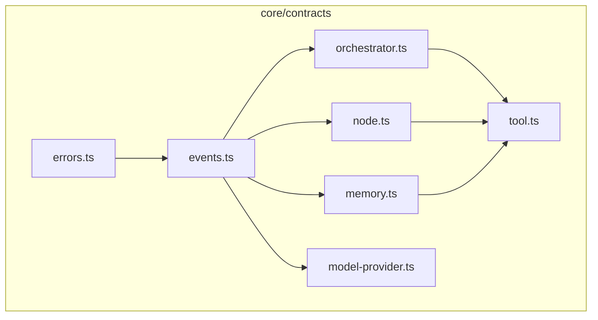
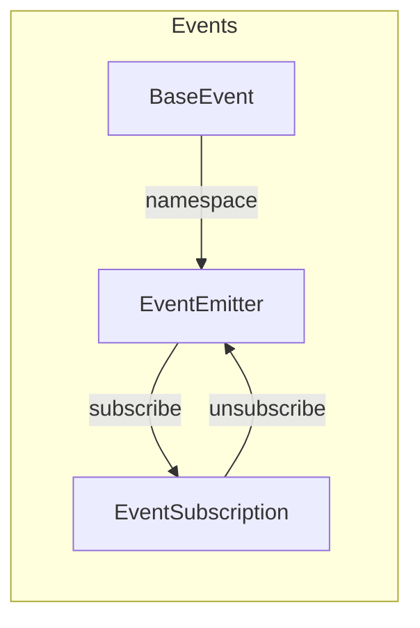

# Nexus Component Map

> **Version:** 1.0.0  
> **Related:** [OVERVIEW.md](OVERVIEW.md), [LAYERS.md](LAYERS.md), [DATA_FLOW.md](DATA_FLOW.md)

---

## 1. Component Hierarchy

### 1.1 Top-Level Structure

```
Nexus
├── apps/                  # Application Layer
│   ├── cli/               # CLI Application
│   ├── desktop/           # Desktop Application
│   └── web/               # Web Application
│
├── interfaces/            # Interface Layer
│   ├── api/               # REST API
│   ├── cli/               # CLI Interface
│   ├── websocket/         # WebSocket Interface
│   └── contracts/         # Interface Contracts
│
├── systems/               # Systems Layer
│   ├── orchestration/    # DAG Execution Engine
│   ├── context/          # Context Management
│   ├── cognitive/        # Reasoning & Planning
│   ├── execution/        # Task Execution
│   ├── memory/            # Memory Systems
│   └── models/           # Model Abstraction
│
├── core/                  # Core Layer
│   ├── contracts/         # Core Contracts
│   ├── types/            # Type Exports
│   ├── errors/           # Error Classes
│   └── utils/            # Utilities
│
├── modules/               # Modules Layer
│   ├── agents/            # Agent Implementations
│   ├── tools/            # Tool Implementations
│   ├── integrations/     # External Integrations
│   ├── workflows/        # Workflow Definitions
│   └── ui-extensions/    # UI Extensions
│
├── data/                  # Data Layer
│   ├── adapters/         # Database Adapters
│   ├── repositories/     # Data Repositories
│   ├── schemas/          # Data Schemas
│   └── migrations/       # Database Migrations
│
└── runtime/               # Runtime Layer
    ├── process/          # Process Management
    ├── ipc/              # IPC Communication
    ├── scheduler/        # Task Scheduling
    ├── sandbox/          # Execution Sandbox
    └── state/            # State Management
```

---

## 2. Component Relationships

### 2.1 Core Contracts Dependencies



### 2.2 Layer Dependencies

```
┌─────────────────────────────────────────────────────────────┐
│  apps/                                                      │
│     │                                                       │
│     ▼                                                       │
│  interfaces/ ──────────────┐                                │
│     │                     │                                 │
│     ▼                     │                                 │
│  systems/                 │                                 │
│     │                     │                                 │
│  ┌──┼─────────────────┼──────────────────────┐              │
│  │  │                 │                      │              │
│  ▼  ▼                 ▼                      ▼              │
│ core/contracts    modules/              runtime/            │
│     │               │                     │                 │
│     │               │                     │                 │
│     ▼               ▼                     ▼                 │
│ core/types        data/                                     │
└─────────────────────────────────────────────────────────────┘
```

---

## 3. Key Components

### 3.1 Orchestration Components

| Component | File | Description |
|-----------|------|-------------|
| Orchestrator | [`core/contracts/orchestrator.ts`](../../core/contracts/orchestrator.ts:128) | Main orchestration interface |
| DAG | [`core/contracts/orchestrator.ts`](../../core/contracts/orchestrator.ts:104) | Directed acyclic graph |
| Node | [`core/contracts/node.ts`](../../core/contracts/node.ts:87) | Base node interface |
| NodeFactory | [`core/contracts/node.ts`](../../core/contracts/node.ts:185) | Node creation |
| NodeExecutor | [`core/contracts/node.ts`](../../core/contracts/node.ts:198) | Node execution |

**Status:** Contracts defined (Phase 1); Implementation TODO (Phase 2-3)

### 3.2 Context Components

| Component | File | Description |
|-----------|------|-------------|
| Memory | [`core/contracts/memory.ts`](../../core/contracts/memory.ts:109) | Memory interface |
| MemoryEntry | [`core/contracts/memory.ts`](../../core/contracts/memory.ts:44) | Memory data structure |
| MemoryQuery | [`core/contracts/memory.ts`](../../core/contracts/memory.ts:57) | Retrieval query |
| MemorySnapshot | [`core/contracts/memory.ts`](../../core/contracts/memory.ts:86) | Context snapshot |
| ContextCompressor | [`core/contracts/memory.ts`](../../core/contracts/memory.ts:176) | Token compression |

**Status:** Contracts defined (Phase 1); Implementation TODO (Phase 4)

### 3.3 Model Components

| Component | File | Description |
|-----------|------|-------------|
| ModelProvider | [`core/contracts/model-provider.ts`](../../core/contracts/model-provider.ts:132) | Provider interface |
| ModelRouter | [`core/contracts/model-provider.ts`](../../core/contracts/model-provider.ts:207) | Multi-provider routing |
| ModelCache | [`core/contracts/model-provider.ts`](../../core/contracts/model-provider.ts:260) | Response caching |
| ModelMetrics | [`core/contracts/model-provider.ts`](../../core/contracts/model-provider.ts:285) | Usage metrics |

**Status:** Contracts defined (Phase 1); Implementation TODO (Phase 5)

### 3.4 Tool Components

| Component | File | Description |
|-----------|------|-------------|
| Tool | [`modules/tools/contracts/tool.ts`](../../modules/tools/contracts/tool.ts) | Tool interface |
| ToolRegistry | [`modules/tools/contracts/registry.ts`](../../modules/tools/contracts/registry.ts) | Tool discovery |
| ToolSchema | [`modules/tools/contracts/schema.ts`](../../modules/tools/contracts/schema.ts) | Input/Output schemas |

**Status:** Contracts defined (Phase 1); Implementation TODO (Phase 5)

### 3.5 Agent Components

| Component | File | Description |
|-----------|------|-------------|
| Agent | [`modules/agents/contracts/agent.ts`](../../modules/agents/contracts/agent.ts) | Agent definition |
| Executor | [`modules/agents/contracts/executor.ts`](../../modules/agents/contracts/executor.ts) | Agent execution |

**Status:** Contracts defined (Phase 1); Implementation TODO (Phase 5)

---

## 4. Interface Contracts

### 4.1 API Interfaces

| Interface | File | Purpose |
|-----------|------|---------|
| ApiEndpoint | [`interfaces/contracts/api.ts`](../../interfaces/contracts/api.ts) | REST endpoint definition |
| RequestHandler | [`interfaces/contracts/api.ts`](../../interfaces/contracts/api.ts) | Request processing |

### 4.2 WebSocket Interfaces

| Interface | File | Purpose |
|-----------|------|---------|
| WebSocketMessage | [`interfaces/contracts/websocket.ts`](../../interfaces/contracts/websocket.ts) | WS message format |
| WebSocketHandler | [`interfaces/contracts/websocket.ts`](../../interfaces/contracts/websocket.ts) | WS event handling |

### 4.3 CLI Interfaces

| Interface | File | Purpose |
|-----------|------|---------|
| CliCommand | [`interfaces/contracts/cli.ts`](../../interfaces/contracts/cli.ts) | CLI command definition |
| CliParser | [`interfaces/contracts/cli.ts`](../../interfaces/contracts/cli.ts) | Input parsing |

---

## 5. Event System Components

### 5.1 Event Architecture



### 5.2 Event Types

| Namespace | File | Events |
|-----------|------|--------|
| ORCHESTRATION | [`core/contracts/events.ts`](../../core/contracts/events.ts:186) | started, progress, completed, failed |
| NODE | [`core/contracts/events.ts`](../../core/contracts/events.ts:191) | started, completed, failed |
| TOOL | [`core/contracts/events.ts`](../../core/contracts/events.ts:196) | started, completed, failed |
| MEMORY | [`core/contracts/events.ts`](../../core/contracts/events.ts:201) | retrieved, stored, cleared, error |
| MODEL | [`core/contracts/events.ts`](../../core/contracts/events.ts:207) | request, response, error |
| CONTEXT | [`core/contracts/events.ts`](../../core/contracts/events.ts:212) | compress, expand, slice, cache |
| RUNTIME | [`core/contracts/events.ts`](../../core/contracts/events.ts:217) | started, stopped, error |
| AGENT | [`core/contracts/events.ts`](../../core/contracts/events.ts:222) | created, started, paused, stopped, error |

---

## 6. Error System Components

### 6.1 Error Hierarchy

```
NexusError (abstract)
├── OrchestrationError
│   └── ErrorCode: ORC_xxx
├── NodeError
│   └── ErrorCode: ND_xxx
├── ToolError
│   └── ErrorCode: TOL_xxx
├── MemoryError
│   └── ErrorCode: MEM_xxx
├── ModelError
│   └── ErrorCode: MOD_xxx
├── ContextError
│   └── ErrorCode: CTX_xxx
├── RuntimeError
│   └── ErrorCode: RT_xxx
├── DataError
│   └── ErrorCode: DAT_xxx
├── ValidationError
│   └── ErrorCode: GEN_002
└── NotImplementedError
    └── ErrorCode: GEN_003
```

### 6.2 Error Utilities

| Function | File | Purpose |
|----------|------|---------|
| `isNexusError()` | [`core/contracts/errors.ts`](../../core/contracts/errors.ts:245) | Type guard |
| `createErrorResponse()` | [`core/contracts/errors.ts`](../../core/contracts/errors.ts:252) | Safe error serialization |

---

## 7. Directory-to-Component Mapping

| Directory | Primary Components | Status |
|-----------|-------------------|--------|
| `core/contracts/` | Orchestrator, Node, Memory, ModelProvider, Events, Errors | ✅ Phase 1 |
| `systems/orchestration/` | DAG Engine, Scheduler, Runtime | 📋 Phase 2-3 |
| `systems/context/` | Compressor, Cache, Prioritizer | 📋 Phase 4 |
| `systems/cognitive/` | Planner, Strategy, Intent | 📋 Phase 5 |
| `modules/tools/` | Tool implementations | 📋 Phase 5 |
| `modules/agents/` | Agent implementations | 📋 Phase 5 |
| `modules/integrations/` | Provider adapters | 📋 Phase 5 |
| `interfaces/` | API, WebSocket, CLI | 📋 Phase 6 |
| `apps/` | Web, Desktop, CLI apps | 📋 Phase 6 |
| `data/` | Adapters, Repositories | 📋 Phase 7 |
| `runtime/` | Process, IPC, Sandbox | 📋 Phase 7 |

---

## 8. Component Interaction Matrix

| From \ To | Orchestrator | Node | Memory | Model | Tool | Agent |
|-----------|--------------|------|--------|-------|------|-------|
| **Orchestrator** | - | Creates | Uses | Uses | Uses | Uses |
| **Node** | Owned by | - | Accesses | Calls | Calls | - |
| **Memory** | Provides context | Provides context | - | - | - | - |
| **Model** | - | Called by | - | - | - | - |
| **Tool** | - | Called by | - | - | - | - |
| **Agent** | Uses | Uses | Uses | Uses | Uses | - |

---

## 9. Summary

| Category | Count | Files |
|----------|-------|-------|
| Core Contracts | 7 | [`core/contracts/`](../../core/contracts/) |
| Interface Contracts | 4 | [`interfaces/contracts/`](../../interfaces/contracts/) |
| Module Contracts | 6 | [`modules/*/contracts/`](../../modules/) |
| Systems | 6 | [`systems/`](../../systems/) |
| Runtime Components | 5 | [`runtime/`](../../runtime/) |

---

## 10. Related Documentation

- [OVERVIEW.md](OVERVIEW.md) - High-level architecture
- [LAYERS.md](LAYERS.md) - Layer breakdown
- [DATA_FLOW.md](DATA_FLOW.md) - Data flow through system
- [BOUNDARIES.md](BOUNDARIES.md) - Module boundaries & interfaces
