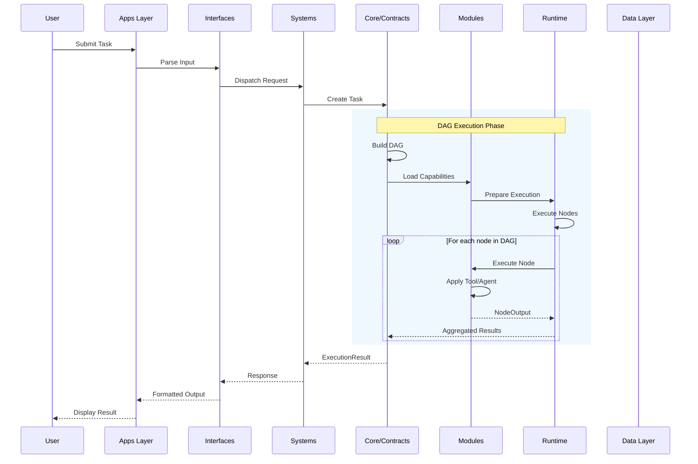

# Nexus Data Flow

> **Version:** 1.0.0  
> **Related:** [OVERVIEW.md](OVERVIEW.md), [LAYERS.md](LAYERS.md)

---

## 1. Overview

Data in Nexus flows through a **bidirectional pipeline**:

1. **Request Flow (Downward):** External input → Apps → Interfaces → Systems → Core
2. **Response Flow (Upward):** Core → Systems → Interfaces → Apps → External output

```
                    REQUEST FLOW
                         │
                         ▼
┌─────────────────────────────────────────────────────────────┐
│                        External Input                       │
│              (API, CLI, WebSocket, UI Events)               │
└─────────────────────────────────────────────────────────────┘
                         │
                         ▼
┌─────────────────────────────────────────────────────────────┐
│  Layer 7: apps/                                             │
│  ┌─────────────────────────────────────────────────────┐    │
│  │  Web App │ Desktop App │ CLI                        │    │
│  └─────────────────────────────────────────────────────┘    │
└─────────────────────────────────────────────────────────────┘
                         │
                         ▼
┌─────────────────────────────────────────────────────────────┐
│  Layer 6: interfaces/                                       │
│  ┌─────────────────────────────────────────────────────┐    │
│  │  API Handler │ WebSocket Handler │ CLI Parser       │    │
│  └─────────────────────────────────────────────────────┘    │
└─────────────────────────────────────────────────────────────┘
                         │
                         ▼
┌─────────────────────────────────────────────────────────────┐
│  Layer 5: systems/                                          │
│  ┌─────────────────────────────────────────────────────┐    │
│  │   Orchestration │ Context │ Cognitive │ Execution   │    │
│  └─────────────────────────────────────────────────────┘    │
└─────────────────────────────────────────────────────────────┘
                         │
                         ▼
┌─────────────────────────────────────────────────────────────┐
│  Layer 4: core/                                             │
│  ┌─────────────────────────────────────────────────────┐    │
│  │   Contracts (Orchestrator, Node, Tool, Memory)      │    │
│  └─────────────────────────────────────────────────────┘    │
└─────────────────────────────────────────────────────────────┘
                         │
                         ▼
                         │ RESPONSE FLOW
                         │
┌─────────────────────────────────────────────────────────────┐
│  Return: ExecutionResult, Events, State Updates             │
└─────────────────────────────────────────────────────────────┘
```

---

## 2. Task Execution Flow

### 2.1 High-Level Sequence



### 2.2 Data Structures

#### Task Input

```typescript
// From core/contracts/orchestrator.ts
interface Task {
  id: string;
  type: string;
  input: unknown;
  constraints?: TaskConstraints;
}

interface TaskConstraints {
  maxTokens?: number;
  maxLatency?: number;
  timeout?: number;
  budget?: number;
  priority?: number;
}
```

#### Execution Context

```typescript
// From core/contracts/orchestrator.ts
interface ExecutionContext {
  sessionId: string;
  userId?: string;
  memory: MemorySnapshot;
  capabilities: CapabilitySet;
  variables: Record<string, unknown>;
  metadata: {
    startTime: Date;
    attemptNumber: number;
    correlationId?: string;
  };
}
```

---

## 3. DAG Execution Flow

### 3.1 Node Execution Order

```
┌─────────────────────────────────────────────────────────────┐
│                    DAG Example                              │
│                                                             │
│    [Node A] ──► [Node B] ──► [Node D]                       │
│         │            │                                      │
│         └──────────► [Node C] ──► [Node E]                  │
│                           │                                 │
│                           └──────────► [Node F]             │
└─────────────────────────────────────────────────────────────┘

Execution Order:
1. Node A (no dependencies)
2. Nodes B & C (A complete)
3. Nodes D & E (B & C complete)
4. Node F (E complete)
```

### 3.2 Node Input/Output

```typescript
// From core/contracts/node.ts
interface NodeInput {
  nodeId: string;
  data: unknown;
  dependencies: Record<string, unknown>;
  context?: Record<string, unknown>;
}

interface NodeOutput {
  nodeId: string;
  data: unknown;
  status: NodeStatus;
  error?: string;
  metadata: {
    startTime: Date;
    endTime: Date;
    tokensUsed?: number;
    cacheHit?: boolean;
  };
}
```

### 3.3 Node Types and Data Flow

| Node Type | Input | Output | Purpose |
|-----------|-------|--------|---------|
| `REASONING` | Prompt + Context | LLM Response | LLM calls |
| `TOOL` | Tool Input | Tool Result | Tool execution |
| `MEMORY` | Query/Store | Memory Entries | Memory ops |
| `CONTROL` | Condition | Branch selection | Flow control |
| `AGGREGATOR` | Multiple inputs | Merged output | Data merging |
| `TRANSFORM` | Raw data | Transformed data | Data transformation |
| `CONDITIONAL` | Condition | True/False branch | Routing |

---

## 4. Memory & Context Flow

### 4.1 Memory Types

```typescript
// From core/contracts/memory.ts
enum MemoryType {
  EPHEMERAL = 'ephemeral',    // Current task only
  SESSION = 'session',         // Conversation session
  PERSISTENT = 'persistent',   // Long-term storage
  DERIVED = 'derived'          // Generated summaries
}
```

### 4.2 Context Pipeline

```
┌─────────────────────────────────────────────────────────────┐
│                   Context Pipeline                          │
│                                                             │
│  ┌─────────┐    ┌─────────┐    ┌─────────┐    ┌─────────┐   │
│  │ Memory  │───►│Retrieve │───►│Compress │───►│  Slice  │   │
│  │ Query   │    │ Context │    │ Tokens  │    │ for LLM │   │
│  └─────────┘    └─────────┘    └─────────┘    └─────────┘   │
│       │                                              │      │
│       │           ┌──────────────────────────────┐   │      │
│       └──────────►│ ContextCompressor Interface  │◄──┘      │
│                   │  (core/contracts/memory.ts)  │          │
│                   └──────────────────────────────┘          │
└─────────────────────────────────────────────────────────────┘
```

### 4.3 Memory Snapshot

```typescript
// From core/contracts/memory.ts
interface MemorySnapshot {
  session: MemoryEntry[];      // Current session memories
  persistent: MemoryEntry[];    // Long-term memories
  derived: MemoryEntry[];      // Generated summaries
  totalTokens: number;          // Total token count
}
```

---

## 5. Model Provider Flow

### 5.1 Request/Response

```typescript
// From core/contracts/model-provider.ts
interface ModelRequest {
  model: string;
  messages: Message[];
  config?: ModelConfig;
  tools?: ToolDefinition[];
  stream?: boolean;
}

interface ModelResponse {
  id: string;
  model: string;
  content: string;
  toolCalls?: ToolCall[];
  finishReason: 'stop' | 'length' | 'tool_calls' | 'content_filter' | null;
  usage: {
    promptTokens: number;
    completionTokens: number;
    totalTokens: number;
  };
  latency: number;
}
```

### 5.2 Multi-Provider Routing

```
┌─────────────────────────────────────────────────────────────┐
│                 Model Provider Flow                         │
│                                                             │
│  ┌─────────────────────────────────────────────────────┐    │
│  │              ModelRouter Interface                  │    │
│  │  selectModel(request) → ModelSelection              │    │
│  └─────────────────────────────────────────────────────┘    │
│                           │                                 │
│           ┌───────────────┼───────────────┐                 │
│           ▼               ▼               ▼                 │
│    ┌────────────┐  ┌────────────┐  ┌────────────┐           │
│    │  OpenAI    │  │ Anthropic  │  │   Local    │           │
│    │  Provider  │  │  Provider  │  │  Provider  │           │
│    └────────────┘  └────────────┘  └────────────┘           │
└─────────────────────────────────────────────────────────────┘
```

---

## 6. Event Flow

### 6.1 Event Types

```typescript
// From core/contracts/events.ts
const EventTypes = {
  // Orchestration events
  ORCHESTRATION_STARTED: 'orchestration:started',
  ORCHESTRATION_PROGRESS: 'orchestration:progress',
  ORCHESTRATION_COMPLETED: 'orchestration:completed',
  ORCHESTRATION_FAILED: 'orchestration:failed',
  
  // Node events
  NODE_STARTED: 'node:started',
  NODE_COMPLETED: 'node:completed',
  NODE_FAILED: 'node:failed',
  
  // Tool events
  TOOL_STARTED: 'tool:started',
  TOOL_COMPLETED: 'tool:completed',
  TOOL_FAILED: 'tool:failed',
  
  // Memory events
  MEMORY_RETRIEVED: 'memory:retrieved',
  MEMORY_STORED: 'memory:stored',
  
  // Model events
  MODEL_REQUEST: 'model:request',
  MODEL_RESPONSE: 'model:response',
};
```

### 6.2 Event Emission Points

| Source | Events Emitted |
|--------|----------------|
| Orchestrator | `orchestration:started`, `orchestration:progress`, `orchestration:completed`, `orchestration:failed` |
| Node | `node:started`, `node:completed`, `node:failed` |
| Tool | `tool:started`, `tool:completed`, `tool:failed` |
| Memory | `memory:retrieved`, `memory:stored`, `memory:cleared`, `memory:error` |
| Model | `model:request`, `model:response`, `model:error` |

---

## 7. Error Flow

### 7.1 Error Propagation

```
┌─────────────────────────────────────────────────────────────┐
│                   Error Flow                                │
│                                                             │
│  ┌──────────┐    ┌──────────┐    ┌──────────┐               │
│  │ Module   │───►│ System   │───►│Interface │───► User      │
│  │ Error    │    │ Handler  │    │ Response │               │
│  └──────────┘    └──────────┘    └──────────┘               │
│       │               │               │                     │
│       ▼               ▼               ▼                     │
│  ┌──────────────────────────────────────────┐               │
│  │         NexusError Hierarchy             │               │
│  │  - OrchestrationError                    │               │
│  │  - NodeError                              │              │
│  │  - ToolError                              │              │
│  │  - MemoryError                            │              │
│  │  - ModelError                             │              │
│  │  - ContextError                          │               │
│  │  - RuntimeError                          │               │
│  │  - DataError                             │               │
│  └──────────────────────────────────────────┘               │
└─────────────────────────────────────────────────────────────┘
```

### 7.2 Error Codes

| Code | Domain | Description |
|------|--------|-------------|
| `ORC-xxx` | Orchestration | ORC_001: Orchestration failed |
| `ND-xxx` | Node | ND_001: Node not found |
| `TOL-xxx` | Tool | TOL_001: Tool not found |
| `MEM-xxx` | Memory | MEM_001: Retrieval failed |
| `MOD-xxx` | Model | MOD_001: Provider unavailable |
| `CTX-xxx` | Context | CTX_001: Compression failed |
| `RT-xxx` | Runtime | RT_001: IPC failed |
| `DAT-xxx` | Data | DAT_001: Connection failed |

---

## 8. Complete Data Flow Example

### Example: Tool Execution Task

```
1. User Input
   "Search for documentation about API authentication"
   │
2. App Layer (apps/cli or apps/web)
   → Parse command → Create Task object
   │
3. Interface Layer (interfaces/api)
   → Validate input → Create API request
   │
4. System Layer (systems/orchestration)
   → Create ExecutionContext
   → Build DAG with nodes:
     - Node 1: REASONING (understand intent)
     - Node 2: MEMORY (retrieve relevant docs)
     - Node 3: TOOL (execute search)
   → Execute DAG
   │
5. Core Contracts
   → Task.execute() → Node.execute()
   → Memory.retrieve() → Tool.execute()
   │
6. Module Layer (modules/tools)
   → Tool searches vector database
   → Returns results
   │
7. Response flows back up
   → Aggregation of all node outputs
   → Final result to user
```

---

## 9. Summary

| Flow Stage | Direction | Data | Layer | Status |
|------------|-----------|------|-------|--------|
| Input | ↓ | Raw user input | apps/ | CLI ✅ |
| Parsing | ↓ | Validated request | interfaces/ | API ✅ |
| Orchestration | ↓ | Task + Context | systems/ | ✅ Complete |
| Execution | ↓ | DAG + Nodes | systems/orchestration/ | ✅ Complete |
| Capability | ↔ | Tool/Memory/Model | modules/ | Contracts ✅ |
| Result | ↑ | ExecutionResult | systems/ | ✅ Complete |
| Response | ↑ | Formatted output | interfaces/ | ✅ Complete |
| Display | ↑ | User-facing result | apps/ | CLI ✅ |

---

## 10. Related Documentation

- [OVERVIEW.md](OVERVIEW.md) - High-level architecture
- [LAYERS.md](LAYERS.md) - Layer breakdown
- [COMPONENT_MAP.md](COMPONENT_MAP.md) - Component relationships
- [BOUNDARIES.md](BOUNDARIES.md) - Module boundaries
