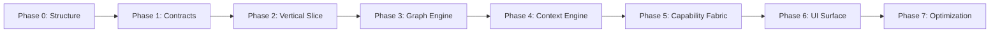

# Nexus Roadmap

This document outlines the comprehensive development roadmap for Nexus, organized into 7 discrete phases as defined in [AGENTS.md](../AGENTS.md).

---

## Table of Contents

- [Phase 0: Structure Initialization](#phase-0--structure-initialization)
- [Phase 1: Core Contracts](#phase-1--core-contracts)
- [Phase 2: Minimal Vertical Slice](#phase-2--minimal-vertical-slice)
- [Phase 3: Graph Execution Engine](#phase-3--graph-execution-engine)
- [Phase 4: Context Engine](#phase-4--context-engine)
- [Phase 5: Capability Fabric](#phase-5--capability-fabric)
- [Phase 6: UI Control Surface](#phase-6--ui-control-surface)
- [Phase 7: Optimization Layer](#phase-7--optimization-layer)

---

## Phase 0: Structure Initialization

**Status**: ✅ Complete

### Overview

Phase 0 establishes the foundational directory structure for the Nexus project. This phase ensures the architecture is properly organized before any implementation begins.

### Goals

- Create full directory tree matching the architecture specification
- Validate structure aligns with the dependency direction rule
- Establish clear boundaries between layers (apps → interfaces → systems → core)

### Key Deliverables

| Directory | Purpose |
|-----------|---------|
| `core/` | Core contracts, types, utilities, and configuration |
| `core/contracts/` | Interface definitions for all core systems |
| `core/types/` | Shared type definitions |
| `core/utils/` | Core utility functions |
| `core/errors/` | Core error types |
| `systems/` | Implementation of orchestration, context, memory, execution, models, capabilities, cognitive |
| `modules/` | Reusable modules (agents, tools, integrations, workflows, ui-extensions) |
| `interfaces/` | API, CLI, WebSocket interface contracts |
| `runtime/` | IPC, process management, sandbox, scheduler, state |
| `data/` | Adapters, migrations, repositories, schemas, seed data |
| `apps/` | CLI, desktop, and web applications |
| `docs/` | Architecture, API, guides, systems, decisions documentation |
| `dev/` | Benchmarks, fixtures, generators, scripts |
| `infra/` | CI/CD, Docker, monitoring, local environment |
| `meta/` | Changelog, conventions, roadmap, standards |

### Dependencies

- None (foundation phase)

---

## Phase 1: Core Contracts

**Status**: ✅ Complete

### Overview

Phase 1 establishes the contract layer across all modules. Following the contract-first development rule, this phase defines all interfaces, types, and input/output schemas before any implementation.

### Goals

- Define all core contracts in `/core/contracts/`
- Define tool contracts in `/modules/tools/contracts/`
- Define agent contracts in `/modules/agents/contracts/`
- Define integration contracts in `/modules/integrations/contracts/`
- Define interface contracts in `/interfaces/contracts/`

### Key Deliverables

#### Core Contracts (`core/contracts/`)

| File | Description |
|------|-------------|
| [`orchestrator.ts`](../../core/contracts/orchestrator.ts) | Orchestrator interface, Task, ExecutionContext, DAG |
| [`node.ts`](../../core/contracts/node.ts) | DAG node types, Node interface, NodeConfig |
| [`tool.ts`](../../core/contracts/tool.ts) | ToolResult, ToolContext, CapabilitySet |
| [`memory.ts`](../../core/contracts/memory.ts) | Memory interface, MemoryEntry, MemoryQuery, MemorySnapshot |
| [`model-provider.ts`](../../core/contracts/model-provider.ts) | ModelProvider, ModelRequest, ModelResponse, ModelRouter |
| [`events.ts`](../../core/contracts/events.ts) | Event types for system communication |
| [`errors.ts`](../../core/contracts/errors.ts) | Error type definitions |
| [`index.ts`](../../core/contracts/index.ts) | Barrel export |

#### Tool Contracts (`modules/tools/contracts/`)

| File | Description |
|------|-------------|
| [`tool.ts`](../../modules/tools/contracts/tool.ts) | Tool interface, ToolExecutionContext, ToolCapabilities |
| [`schema.ts`](../../modules/tools/contracts/schema.ts) | JSON Schema types, ToolInputSchema, ToolOutputSchema |
| [`registry.ts`](../../modules/tools/contracts/registry.ts) | ToolRegistry, ToolExecutor, ToolCache |
| [`index.ts`](../../modules/tools/contracts/index.ts) | Barrel export |

#### Agent Contracts (`modules/agents/contracts/`)

| File | Description |
|------|-------------|
| [`agent.ts`](../../modules/agents/contracts/agent.ts) | Agent interface, AgentConfig, AgentState |
| [`executor.ts`](../../modules/agents/contracts/executor.ts) | Agent executor contracts |
| [`index.ts`](../../modules/agents/contracts/index.ts) | Barrel export |

#### Integration Contracts (`modules/integrations/contracts/`)

| File | Description |
|------|-------------|
| [`provider.ts`](../../modules/integrations/contracts/provider.ts) | Integration provider interface |
| [`adapter.ts`](../../modules/integrations/contracts/adapter.ts) | Adapter pattern contracts |
| [`index.ts`](../../modules/integrations/contracts/index.ts) | Barrel export |

#### Interface Contracts (`interfaces/contracts/`)

| File | Description |
|------|-------------|
| [`api.ts`](../../interfaces/contracts/api.ts) | REST API interface contracts |
| [`websocket.ts`](../../interfaces/contracts/websocket.ts) | WebSocket interface contracts |
| [`cli.ts`](../../interfaces/contracts/cli.ts) | CLI interface contracts |

### Dependencies

- Phase 0 (Structure Initialization)

---

## Phase 2: Minimal Vertical Slice

**Status**: ✅ Complete

### Overview

Phase 2 creates a working end-to-end system with minimal capability. This establishes the data flow from apps through interfaces, orchestration, to models.

### Goals

- Implement a minimal orchestrator that can execute tasks
- Create basic node execution
- Connect to a model provider
- Establish the CLI interface

### Path

```
apps → interfaces → orchestration → models
```

### Key Deliverables

| Component | Description |
|-----------|-------------|
| **Minimal Orchestrator** | Basic Task execution with DAG support |
| **Basic Node Types** | ReasoningNode, ToolNode implementations |
| **Model Provider** | Single provider implementation (e.g., OpenAI) |
| **CLI Interface** | Basic command-line interface |
| **State Management** | Simple task state tracking |

### Constraints

- No memory system
- No tool system
- No advanced UI
- Single model provider

### Dependencies

- Phase 1 (Core Contracts)

---

## Phase 3: Graph Execution Engine

**Status**: 📋 Planned

### Overview

Phase 3 builds the full DAG-based execution engine with advanced scheduling, node execution logic, and parallel execution support.

### Goals

- Implement full DAG structure and validation
- Create comprehensive node execution logic
- Build the scheduler for optimal execution order
- Add retry and error handling

### Key Deliverables

| Component | Description |
|-----------|-------------|
| **DAG Engine** | Full DAG creation, validation, optimization |
| **Node Execution** | All node types: reasoning, tool, memory, control, aggregator, transform, conditional |
| **Scheduler** | Topological sorting, parallel execution, resource management |
| **Execution State** | Task state machine with pause/resume/cancel |
| **Metrics Collection** | Execution timing, token usage, cache hits |

### Systems

- [`systems/orchestration/`](../../systems/orchestration/) - DAG engine, node execution, scheduler
- [`runtime/scheduler/`](../../runtime/scheduler/) - Task scheduling
- [`runtime/state/`](../../runtime/state/) - State management

### Dependencies

- Phase 2 (Minimal Vertical Slice)

---

## Phase 4: Context Engine

**Status**: 📋 Planned

### Overview

Phase 4 implements the memory abstraction, retrieval system, and basic context compression for token optimization.

### Goals

- Create memory abstraction layer
- Implement retrieval system with embeddings
- Build basic context compressor
- Support session and persistent memory

### Key Deliverables

| Component | Description |
|-----------|-------------|
| **Memory System** | Full Memory implementation |
| **Vector Index** | Embedding-based retrieval |
| **Context Compressor** | Token reduction for prompts |
| **Memory Snapshot** | Context slice for execution |
| **Archive System** | Memory expiration and cleanup |

### Systems

- [`systems/memory/`](../../systems/memory/) - Memory storage and retrieval
- [`systems/context/`](../../systems/context/) - Cache, compressor, prioritizer, router

### Dependencies

- Phase 3 (Graph Execution Engine)

---

## Phase 5: Capability Fabric

**Status**: 📋 Planned

### Overview

Phase 5 implements the tool interface, tool registry, and execution chaining capabilities.

### Goals

- Implement tool interface from contracts
- Build tool registry with discovery
- Create execution chaining
- Implement core tools (filesystem, HTTP, code execution, vector search)

### Key Deliverables

| Component | Description |
|-----------|-------------|
| **Tool System** | Full Tool implementation |
| **Tool Registry** | Registration, discovery, management |
| **Tool Executor** | Execution, caching, parallel execution |
| **Core Tools** | Filesystem, HTTP, Code Execution, Vector Search |
| **Sandbox** | Safe tool execution environment |

### Modules

- [`modules/tools/`](../../modules/tools/) - Tool implementations
- [`modules/tools/code-exec/`](../../modules/tools/code-exec/) - Code execution tool
- [`modules/tools/filesystem/`](../../modules/tools/filesystem/) - Filesystem access tool
- [`modules/tools/http/`](../../modules/tools/http/) - HTTP client tool
- [`modules/tools/vector-search/`](../../modules/tools/vector-search/) - Vector search tool

### Systems

- [`systems/capabilities/`](../../systems/capabilities/) - Capability management

### Dependencies

- Phase 4 (Context Engine)

---

## Phase 6: UI Control Surface

**Status**: 📋 Planned

### Overview

Phase 6 builds the workspace layout and execution visualization for the user interface.

### Goals

- Create workspace layout for desktop/web
- Build execution visualization (graph, logs, metrics)
- Implement interactive debugging
- Add real-time updates via WebSocket

### Key Deliverables

| Component | Description |
|-----------|-------------|
| **Workspace UI** | Main application layout |
| **Graph Visualization** | DAG rendering and interaction |
| **Execution Dashboard** | Real-time task monitoring |
| **Log Viewer** | Structured log display |
| **Settings Panel** | Configuration management |

### Applications

- [`apps/desktop/`](../../apps/desktop/) - Electron-based desktop app
- [`apps/web/`](../../apps/web/) - Web application
- [`apps/cli/`](../../apps/cli/) - Enhanced CLI

### Interfaces

- [`interfaces/websocket/`](../../interfaces/websocket/) - WebSocket server
- [`interfaces/api/`](../../interfaces/api/) - REST API

### Dependencies

- Phase 5 (Capability Fabric)

---

## Phase 7: Optimization Layer

**Status**: 📋 Planned

### Overview

Phase 7 adds performance optimizations including caching, token reduction, and parallel execution tuning.

### Goals

- Implement intelligent response caching
- Optimize token usage across all components
- Tune parallel execution
- Add performance monitoring

### Key Deliverables

| Component | Description |
|-----------|-------------|
| **Response Cache** | Semantic caching for model responses |
| **Token Optimizer** | Advanced token reduction strategies |
| **Parallel Executor** | Optimized parallel tool execution |
| **Performance Metrics** | Comprehensive observability |
| **Auto-tuning** | Self-optimizing configuration |

### Systems

- [`systems/context/cache/`](../../systems/context/cache/) - Response caching
- [`systems/context/compressor/`](../../systems/context/compressor/) - Advanced compression

### Dependencies

- Phase 6 (UI Control Surface)

---

## Phase Dependency Graph



---

## Success Criteria

Each phase is complete when:

1. **Structure is correct** - Directory structure matches specification
2. **No dependency violations** - Follows the dependency direction rule
3. **Contracts are respected** - All implementations follow contracts
4. **System compiles** - TypeScript compilation passes without errors

---

## Notes

- Phase progression follows the [Progression Rule](../AGENTS.md#10-progression-rule): Do not move to the next phase until current phase is complete, functional, and validated.
- All phases build incrementally - no rewrites required
- Each subsystem must be independently testable
- Architecture must remain intact over time

---

**Last Updated**: 2026-03-21
