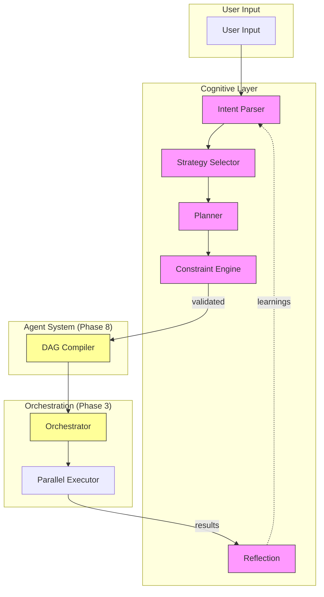

# Phase 10: Cognitive Layer Implementation Plan

## Overview

This document outlines the comprehensive Phase 10 implementation plan for the Nexus project. Phase 10 transforms Nexus from a "well-engineered orchestration system" into a **general-purpose cognitive execution platform** by implementing the cognitive layer that bridges user intent to deterministic execution.

**Phase 10 Goal**: Transform Nexus from tool-driven orchestration to intent-driven cognitive execution, where user input is parsed into structured intents, mapped to strategies, compiled into plans, and executed through the orchestrator with constraint enforcement and reflection.

**Core Principle**: The cognitive layer is the "largest unrealized multiplier" per architectural feedback. It adds the missing middle layer between raw user input and DAG execution, enabling Nexus to understand what users want to accomplish, not just what tools to call.

---

## Phase Overview

### Objective

Transform Nexus from DAG-execution engine to cognitive execution platform:

1. **Intent Parsing**: Convert user input into structured Intent with goals, constraints, and priorities
2. **Strategy Selection**: Map intent to appropriate execution style (reasoning-heavy vs. tool-heavy)
3. **Planning**: Generate deterministic ExecutionPlan from intent + strategy
4. **Constraint Enforcement**: Validate plans against policies before execution
5. **Reflection**: Review execution results and extract learnings

### Why the Cognitive Layer Matters

| Current State | With Cognitive Layer |
|---------------|----------------------|
| User → DAG → Execute | User → Intent → Strategy → Plan → DAG → Execute → Reflection |
| "Call tool X with Y" | "Analyze sales data and create report" |
| Manual tool orchestration | Automatic intent-to-execution pipeline |
| No constraint validation | Policy enforcement at planning time |
| No execution learning | Reflection extracts improvements |

### Architectural Position

Phase 10 introduces the Cognitive Layer between the Agent System and Orchestration:

```
┌─────────────────────────────────────────────────────────────┐
│                     Application Layer                        │
│  (CLI, Web, Desktop Apps)                                   │
└─────────────────────────────────────────────────────────────┘
                               │
                               ▼
┌─────────────────────────────────────────────────────────────┐
│                     Interface Layer                          │
│  (API, WebSocket, CLI Contracts)                           │
└─────────────────────────────────────────────────────────────┘
                               │
                               ▼
┌─────────────────────────────────────────────────────────────┐
│               Cognitive Layer (NEW - Phase 10)               │
│  ┌─────────────┐  ┌─────────────┐  ┌──────────────────────┐ │
│  │ Intent      │  │ Strategy    │  │ Planner              │ │
│  │ Parser      │  │ Selector    │  │ (to ExecutionPlan)   │ │
│  └─────────────┘  └─────────────┘  └──────────────────────┘ │
│  ┌─────────────┐  ┌─────────────┐                          │
│  │ Constraint  │  │ Reflection   │                          │
│  │ Engine      │  │ Component    │                          │
│  └─────────────┘  └─────────────┘                          │
└─────────────────────────────────────────────────────────────┘
                               │
                               ▼
┌─────────────────────────────────────────────────────────────┐
│                     Agent System (Phase 8)                   │
│  (Agent Engine, Planner, DAG Compiler)                      │
└─────────────────────────────────────────────────────────────┘
                               │
                               ▼
┌─────────────────────────────────────────────────────────────┐
│                     Orchestration Layer (Phase 3)            │
│  (DAG Engine, Scheduler, Parallel Executor)                │
└─────────────────────────────────────────────────────────────┘
                               │
                               ▼
┌─────────────────────────────────────────────────────────────┐
│                     Core Systems                             │
│  (Context Engine, Memory, Models, Tools, Capabilities)      │
└─────────────────────────────────────────────────────────────┘
```

---

## Current State Analysis

### What's Already in Place

| Component | Status | Location |
|-----------|--------|----------|
| Cognitive directories | ✅ Exist (empty) | `systems/cognitive/` |
| Intent subsystem dir | ✅ Exist | `systems/cognitive/intent/` |
| Strategy subsystem dir | ✅ Exist | `systems/cognitive/strategy/` |
| Planner subsystem dir | ✅ Exist | `systems/cognitive/planner/` |
| Constraints subsystem dir | ✅ Exist | `systems/cognitive/constraints/` |
| Cognitive system docs | ✅ Complete | `docs/systems/COGNITIVE.md` |
| Intent interfaces (planned) | 🔄 Documented | `docs/systems/COGNITIVE.md` |
| Plan interfaces (planned) | 🔄 Documented | `docs/systems/COGNITIVE.md` |
| Strategy interfaces (planned) | 🔄 Documented | `docs/systems/COGNITIVE.md` |
| Constraint interfaces (planned) | 🔄 Documented | `docs/systems/COGNITIVE.md` |
| ExecutionPlan type | ✅ Complete | `modules/agents/contracts/executor.ts` |
| Orchestrator interface | ✅ Complete | `core/contracts/orchestrator.ts` |
| DAG interface | ✅ Complete | `core/contracts/orchestrator.ts` |

### What's Missing Entirely

| Component | Priority | Description |
|-----------|----------|-------------|
| Intent Parser | 🔴 Critical | Parses user input into structured Intent |
| Strategy Selector | 🔴 Critical | Maps intent to execution style |
| Planner Implementation | 🔴 Critical | Creates ExecutionPlan from intent + strategy |
| Constraint Engine | 🔴 Critical | Validates plans against policies |
| Reflection Component | 🟡 High | Reviews execution and extracts learnings |
| Cognitive orchestration | 🔴 Critical | Coordinates cognitive components |

### Dependencies on Previous Phases

Phase 10 depends on:

1. **Phase 1** (Core Contracts): Orchestrator, DAG, Task, ExecutionContext types
2. **Phase 3** (Graph Execution): DAG infrastructure, parallel execution, scheduler
3. **Phase 4** (Context Engine): Context routing, compression, prioritization
4. **Phase 5** (Capability Fabric): Tool registry, capability discovery, policy system
5. **Phase 8** (Agent Execution): ExecutionPlan type, agent planning foundation
6. **Phase 9** (Integration Layer): Adapter pattern for external services

---

## Execution Flow Upgrade

### Current Flow (Pre-Phase 10)

```
User Input → DAG Construction → Orchestrator → Execution
```

- User provides task
- Agent/DAG compiler constructs DAG manually
- Orchestrator executes DAG
- No understanding of user intent
- No strategy selection
- No constraint validation pre-execution

### Target Flow (Post-Phase 10)

```
User Input → Intent Parser → Strategy Selector → Planner 
         → Constraint Engine → DAG Compiler → Orchestrator 
         → Execution → Reflection → Learning
```

| Stage | Description | Output |
|-------|-------------|--------|
| Intent Parser | Parse user input into structured intent | `Intent` with goal, constraints, priority |
| Strategy Selector | Map intent to execution approach | `Strategy` with approach, model, tools |
| Planner | Generate execution plan from intent + strategy | `ExecutionPlan` |
| Constraint Engine | Validate plan against policies | Validation result |
| DAG Compiler | Convert plan to DAG (existing Phase 8) | `DAG` |
| Orchestrator | Execute DAG (existing Phase 3) | `ExecutionResult` |
| Reflection | Review results, extract learnings | `ReflectionResult` |

### Key Differences

| Aspect | Before Phase 10 | After Phase 10 |
|--------|-----------------|----------------|
| Input understanding | None (raw tool calls) | Structured intent parsing |
| Execution approach | Fixed (manual DAG) | Strategy-selected |
| Constraint validation | None or post-exec | Pre-execution validation |
| Learning | None | Reflection on results |
| Replayability | Limited | Full via intent→plan→execution |

---

## Required Components

### Directory Structure

```
systems/cognitive/
├── index.ts                     # Barrel export
├── cognitive-engine.ts          # Main cognitive orchestration
├── types.ts                     # Cognitive system types
└── __tests__/
    ├── cognitive-engine.test.ts
    └── types.test.ts

systems/cognitive/intent/
├── index.ts
├── parser.ts                    # Intent parser implementation
├── types.ts                     # Intent types
└── __tests__/
    ├── parser.test.ts

systems/cognitive/strategy/
├── index.ts
├── selector.ts                  # Strategy selector implementation
├── types.ts                     # Strategy types
└── __tests__/
    ├── selector.test.ts

systems/cognitive/planner/
├── index.ts
├── planner.ts                   # Planner implementation
├── types.ts                     # Planner types
└── __tests__/
    ├── planner.test.ts

systems/cognitive/constraints/
├── index.ts
├── engine.ts                    # Constraint engine implementation
├── types.ts                     # Constraint types
└── __tests__/
    ├── engine.test.ts

systems/cognitive/reflection/
├── index.ts
├── reviewer.ts                  # Reflection/review implementation
├── types.ts                     # Reflection types
└── __tests__/
    ├── reviewer.test.ts
```

### Core Files

| File | Purpose | Lines (est.) |
|------|---------|--------------|
| `cognitive-engine.ts` | Main orchestration | ~250 |
| `intent/parser.ts` | Intent parsing | ~300 |
| `strategy/selector.ts` | Strategy selection | ~200 |
| `planner/planner.ts` | Plan generation | ~350 |
| `constraints/engine.ts` | Constraint validation | ~250 |
| `reflection/reviewer.ts` | Execution reflection | ~200 |

---

## Intent Parser Design

### Interface Definition

Based on `docs/systems/COGNITIVE.md` planned interfaces, the Intent interface:

```typescript
// systems/cognitive/intent/types.ts
export interface Intent {
  id: string;
  type: IntentType;
  goal: string;                      // What user wants to accomplish
  constraints: IntentConstraints;    // User-specified constraints
  priority: IntentPriority;         // Execution priority
  entities: Entity[];               // Extracted entities
  context?: Record<string, unknown>; // Additional context
  confidence: number;               // Parsing confidence (0-1)
}

export enum IntentType {
  QUESTION = 'question',            // User asking a question
  TASK = 'task',                    // User requesting task execution
  CLARIFICATION = 'clarification',  // User seeking clarification
  FEEDBACK = 'feedback',            // User providing feedback
  ANALYSIS = 'analysis',            // User requesting analysis
  GENERATION = 'generation',        // User requesting content generation
}

export enum IntentPriority {
  LOW = 0,
  NORMAL = 1,
  HIGH = 2,
  CRITICAL = 3
}

export interface IntentConstraints {
  maxTokens?: number;
  maxLatency?: number;
  budget?: number;
  timeout?: number;
  allowedTools?: string[];
  prohibitedTools?: string[];
  quality?: 'minimal' | 'balanced' | 'thorough';
}

export interface Entity {
  type: string;
  value: string;
  confidence: number;
  metadata?: Record<string, unknown>;
}
```

### Parsing Pipeline

```
User Input → Preprocessing → Classification → Entity Extraction 
          → Constraint Parsing → Context Integration → Intent
```

| Stage | Description |
|-------|-------------|
| Preprocessing | Normalize input, remove noise, handle encoding |
| Classification | Determine IntentType (question, task, analysis, etc.) |
| Entity Extraction | Extract key entities (files, names, dates, actions) |
| Constraint Parsing | Parse user-specified constraints (budget, quality) |
| Context Integration | Add conversation history, user preferences |

### Input Validation

```typescript
interface IntentParserConfig {
  minConfidence: number;        // Default: 0.7
  maxInputLength: number;       // Default: 10000
  enableEntityExtraction: boolean; // Default: true
  fallbackIntentType: IntentType;   // Default: TASK
}

class IntentParser {
  async parse(input: string, config?: IntentParserConfig): Promise<Intent> {
    // Validate input length
    if (input.length > config?.maxInputLength ?? 10000) {
      throw new IntentParseError('Input exceeds maximum length');
    }
    
    // Preprocess input
    const normalized = this.normalize(input);
    
    // Classify intent type
    const type = await this.classify(normalized);
    
    // Extract entities
    const entities = config?.enableEntityExtraction !== false
      ? await this.extractEntities(normalized, type)
      : [];
    
    // Parse constraints
    const constraints = this.parseConstraints(normalized);
    
    // Calculate confidence
    const confidence = this.calculateConfidence(type, entities);
    
    // Fallback for low confidence
    if (confidence < (config?.minConfidence ?? 0.7)) {
      return this.createFallbackIntent(input, config?.fallbackIntentType ?? IntentType.TASK);
    }
    
    return {
      id: this.generateId(),
      type,
      goal: this.extractGoal(normalized),
      constraints,
      priority: this.derivePriority(type, constraints),
      entities,
      confidence
    };
  }
}
```

---

## Strategy Selector Design

### Interface Definition

```typescript
// systems/cognitive/strategy/types.ts
export interface Strategy {
  id: string;
  approach: Approach;
  modelSelection: ModelSelection;
  toolSelection: string[];
  executionMode: ExecutionMode;
  fallbackPlan?: StrategyFallback;
}

export enum Approach {
  MINIMAL = 'minimal',          // Quick, basic execution
  BALANCED = 'balanced',        // Standard quality/performance
  THOROUGH = 'thorough',        // Comprehensive, high quality
  CREATIVE = 'creative'         // Exploratory, novel approaches
}

export interface ModelSelection {
  primary: string;              // Primary model to use
  fallback: string[];           // Fallback models in order
  reasoningModel?: string;     // Dedicated reasoning model
}

export type ExecutionMode = 'sequential' | 'parallel' | 'hybrid';

export interface StrategyFallback {
  onFailure: 'retry' | 'simplify' | 'degrade' | 'fail';
  maxAttempts: number;
  simplifiedApproach?: Approach;
}
```

### Intent → Strategy Mapping

| Intent Type | Default Approach | Reasoning-Heavy | Tool-Heavy |
|-------------|-----------------|-----------------|------------|
| QUESTION | BALANCED | ✓ | |
| TASK | BALANCED | | ✓ |
| ANALYSIS | THOROUGH | ✓ | ✓ |
| GENERATION | BALANCED | | ✓ |
| CLARIFICATION | MINIMAL | ✓ | |

### Selection Criteria

```typescript
interface StrategySelectorConfig {
  defaultApproach: Approach;
  enableModelFallback: boolean;
  maxToolsPerStrategy: number;
}

class StrategySelector {
  async selectStrategy(
    intent: Intent,
    context: StrategyContext,
    config?: StrategySelectorConfig
  ): Promise<Strategy> {
    // Determine approach based on intent type
    const approach = this.determineApproach(intent, context);
    
    // Select models
    const modelSelection = await this.selectModels(intent, approach, context);
    
    // Select tools based on intent
    const toolSelection = this.selectTools(intent, approach, context);
    
    // Determine execution mode
    const executionMode = this.determineExecutionMode(intent, toolSelection);
    
    // Build fallback strategy
    const fallbackPlan = this.buildFallback(approach);
    
    return {
      id: this.generateId(),
      approach,
      modelSelection,
      toolSelection,
      executionMode,
      fallbackPlan
    };
  }
  
  private determineApproach(intent: Intent, context: StrategyContext): Approach {
    // Quality constraint takes precedence
    if (intent.constraints.quality === 'minimal') return Approach.MINIMAL;
    if (intent.constraints.quality === 'thorough') return Approach.THOROUGH;
    
    // Intent type influences approach
    switch (intent.type) {
      case IntentType.ANALYSIS:
        return Approach.THOROUGH;
      case IntentType.QUESTION:
        return Approach.BALANCED;
      case IntentType.GENERATION:
        return context.complexity > 0.7 ? Approach.THOROUGH : Approach.BALANCED;
      default:
        return config?.defaultApproach ?? Approach.BALANCED;
    }
  }
}
```

---

## Planner (Critical Component)

### Interface Definition

The Planner MUST output `ExecutionPlan`, not freeform steps, maintaining compatibility with Phase 8's agent system:

```typescript
// systems/cognitive/planner/types.ts
import type { ExecutionPlan } from '../../../modules/agents/contracts/executor';

export interface CognitivePlan {
  intent: Intent;
  strategy: Strategy;
  executionPlan: ExecutionPlan;
  estimatedCost: number;
  estimatedLatency: number;
  metadata: {
    planningTimeMs: number;
    approach: string;
    constraintsSatisfied: boolean;
  };
}

export interface PlannerConfig {
  maxStepsPerPlan: number;         // Default: 50
  planningTimeoutMs: number;       // Default: 30000
  enableLLMAssistedPlanning: boolean; // Default: true
  deterministicFallback: boolean;  // Default: true
}

export interface PlanningContext {
  availableModels: string[];
  availableTools: string[];
  executionHistory?: ExecutionStep[];
  memorySnapshot?: MemorySnapshot;
}
```

### Deterministic vs LLM-Assisted Planning

| Mode | When Used | Output |
|------|-----------|--------|
| **Deterministic** | Simple, well-defined tasks | Rule-based step generation |
| **LLM-Assisted** | Complex, ambiguous tasks | Model-generated ExecutionPlan |

```typescript
class Planner {
  async createPlan(
    intent: Intent,
    strategy: Strategy,
    context: PlanningContext,
    config?: PlannerConfig
  ): Promise<CognitivePlan> {
    const startTime = Date.now();
    
    // Choose planning approach
    const useLLM = config?.enableLLMAssistedPlanning !== false && 
                   this.shouldUseLLM(intent, strategy);
    
    let executionPlan: ExecutionPlan;
    
    if (useLLM) {
      executionPlan = await this.llmPlan(intent, strategy, context, config);
    } else {
      executionPlan = this.deterministicPlan(intent, strategy, context, config);
    }
    
    // Calculate estimates
    const estimatedCost = this.estimateCost(executionPlan, strategy);
    const estimatedLatency = this.estimateLatency(executionPlan, strategy);
    
    return {
      intent,
      strategy,
      executionPlan,
      estimatedCost,
      estimatedLatency,
      metadata: {
        planningTimeMs: Date.now() - startTime,
        approach: useLLM ? 'llm-assisted' : 'deterministic',
        constraintsSatisfied: true
      }
    };
  }
  
  private shouldUseLLM(intent: Intent, strategy: Strategy): boolean {
    // Use LLM for complex tasks
    if (intent.type === IntentType.ANALYSIS) return true;
    if (intent.type === IntentType.GENERATION && intent.goal.length > 200) return true;
    
    // Use LLM for thorough approach
    if (strategy.approach === Approach.THOROUGH) return true;
    if (strategy.approach === Approach.CREATIVE) return true;
    
    // Default to deterministic for simple tasks
    return false;
  }
  
  private deterministicPlan(
    intent: Intent,
    strategy: Strategy,
    context: PlanningContext,
    config?: PlannerConfig
  ): ExecutionPlan {
    // Simple rule-based planning
    const steps: ExecutionStep[] = [];
    let stepNumber = 0;
    
    // Add reasoning step for analysis-type intents
    if (this.needsReasoning(intent)) {
      steps.push({
        stepNumber: ++stepNumber,
        action: 'reasoning',
        input: { prompt: this.buildReasoningPrompt(intent) },
        output: undefined,
        timestamp: new Date(),
        duration: 0
      });
    }
    
    // Add tool steps based on strategy tool selection
    for (const toolId of strategy.toolSelection) {
      if (stepNumber >= (config?.maxStepsPerPlan ?? 50)) break;
      
      steps.push({
        stepNumber: ++stepNumber,
        action: 'tool_call',
        input: { toolId, intent: intent.goal },
        output: undefined,
        timestamp: new Date(),
        duration: 0
      });
    }
    
    return {
      agentId: 'cognitive-planner',
      steps,
      estimatedDuration: stepNumber * 1000, // Rough estimate
      requiredTools: strategy.toolSelection
    };
  }
}
```

### Integration with Orchestration

```
Planner Output → DAG Compiler (Phase 8) → DAG → Orchestrator (Phase 3)
```

The Planner outputs `ExecutionPlan` which is then:
1. Passed to DAG Compiler (Phase 8) to convert to `DAG`
2. Submitted to Orchestrator (Phase 3) for execution

---

## Constraint Engine

### Interface Definition

```typescript
// systems/cognitive/constraints/types.ts
export interface Constraint {
  type: ConstraintType;
  evaluate(context: ConstraintContext): ConstraintResult;
}

export enum ConstraintType {
  TOKEN_LIMIT = 'token_limit',
  TIME_LIMIT = 'time_limit',
  BUDGET = 'budget',
  CAPABILITY = 'capability',
  POLICY = 'policy',
  SAFETY = 'safety'
}

export interface ConstraintResult {
  satisfied: boolean;
  violations?: ConstraintViolation[];
  remaining?: Record<string, number>;
}

export interface ConstraintViolation {
  type: ConstraintType;
  message: string;
  severity: 'error' | 'warning';
  suggestedResolution?: string;
}

export interface ConstraintContext {
  plan: CognitivePlan;
  userConstraints: IntentConstraints;
  availableBudget: number;
  availableCapabilities: CapabilitySet;
  policyRules: PolicyRule[];
}
```

### Constraint Categories

| Category | Purpose | Examples |
|----------|---------|----------|
| **Resource** | Prevent resource exhaustion | maxTokens, maxLatency, budget |
| **Capability** | Validate tool availability | allowedTools, prohibitedTools |
| **Policy** | Enforce organizational rules | Rate limits, access control |
| **Safety** | Prevent unsafe operations | Dangerous tool usage, data exposure |

### Integration with Policy System (Phase 5)

The Constraint Engine integrates with Phase 5's policy system:

```typescript
class ConstraintEngine {
  private policyValidator: PolicyValidator;
  
  async validate(plan: CognitivePlan, context: ConstraintContext): Promise<ConstraintValidationResult> {
    const violations: ConstraintViolation[] = [];
    
    // 1. Validate resource constraints
    const resourceViolations = this.validateResourceConstraints(plan, context);
    violations.push(...resourceViolations);
    
    // 2. Validate capability constraints
    const capabilityViolations = this.validateCapabilityConstraints(plan, context);
    violations.push(...capabilityViolations);
    
    // 3. Validate policy constraints (Phase 5 integration)
    const policyViolations = await this.policyValidator.validate(
      plan.executionPlan,
      context.policyRules
    );
    violations.push(...policyViolations);
    
    // 4. Validate safety constraints
    const safetyViolations = this.validateSafetyConstraints(plan, context);
    violations.push(...safetyViolations);
    
    const satisfied = violations.filter(v => v.severity === 'error').length === 0;
    
    return {
      satisfied,
      violations,
      warnings: violations.filter(v => v.severity === 'warning'),
      remaining: this.calculateRemaining(context, plan)
    };
  }
  
  private async validatePolicyConstraints(
    plan: CognitivePlan,
    context: ConstraintContext
  ): Promise<ConstraintViolation[]> {
    // Use Phase 5 policy system
    const policyResult = await this.policyValidator.validatePlan(
      plan.executionPlan,
      context.userId
    );
    
    return policyResult.violations.map(v => ({
      type: ConstraintType.POLICY,
      message: v.message,
      severity: v.enforcement === 'hard' ? 'error' : 'warning',
      suggestedResolution: v.remediation
    }));
  }
}
```

---

## Reflection Component

### Purpose

After execution, the Reflection component reviews results to:

1. **Validate Success**: Did the execution achieve the intended goal?
2. **Extract Learnings**: What can be improved for future similar tasks?
3. **Detect Failures**: What went wrong and why?
4. **Adapt Strategy**: Update strategy selection based on outcomes

### Interface Definition

```typescript
// systems/cognitive/reflection/types.ts
export interface ReflectionResult {
  success: boolean;
  goalAchieved: boolean;
  qualityScore: number;          // 0-1
  learnings: Learning[];
  failures: Failure[];
  adaptations: Adaptation[];
  metadata: {
    reflectionTimeMs: number;
    executionId: string;
  };
}

export interface Learning {
  category: 'strategy' | 'planning' | 'constraint' | 'execution';
  insight: string;
  confidence: number;
  applicableTo: string[];        // Intent types this applies to
}

export interface Failure {
  stage: 'parsing' | 'strategy' | 'planning' | 'constraint' | 'execution';
  error: string;
  rootCause: string;
  recoverable: boolean;
}

export interface Adaptation {
  type: 'strategy_adjustment' | 'constraint_tuning' | 'planning_improvement';
  previousValue: string;
  newValue: string;
  rationale: string;
}
```

---

## Implementation Phases

### Phase 10.1: Intent Parser

**Goal**: User input transforms to structured Intent.

**Files to Create**:
```
systems/cognitive/intent/
├── types.ts                     # Intent types
├── parser.ts                    # Intent parser implementation
└── __tests__/
    └── parser.test.ts
```

**Milestone**: `IntentParser.parse("Analyze sales data")` returns structured Intent.

### Phase 10.2: Strategy Selector

**Goal**: Intent maps to appropriate execution Strategy.

**Files to Create**:
```
systems/cognitive/strategy/
├── types.ts                     # Strategy types
├── selector.ts                  # Strategy selector implementation
└── __tests__/
    └── selector.test.ts
```

**Milestone**: `StrategySelector.select(intent, context)` returns Strategy with approach, models, tools.

### Phase 10.3: Basic Planner

**Goal**: Intent + Strategy transforms to ExecutionPlan.

**Files to Create**:
```
systems/cognitive/planner/
├── types.ts                     # Planner types
├── planner.ts                   # Planner implementation
└── __tests__/
    └── planner.test.ts
```

**Milestone**: `Planner.createPlan(intent, strategy, context)` returns CognitivePlan with ExecutionPlan.

### Phase 10.4: Constraint Engine

**Goal**: Plans validated against policies before execution.

**Files to Create**:
```
systems/cognitive/constraints/
├── types.ts                     # Constraint types
├── engine.ts                    # Constraint engine implementation
└── __tests__/
    └── engine.test.ts
```

**Milestone**: `ConstraintEngine.validate(plan, context)` returns validation result with violations.

### Phase 10.5: Cognitive Engine + Reflection

**Goal**: Full cognitive pipeline with reflection.

**Files to Create**:
```
systems/cognitive/
├── types.ts                     # Cognitive system types
├── cognitive-engine.ts          # Main cognitive orchestration
└── __tests__/
    └── cognitive-engine.test.ts

systems/cognitive/reflection/
├── types.ts                     # Reflection types
├── reviewer.ts                  # Reflection implementation
└── __tests__/
    └── reviewer.test.ts
```

**Milestone**: Full flow: input → intent → strategy → plan → validation → DAG → result → reflection.

### Phase 10.6: Integration + Edge Cases

**Goal**: Full system with edge case handling.

**Enhancements**:
- Unknown intents → fallback strategy
- Conflicting constraints → priority resolution
- Planning failures → graceful degradation
- Cost/performance tradeoffs

**Milestone**: All edge cases handled, full test coverage.

---

## Mermaid: Cognitive Execution Flow



---

## Edge Cases

### 1. Unknown Intents → Fallback Strategy

**Problem**: Parser cannot understand user input.

**Solution**:
```typescript
interface FallbackConfig {
  fallbackIntentType: IntentType;
  fallbackStrategy: Strategy;
  maxRetries: number;
}

class IntentParser {
  async parseWithFallback(input: string): Promise<Intent> {
    try {
      return await this.parse(input);
    } catch (error) {
      if (error instanceof IntentParseError) {
        return this.createFallbackIntent(input);
      }
      throw error;
    }
  }
  
  private createFallbackIntent(input: string): Intent {
    return {
      id: this.generateId(),
      type: IntentType.TASK,
      goal: input,  // Use raw input as goal
      constraints: {},
      priority: IntentPriority.NORMAL,
      entities: [],
      confidence: 0.5  // Lower confidence for fallback
    };
  }
}
```

### 2. Conflicting Constraints → Priority Resolution

**Problem**: User specifies conflicting constraints (e.g., maxTokens=1000 + thorough quality).

**Solution**:
```typescript
class ConstraintEngine {
  resolveConflicts(constraints: IntentConstraints): ResolvedConstraints {
    const conflicts = this.detectConflicts(constraints);
    
    if (conflicts.length === 0) return constraints;
    
    // Priority resolution: explicit user constraints > implicit defaults
    const resolved = { ...constraints };
    
    for (const conflict of conflicts) {
      // Quality affects token budget - adjust accordingly
      if (conflict.type === 'quality_vs_tokens') {
        resolved.maxTokens = this.adjustForQuality(resolved.quality);
      }
      
      // Timeout vs thoroughness - warn but allow
      if (conflict.type === 'timeout_vs_thoroughness') {
        this.emitWarning('timeout_vs_thoroughness', conflict);
      }
    }
    
    return resolved;
  }
}
```

### 3. Planning Failures → Graceful Degradation

**Problem**: Planner cannot create valid plan.

**Solution**:
```typescript
class Planner {
  async createPlanWithFallback(
    intent: Intent,
    strategy: Strategy,
    context: PlanningContext
  ): Promise<CognitivePlan> {
    try {
      return await this.createPlan(intent, strategy, context);
    } catch (error) {
      // Fallback to minimal deterministic plan
      const fallbackPlan = this.createMinimalPlan(intent, strategy);
      
      return {
        intent,
        strategy: { ...strategy, approach: Approach.MINIMAL },
        executionPlan: fallbackPlan,
        estimatedCost: 0,
        estimatedLatency: 0,
        metadata: {
          planningTimeMs: 0,
          approach: 'fallback-minimal',
          constraintsSatisfied: false,
          fallbackReason: error.message
        }
      };
    }
  }
}
```

### 4. Cost/Performance Tradeoffs

**Problem**: Plan exceeds budget or takes too long.

**Solution**:
```typescript
interface CostOptimizationConfig {
  maxCostPerPlan: number;
  maxLatencyMs: number;
  costWeight: number;        // 0-1, higher = more cost-sensitive
}

class Planner {
  private optimizeForCost(plan: CognitivePlan, config: CostOptimizationConfig): CognitivePlan {
    if (plan.estimatedCost <= config.maxCostPerPlan &&
        plan.estimatedLatency <= config.maxLatencyMs) {
      return plan;
    }
    
    // Reduce steps, switch to cheaper models
    return this.reducePlan(plan, {
      maxSteps: Math.floor(plan.executionPlan.steps.length * 0.7),
      preferFasterModel: true
    });
  }
}
```

---

## Success Criteria

### Phase 10 Complete When:

- [ ] Intent Parser transforms user input to structured Intent
- [ ] Strategy Selector maps Intent to appropriate execution Strategy
- [ ] Planner generates valid ExecutionPlan from Intent + Strategy
- [ ] Constraint Engine validates plans against policies
- [ ] Reflection component reviews execution results
- [ ] Full cognitive pipeline: input → intent → strategy → plan → DAG → execution → reflection
- [ ] Unknown intents handled via fallback strategy
- [ ] Conflicting constraints resolved with priority rules
- [ ] Planning failures degrade gracefully
- [ ] Cost/performance tradeoffs optimized
- [ ] Runnable tests for all cognitive components
- [ ] TypeScript compiles without errors
- [ ] ESLint passes

### Validation Commands

```bash
# TypeScript check
npm run typecheck

# Build all packages
npm run build

# Run cognitive system tests
npm test -- systems/cognitive

# Run intent parser tests
npm test -- --grep "intent.*parser"

# Test full cognitive flow
cd apps/cli && npm run start -- "analyze sales data and create report"
```

---

## Constraints & Exclusions

### In Scope (Phase 10)

- Intent Parser implementation
- Strategy Selector implementation
- Planner implementation (deterministic + LLM-assisted)
- Constraint Engine implementation
- Reflection component implementation
- Cognitive engine orchestration
- Edge case handling (fallback, conflicts, degradation)

### Out of Scope (Future Phases)

| Feature | Phase | Reason |
|---------|-------|--------|
| Learning from Reflection | Phase 11 | Requires memory/feedback loop |
| Multi-Agent Cognitive Coordination | Phase 11+ | Requires agent-to-agent protocols |
| Adaptive Strategy Selection | Phase 11+ | Requires historical data |
| Distributed Cognitive Execution | Phase 11+ | Requires runtime scaling |
| Cognitive Caching | Phase 11+ | Requires optimization layer |

---

## Risk Mitigation

| Risk | Mitigation |
|------|------------|
| Intent parsing ambiguity | Fallback strategy with confidence scoring |
| Strategy selection poor | Multiple selection criteria, fallback plans |
| Plan explosion | Max steps constraint, capability scoping |
| Constraint conflicts | Priority resolution, warning system |
| LLM planning inconsistency | Deterministic fallback, validation |
| Performance degradation | Cost optimization, timeout handling |

---

## Notes

1. **Contract-First**: All cognitive implementations must follow interfaces in `systems/cognitive/*/types.ts`
2. **DAG-First**: Plans must compile to DAGs, never bypass orchestrator
3. **Deterministic**: Same intent + context = same plan (for replayability)
4. **Validated**: All plans must pass constraint validation before execution
5. **Observable**: Every cognitive stage emits events for debugging/monitoring
6. **Graceful Degradation**: If any stage fails, fall back to minimal execution

---

**Last Updated**: 2026-03-25
**Phase Status**: 📋 Ready for Implementation