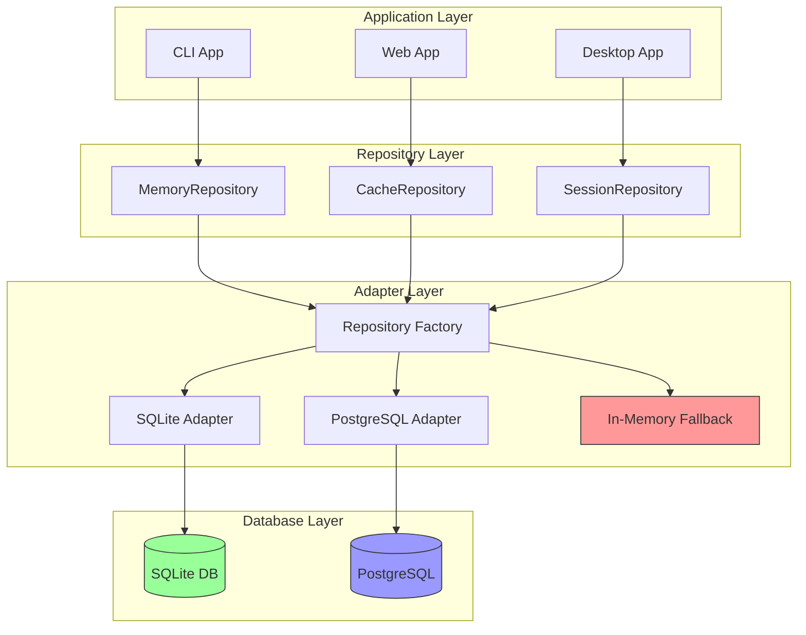

# Phase 11: Persistence Layer Implementation Plan

## Overview

This document outlines the comprehensive Phase 11 implementation plan for the Nexus project. Phase 11 adds durability to the Nexus system by implementing a persistent storage layer, transforming Nexus from a volatile in-memory-only system to one that can persist data across restarts.

**Phase 11 Goal**: Transform Nexus from "memory is volatile → system is non-durable" to "data persists across restarts → system is durable and production-ready."

**Core Principle**: Persistence is essential for production use. While the in-memory design from Phase 2 was appropriate for development and prototyping, Nexus requires a durable data layer to support production workloads, session recovery, and data analysis.

---

## Phase Overview

### Objective

Add durability to Nexus through persistent storage:

1. **Database Layer**: Implement SQLite as the primary local-first database
2. **Repository Pattern**: Abstract data access through repository interfaces
3. **Migration System**: Version-based database migrations with rollback support
4. **Data Persistence**: Memory, cache, and session data survive restarts
5. **Fallback Mechanism**: Preserve in-memory implementation as fallback

### Why Persistence Matters for Production

| Aspect | In-Memory Only | With Persistence |
|--------|----------------|------------------|
| Session Recovery | Lost on restart | Survives restarts |
| Data Analysis | None | Historical queries |
| Production Readiness | Development only | Production-ready |
| Scaling | Single instance | Multi-instance capable |
| Audit Trail | None | Full history |

### Architectural Position

Phase 11 introduces the Persistence Layer at the data tier:

```
┌─────────────────────────────────────────────────────────────┐
│                     Application Layer                        │
│  (CLI, Web, Desktop Apps)                                   │
└─────────────────────────────────────────────────────────────┘
                               │
                               ▼
┌─────────────────────────────────────────────────────────────┐
│                     Interface Layer                          │
│  (API, WebSocket, CLI Contracts)                             │
└─────────────────────────────────────────────────────────────┘
                               │
                               ▼
┌─────────────────────────────────────────────────────────────┐
│                     Cognitive Layer (Phase 10)               │
│  (Intent Parser, Strategy, Planner, Constraints)             │
└─────────────────────────────────────────────────────────────┘
                               │
                               ▼
┌─────────────────────────────────────────────────────────────┐
│                     Agent System (Phase 8)                  │
│  (Agent Engine, Planner, DAG Compiler)                       │
└─────────────────────────────────────────────────────────────┘
                               │
                               ▼
┌─────────────────────────────────────────────────────────────┐
│                     Orchestration Layer (Phase 3)           │
│  (DAG Engine, Scheduler, Parallel Executor)                │
└─────────────────────────────────────────────────────────────┘
                               │
                               ▼
┌─────────────────────────────────────────────────────────────┐
│                  Persistence Layer (NEW - Phase 11)          │
│  ┌─────────────┐  ┌─────────────┐  ┌──────────────────────┐ │
│  │ Repository  │  │   SQLite    │  │    Migration         │ │
│  │   Pattern   │  │   Adapter   │  │    System            │ │
│  └─────────────┘  └─────────────┘  └──────────────────────┘ │
│  ┌─────────────┐  ┌─────────────┐                          │
│  │   In-Memory │  │   Cache/    │                          │
│  │   Fallback  │  │   Session   │                          │
│  └─────────────┘  └─────────────┘                          │
└─────────────────────────────────────────────────────────────┘
                               │
                               ▼
┌─────────────────────────────────────────────────────────────┐
│                     Core Systems                             │
│  (Context Engine, Memory, Models, Tools, Capabilities)      │
└─────────────────────────────────────────────────────────────┘
```

---

## Current State Analysis

### What's Already in Place

| Component | Status | Location |
|-----------|--------|----------|
| Data directories | ✅ Exist (empty) | `data/` |
| Adapters directory | ✅ Exist | `data/adapters/` |
| Migrations directory | ✅ Exist | `data/migrations/` |
| Repositories directory | ✅ Exist | `data/repositories/` |
| Schemas directory | ✅ Exist | `data/schemas/` |
| Seed directory | ✅ Exist | `data/seed/` |
| Memory system | ✅ Implemented | `systems/memory/` |
| Cache system | ✅ Implemented | `systems/context/src/cache/` |

### What's Missing Entirely

| Component | Priority | Description |
|-----------|----------|-------------|
| Database layer | 🔴 Critical | SQLite or other database implementation |
| Repository interfaces | 🔴 Critical | Repository pattern contracts |
| Repository implementations | 🔴 Critical | Concrete implementations |
| Migration system | 🔴 High | Version-based migration runner |
| Schema definitions | 🔴 High | Database schema definitions |
| Seed data | 🟡 Medium | Test data for development |

### Dependencies on Previous Phases

Phase 11 depends on:

1. **Phase 1** (Core Contracts): Error types, base interfaces
2. **Phase 2** (Vertical Slice): Initial architecture decisions
3. **Phase 4** (Context Engine): Memory system, cache implementation
4. **Phase 9** (Integration Layer): Adapter pattern foundation

---

## Target Architecture

### Directory Structure

```
data/
├── index.ts                     # Barrel export for data layer
├── adapters/
│   ├── index.ts
│   ├── sqlite-adapter.ts        # SQLite database adapter
│   ├── postgres-adapter.ts     # PostgreSQL adapter (future)
│   └── types.ts                # Adapter interfaces
│
├── repositories/
│   ├── index.ts
│   ├── memory-repository.ts    # Memory persistence implementation
│   ├── cache-repository.ts     # Cache persistence implementation
│   ├── session-repository.ts   # Session persistence implementation
│   ├── interfaces.ts           # Repository contracts
│   └── factory.ts              # Repository factory
│
├── migrations/
│   ├── index.ts
│   ├── runner.ts               # Migration runner
│   ├── migration-001.ts        # Initial schema migration
│   └── types.ts                # Migration types
│
├── schemas/
│   ├── index.ts
│   ├── memory.schema.ts        # Memory table definitions
│   ├── cache.schema.ts         # Cache table definitions
│   └── session.schema.ts       # Session table definitions
│
└── seed/
    ├── index.ts
    ├── development.ts          # Development seed data
    └── production.ts          # Production seed data
```

---

## Repository Pattern Design

### Interface Definitions

```typescript
// data/repositories/interfaces.ts

// Base repository interface
export interface BaseRepository<T extends BaseEntity> {
  findById(id: string): Promise<T | null>;
  findAll(filter?: RepositoryFilter): Promise<T[]>;
  create(entity: Omit<T, 'id' | 'createdAt' | 'updatedAt'>): Promise<T>;
  update(id: string, entity: Partial<T>): Promise<T>;
  delete(id: string): Promise<boolean>;
  count(filter?: RepositoryFilter): Promise<number>;
}

export interface BaseEntity {
  id: string;
  createdAt: Date;
  updatedAt: Date;
}

export interface RepositoryFilter {
  limit?: number;
  offset?: number;
  orderBy?: string;
  orderDirection?: 'asc' | 'desc';
  where?: Record<string, unknown>;
}

// Memory Repository
export interface MemoryRepository extends BaseRepository<MemoryEntity> {
  findBySessionId(sessionId: string): Promise<MemoryEntity[]>;
  findByType(type: MemoryType): Promise<MemoryEntity[]>;
  search(query: string, limit?: number): Promise<MemoryEntity[]>;
  deleteBySessionId(sessionId: string): Promise<number>;
}

export interface MemoryEntity extends BaseEntity {
  sessionId: string;
  type: MemoryType;
  content: string;
  metadata: Record<string, unknown>;
  vector?: number[];  // For semantic search
}

// Cache Repository
export interface CacheRepository extends BaseRepository<CacheEntity> {
  get(key: string): Promise<CacheEntity | null>;
  set(key: string, value: string, ttl?: number): Promise<CacheEntity>;
  invalidate(pattern: string): Promise<number>;
  getStats(): Promise<CacheStats>;
}

export interface CacheEntity extends BaseEntity {
  key: string;
  value: string;
  ttl: number | null;
  hits: number;
}

// Session Repository
export interface SessionRepository extends BaseRepository<SessionEntity> {
  findByUserId(userId: string): Promise<SessionEntity[]>;
  findActive(): Promise<SessionEntity[]>;
  updateLastActivity(id: string): Promise<void>;
}

export interface SessionEntity extends BaseEntity {
  userId: string;
  state: Record<string, unknown>;
  metadata: Record<string, unknown>;
  expiresAt: Date | null;
  isActive: boolean;
}
```

### In-Memory Fallback Implementation

```typescript
// data/repositories/memory-repository.ts

import type { MemoryRepository, MemoryEntity } from './interfaces';
import type { MemoryType } from '../../core/contracts/memory';

export class InMemoryMemoryRepository implements MemoryRepository {
  private store: Map<string, MemoryEntity> = new Map();

  async findById(id: string): Promise<MemoryEntity | null> {
    return this.store.get(id) ?? null;
  }

  async findAll(filter?: RepositoryFilter): Promise<MemoryEntity[]> {
    const all = Array.from(this.store.values());
    return this.applyFilter(all, filter);
  }

  async create(entity: Omit<MemoryEntity, 'id' | 'createdAt' | 'updatedAt'>): Promise<MemoryEntity> {
    const now = new Date();
    const record: MemoryEntity = {
      ...entity,
      id: this.generateId(),
      createdAt: now,
      updatedAt: now
    };
    this.store.set(record.id, record);
    return record;
  }

  async findBySessionId(sessionId: string): Promise<MemoryEntity[]> {
    return Array.from(this.store.values()).filter(m => m.sessionId === sessionId);
  }

  async findByType(type: MemoryType): Promise<MemoryEntity[]> {
    return Array.from(this.store.values()).filter(m => m.type === type);
  }

  async search(query: string, limit: number = 10): Promise<MemoryEntity[]> {
    // Simple text search fallback
    const lowerQuery = query.toLowerCase();
    return Array.from(this.store.values())
      .filter(m => m.content.toLowerCase().includes(lowerQuery))
      .slice(0, limit);
  }

  private generateId(): string {
    return `mem_${Date.now()}_${Math.random().toString(36).slice(2, 9)}`;
  }

  private applyFilter(items: MemoryEntity[], filter?: RepositoryFilter): MemoryEntity[] {
    if (!filter) return items;
    let result = items;
    if (filter.where) {
      // Apply where conditions
    }
    if (filter.orderBy) {
      result = this.sortBy(result, filter.orderBy, filter.orderDirection);
    }
    if (filter.offset) {
      result = result.slice(filter.offset);
    }
    if (filter.limit) {
      result = result.slice(0, filter.limit);
    }
    return result;
  }
}
```

---

## Database Options

### SQLite (Recommended for Start)

```typescript
// data/adapters/sqlite-adapter.ts

export interface SQLiteConfig {
  filename: string;           // Database file path
  mode?: 'readonly' | 'readwrite' | 'create';
  timeout?: number;          // Lock timeout in ms
}

export interface SQLiteAdapter {
  execute(sql: string, params?: unknown[]): Promise<SQLiteResult>;
  all<T>(sql: string, params?: unknown[]): Promise<T[]>;
  get<T>(sql: string, params?: unknown[]): Promise<T | null>;
  run(sql: string, params?: unknown[]): Promise<{ changes: number; lastInsertRowid: number }>;
  transaction<T>(fn: () => Promise<T>): Promise<T>;
  close(): Promise<void>;
}

export class SQLiteAdapter implements SQLiteAdapter {
  private db: Database | null = null;

  async initialize(config: SQLiteConfig): Promise<void> {
    this.db = await open({
      filename: config.filename,
      mode: config.mode ?? 'readwrite | create',
      timeout: config.timeout ?? 5000
    });
  }

  async execute(sql: string, params?: unknown[]): Promise<SQLiteResult> {
    if (!this.db) throw new Error('Database not initialized');
    const stmt = await this.db.prepare(sql);
    const result = await stmt.all(params ?? []);
    return { rows: result, columns: stmt.columns().map(c => c.name) };
  }

  async transaction<T>(fn: () => Promise<T>): Promise<T> {
    if (!this.db) throw new Error('Database not initialized');
    return this.db.transaction(fn)();
  }

  async close(): Promise<void> {
    await this.db?.close();
    this.db = null;
  }
}
```

### PostgreSQL (Future Production)

```typescript
// data/adapters/postgres-adapter.ts (Future)

export interface PostgresConfig {
  host: string;
  port: number;
  database: string;
  user: string;
  password: string;
  ssl?: boolean;
  poolSize?: number;
}
```

### Database Strategy

| Phase | Database | Use Case |
|-------|----------|-----------|
| Phase 11.1-11.5 | SQLite | Local-first development |
| Future | PostgreSQL | Production scale |

**Strategy**: Start with SQLite for rapid development and local-first usage. Abstract the adapter layer to enable future migration to PostgreSQL without changing repository implementations.

---

## Migration System

### Migration Types

```typescript
// data/migrations/types.ts

export interface Migration {
  version: number;
  name: string;
  timestamp: Date;
  up(adapter: DatabaseAdapter): Promise<void>;
  down(adapter: DatabaseAdapter): Promise<void>;
}

export interface MigrationResult {
  success: boolean;
  applied: number;
  rolledBack: number;
  errors: MigrationError[];
}

export interface MigrationError {
  version: number;
  message: string;
  stack?: string;
}

export interface MigrationOptions {
  direction: 'up' | 'down';
  targetVersion?: number;
  dryRun?: boolean;
}
```

### Migration Runner

```typescript
// data/migrations/runner.ts

export class MigrationRunner {
  private adapter: DatabaseAdapter;
  private migrations: Migration[] = [];

  constructor(adapter: DatabaseAdapter) {
    this.adapter = adapter;
  }

  async registerMigrations(...migrations: Migration[]): Promise<void> {
    this.migrations.push(...migrations);
    this.migrations.sort((a, b) => a.version - b.version);
  }

  async run(options: MigrationOptions): Promise<MigrationResult> {
    const result: MigrationResult = {
      success: true,
      applied: 0,
      rolledBack: 0,
      errors: []
    };

    // Get current version from migrations table
    const currentVersion = await this.getCurrentVersion();

    if (options.direction === 'up') {
      result.success = await this.migrateUp(currentVersion, options.targetVersion, result);
    } else {
      result.success = await this.migrateDown(currentVersion, options.targetVersion, result);
    }

    return result;
  }

  private async migrateUp(from: number, to?: number, result: MigrationResult): Promise<boolean> {
    const target = to ?? this.migrations[this.migrations.length - 1].version;
    const pending = this.migrations.filter(m => m.version > from && m.version <= target);

    for (const migration of pending) {
      try {
        await this.adapter.transaction(async () => {
          await migration.up(this.adapter);
        });
        await this.recordMigration(migration, 'up');
        result.applied++;
      } catch (error) {
        result.errors.push({
          version: migration.version,
          message: error instanceof Error ? error.message : String(error)
        });
        return false;
      }
    }

    return true;
  }

  private async getCurrentVersion(): Promise<number> {
    const tableExists = await this.adapter.get<{ count: number }>(
      "SELECT COUNT(*) as count FROM sqlite_master WHERE type='table' AND name='migrations'"
    );

    if (!tableExists || tableExists.count === 0) {
      await this.adapter.run(`
        CREATE TABLE IF NOT EXISTS migrations (
          version INTEGER PRIMARY KEY,
          name TEXT NOT NULL,
          timestamp TEXT NOT NULL,
          direction TEXT NOT NULL
        )
      `);
      return 0;
    }

    const row = await this.adapter.get<{ version: number }>(
      'SELECT MAX(version) as version FROM migrations WHERE direction = ?',
      ['up']
    );

    return row?.version ?? 0;
  }
}
```

### Migration: 001_Initial Schema

```typescript
// data/migrations/migration-001.ts

export const migration001: Migration = {
  version: 1,
  name: 'initial_schema',
  timestamp: new Date('2026-01-01T00:00:00Z'),

  async up(adapter: DatabaseAdapter): Promise<void> {
    // Memory table
    await adapter.run(`
      CREATE TABLE IF NOT EXISTS memory (
        id TEXT PRIMARY KEY,
        session_id TEXT NOT NULL,
        type TEXT NOT NULL,
        content TEXT NOT NULL,
        metadata TEXT NOT NULL,
        vector BLOB,
        created_at TEXT NOT NULL,
        updated_at TEXT NOT NULL
      )
    `);

    await adapter.run('CREATE INDEX IF NOT EXISTS idx_memory_session ON memory(session_id)');
    await adapter.run('CREATE INDEX IF NOT EXISTS idx_memory_type ON memory(type)');

    // Cache table
    await adapter.run(`
      CREATE TABLE IF NOT EXISTS cache (
        id TEXT PRIMARY KEY,
        key TEXT NOT NULL UNIQUE,
        value TEXT NOT NULL,
        ttl INTEGER,
        hits INTEGER DEFAULT 0,
        created_at TEXT NOT NULL,
        updated_at TEXT NOT NULL
      )
    `);

    await adapter.run('CREATE UNIQUE INDEX IF NOT EXISTS idx_cache_key ON cache(key)');

    // Session table
    await adapter.run(`
      CREATE TABLE IF NOT EXISTS session (
        id TEXT PRIMARY KEY,
        user_id TEXT NOT NULL,
        state TEXT NOT NULL,
        metadata TEXT NOT NULL,
        expires_at TEXT,
        is_active INTEGER DEFAULT 1,
        created_at TEXT NOT NULL,
        updated_at TEXT NOT NULL
      )
    `);

    await adapter.run('CREATE INDEX IF NOT EXISTS idx_session_user ON session(user_id)');
    await adapter.run('CREATE INDEX IF NOT EXISTS idx_session_active ON session(is_active)');
  },

  async down(adapter: DatabaseAdapter): Promise<void> {
    await adapter.run('DROP TABLE IF EXISTS memory');
    await adapter.run('DROP TABLE IF EXISTS cache');
    await adapter.run('DROP TABLE IF EXISTS session');
  }
};
```

---

## Implementation Phases

### Phase 11.1: Repository Interfaces + SQLite Adapter

**Goal**: Establish the foundation - interfaces and database adapter.

**Files to Create**:
```
data/adapters/
├── index.ts
├── sqlite-adapter.ts
└── types.ts

data/repositories/
├── index.ts
└── interfaces.ts
```

**Milestone**: SQLite adapter connects and executes queries; repository interfaces defined.

### Phase 11.2: MemoryRepository Implementation

**Goal**: Implement memory persistence with SQLite.

**Files to Create**:
```
data/repositories/
├── memory-repository.ts
└── __tests__/
    └── memory-repository.test.ts

data/schemas/
├── index.ts
└── memory.schema.ts
```

**Milestone**: `MemoryRepository` stores and retrieves memory entries from SQLite.

### Phase 11.3: Cache/Session Repositories

**Goal**: Implement cache and session persistence.

**Files to Create**:
```
data/repositories/
├── cache-repository.ts
├── session-repository.ts
├── factory.ts
└── __tests__/
    ├── cache-repository.test.ts
    └── session-repository.test.ts

data/schemas/
├── cache.schema.ts
└── session.schema.ts
```

**Milestone**: Cache and session repositories fully functional.

### Phase 11.4: Migration System

**Goal**: Implement version-based migration system.

**Files to Create**:
```
data/migrations/
├── index.ts
├── runner.ts
├── migration-001.ts
├── migration-002.ts (if needed)
└── types.ts
```

**Milestone**: `MigrationRunner` executes up/down migrations successfully.

### Phase 11.5: Seed Data + Testing

**Goal**: Populate test data and comprehensive testing.

**Files to Create**:
```
data/seed/
├── index.ts
├── development.ts
└── production.ts
```

**Milestone**: Seed data populates database; tests verify persistence.

### Phase 11.6: Fallback to In-Memory

**Goal**: Preserve in-memory implementations as fallback when database unavailable.

**Files to Modify**:
```
data/repositories/
├── memory-repository.ts (add in-memory implementation)
├── cache-repository.ts (add in-memory implementation)
└── factory.ts (add fallback logic)
```

**Milestone**: System works with in-memory fallback when SQLite unavailable.

---

## Data Consistency

### Transaction Support

```typescript
// Transaction interface for repositories

export interface Transaction {
  commit(): Promise<void>;
  rollback(): Promise<void>;
}

export interface TransactionalRepository<T> extends BaseRepository<T> {
  withTransaction(fn: (repo: TransactionalRepository<T>) => Promise<void>): Promise<void>;
}
```

### Error Recovery

```typescript
// Recovery strategies

export interface RecoveryConfig {
  maxRetries: number;
  backoffMs: number;
  onFailure: 'throw' | 'fallback' | 'log';
}

export class RepositoryError extends Error {
  constructor(
    message: string,
    public readonly code: 'CONNECTION' | 'QUERY' | 'TRANSACTION' | 'MIGRATION',
    public readonly recoverable: boolean
  ) {
    super(message);
    this.name = 'RepositoryError';
  }
}
```

### Backup/Restore Mechanisms

```typescript
// Backup interface

export interface BackupService {
  createBackup(destination: string): Promise<BackupResult>;
  restoreBackup(source: string): Promise<RestoreResult>;
  listBackups(): Promise<BackupInfo[]>;
}

export interface BackupResult {
  success: boolean;
  path: string;
  size: number;
  timestamp: Date;
}
```

---

## Performance Considerations

### Connection Pooling

```typescript
// Connection pool for SQLite

export interface ConnectionPoolConfig {
  minConnections: number;
  maxConnections: number;
  idleTimeoutMs: number;
}

export class SQLiteConnectionPool {
  private pool: SQLiteAdapter[] = [];
  private available: SQLiteAdapter[] = [];

  async acquire(): Promise<SQLiteAdapter> {
    if (this.available.length > 0) {
      return this.available.pop()!;
    }
    if (this.pool.length < this.config.maxConnections) {
      const conn = await this.createConnection();
      this.pool.push(conn);
      return conn;
    }
    // Wait for available connection
    return this.waitForConnection();
  }

  release(conn: SQLiteAdapter): void {
    this.available.push(conn);
  }
}
```

### Query Optimization

| Strategy | Implementation |
|----------|-----------------|
| Indexing | Create indexes on frequently queried columns |
| Batching | Batch inserts for bulk operations |
| Caching | Cache frequently accessed data |
| Pagination | Use LIMIT/OFFSET for large datasets |

### Caching Strategies with Persistence

```typescript
// Two-tier caching: memory cache + persistent storage

export class CachedRepository<T> {
  private memoryCache: Map<string, { data: T; expiresAt: number }> = new Map();
  private repository: Repository<T>;

  async findById(id: string): Promise<T | null> {
    const cached = this.memoryCache.get(id);
    if (cached && cached.expiresAt > Date.now()) {
      return cached.data;
    }
    const result = await this.repository.findById(id);
    if (result) {
      this.memoryCache.set(id, { data: result, expiresAt: Date.now() + 60000 });
    }
    return result;
  }
}
```

---

## Mermaid: Persistence Architecture



---

## Success Criteria

### Phase 11 Complete When:

- [ ] SQLite adapter connects and executes queries
- [ ] Repository interfaces defined and implemented
- [ ] MemoryRepository persists memory entries to SQLite
- [ ] CacheRepository persists cache entries to SQLite
- [ ] SessionRepository persists session data to SQLite
- [ ] Migration system runs up/down migrations successfully
- [ ] Seed data populates database for testing
- [ ] In-memory fallback works when SQLite unavailable
- [ ] Data persists across application restarts
- [ ] TypeScript compiles without errors
- [ ] Unit tests pass for all repository implementations
- [ ] Integration tests verify end-to-end persistence

### Validation Commands

```bash
# TypeScript check
npm run typecheck

# Build all packages
npm run build

# Run data layer tests
npm test -- data/

# Run repository tests
npm test -- --grep "repository"

# Verify database initialization
cd apps/cli && npm run start -- status

# Check migration status
npm run migrations:status

# Seed development data
npm run seed:dev
```

---

## Constraints & Exclusions

### In Scope (Phase 11)

- SQLite adapter implementation
- Repository interfaces and implementations
- Migration system with up/down support
- Seed data for development/testing
- In-memory fallback mechanism
- Basic backup/restore utilities

### Out of Scope (Future Phases)

| Feature | Phase | Reason |
|---------|-------|--------|
| PostgreSQL migration | Phase 12+ | Production scaling |
| Distributed transactions | Phase 12+ | Multi-instance support |
| Real-time replication | Phase 12+ | High availability |
| Advanced backup strategies | Phase 12+ | Enterprise features |

---

## Risk Mitigation

| Risk | Mitigation |
|------|------------|
| Database file corruption | Implement backup before migrations |
| Migration failures | Dry-run validation before execution |
| Performance degradation | Connection pooling, query optimization |
| Data loss | Transaction safety, rollback support |
| Adapter coupling | Abstract interface for future databases |

---

## Notes

1. **Contract-First**: All repository implementations must follow interfaces in `data/repositories/interfaces.ts`
2. **DAG-First**: Persistence does not bypass orchestration - data flows through defined layers
3. **Deterministic**: Same operations produce same results (for replayability)
4. **Validated**: All data operations validated before execution
5. **Observable**: Database operations emit events for debugging/monitoring
6. **Graceful Degradation**: In-memory fallback ensures system works without database

---

## Dependencies Summary

| Phase | Dependency | Purpose |
|-------|------------|---------|
| Phase 1 | Core Contracts | Error types, base interfaces |
| Phase 2 | Vertical Slice | Architecture foundation |
| Phase 4 | Context Engine | Memory system foundation |
| Phase 9 | Integration Layer | Adapter pattern foundation |
| Phase 10 | Cognitive Layer | Planning before persistence |

---

**Last Updated**: 2026-03-25
**Phase Status**: 📋 Ready for Implementation