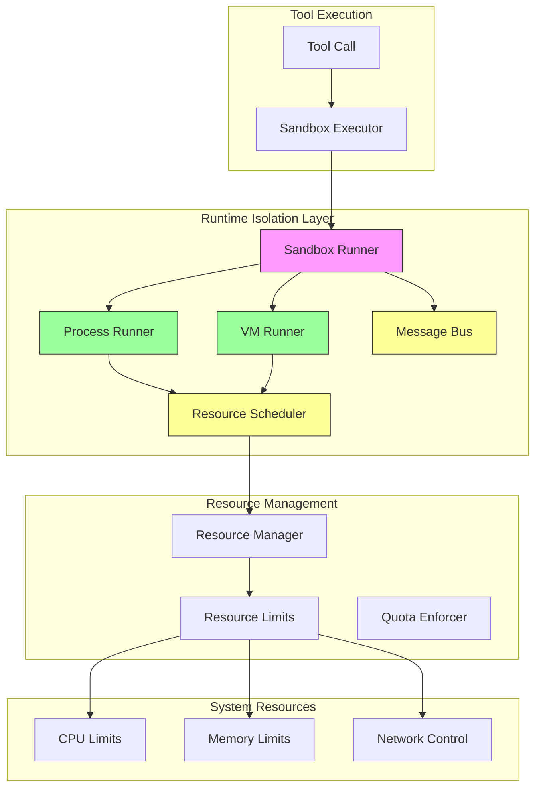

# Phase 12: Runtime Isolation Implementation Plan

## Overview

This document outlines the comprehensive Phase 12 implementation plan for the Nexus project. Phase 12 adds critical security infrastructure by implementing runtime isolation through sandboxing, enabling safe execution of untrusted code, third-party tools, and supporting multi-tenant environments in production.

**Phase 12 Goal**: Transform Nexus from a system with execution vulnerability to a secure-by-design platform where all code execution happens within isolated boundaries, preventing privilege escalation, resource exhaustion, and sandbox escape.

**Core Principle**: Runtime isolation is non-negotiable for production deployment. Without sandboxing, Nexus cannot safely execute untrusted tools, third-party integrations, or support multi-tenant workloads. Phase 12 establishes the security perimeter that makes Nexus production-ready.

---

## Phase Overview

### Objective

Create security boundary with sandboxing for:

1. **Process Isolation**: Execute tools in separate OS processes with restricted privileges
2. **VM Sandboxing**: Isolate JavaScript/code execution within VM contexts
3. **Resource Limits**: Enforce CPU, memory, and time boundaries on all executions
4. **IPC Security**: Safe inter-process communication with message validation
5. **Syscall Restrictions**: Limit system calls to prevent privilege escalation

### Why Runtime Isolation Matters for Production

| Aspect | Without Isolation | With Isolation |
|--------|-------------------|---------------|
| Untrusted Tools | Full system access | Restricted sandbox |
| Multi-Tenant | Tenant data leak risk | Complete isolation |
| Resource Exhaustion | System crash possible | Hard limits enforced |
| Exploit Escalation | Full compromise | Containment at sandbox |
| Compliance | Fails security audits | Meets security standards |

### Architectural Position

Phase 12 introduces the Runtime Layer between the Tool System and the Orchestration Layer:

```
┌─────────────────────────────────────────────────────────────┐
│                     Application Layer                        │
│  (CLI, Web, Desktop Apps)                                   │
└─────────────────────────────────────────────────────────────┘
                                │
                                ▼
┌─────────────────────────────────────────────────────────────┐
│                     Interface Layer                          │
│  (API, WebSocket, CLI Contracts)                             │
└─────────────────────────────────────────────────────────────┘
                                │
                                ▼
┌─────────────────────────────────────────────────────────────┐
│                     Cognitive Layer (Phase 10)               │
│  (Intent Parser, Strategy, Planner, Constraints)             │
└─────────────────────────────────────────────────────────────┘
                                │
                                ▼
┌─────────────────────────────────────────────────────────────┐
│                     Agent System (Phase 8)                   │
│  (Agent Engine, Planner, DAG Compiler)                       │
└─────────────────────────────────────────────────────────────┘
                                │
                                ▼
┌─────────────────────────────────────────────────────────────┐
│               Runtime Layer (NEW - Phase 12)                 │
│  ┌─────────────┐  ┌─────────────┐  ┌──────────────────────┐ │
│  │  Sandbox   │  │     IPC     │  │     Scheduler        │ │
│  │  Runner    │  │  Message    │  │    (Resource)        │ │
│  │            │  │    Bus      │  │                      │ │
│  └─────────────┘  └─────────────┘  └──────────────────────┘ │
│  ┌─────────────┐  ┌─────────────┐                          │
│  │  Process    │  │    State    │                          │
│  │  Manager   │  │  Isolation  │                          │
│  └─────────────┘  └─────────────┘                          │
└─────────────────────────────────────────────────────────────┘
                                │
                                ▼
┌─────────────────────────────────────────────────────────────┐
│                     Orchestration Layer (Phase 3)            │
│  (DAG Engine, Scheduler, Parallel Executor)                  │
└─────────────────────────────────────────────────────────────┘
                                │
                                ▼
┌─────────────────────────────────────────────────────────────┐
│                     Core Systems                             │
│  (Context Engine, Memory, Models, Tools, Capabilities)        │
└─────────────────────────────────────────────────────────────┘
```

---

## Current State Analysis

### What's Already in Place

| Component | Status | Location |
|-----------|--------|----------|
| Runtime directories | ✅ Exist (empty) | `runtime/` |
| IPC directory | ✅ Exist | `runtime/ipc/` |
| Process directory | ✅ Exist | `runtime/process/` |
| Sandbox directory | ✅ Exist | `runtime/sandbox/` |
| Scheduler directory | ✅ Exist | `runtime/scheduler/` |
| State directory | ✅ Exist | `runtime/state/` |
| Tool system | ✅ Implemented | `modules/tools/` |
| Policy system | ✅ Implemented | `modules/tools/runtime/policy.ts` |
| Executor | ✅ Implemented | `modules/tools/runtime/executor.ts` |

### What's Missing Entirely

| Component | Priority | Description |
|-----------|----------|-------------|
| Sandbox framework | 🔴 Critical | Core sandbox abstraction and interfaces |
| Process runner | 🔴 Critical | Execute tools in isolated processes |
| VM runner | 🔴 Critical | Execute JavaScript in VM contexts |
| IPC message bus | 🔴 High | Inter-process communication |
| Resource limiting | 🔴 High | CPU, memory, time enforcement |
| Syscall restrictions | 🔴 High | System call allowlisting |
| State isolation | 🟡 Medium | Tenant state separation |

### Dependencies on Previous Phases

Phase 12 depends on:

1. **Phase 1** (Core Contracts): Error types, base interfaces, event types
2. **Phase 3** (Graph Execution): DAG infrastructure, parallel execution
3. **Phase 5** (Capability Fabric): Tool registry, policy system
4. **Phase 8** (Agent Execution): ExecutionPlan, agent execution
5. **Phase 11** (Persistence): Repository pattern, transaction support

---

## Isolation Options Analysis

### Option Comparison

| Technology | Isolation Level | Performance | Complexity | Use Case |
|------------|-----------------|-------------|------------|----------|
| **child_process** | Low (OS-level) | High | Low | Simple tool execution |
| **VM2** | Medium (VM-level) | Medium | Medium | JavaScript isolation |
| **QuickJS** | Medium-High | Medium | Medium | Lightweight JS VM |
| **Docker/Containers** | High (Strongest) | Lower | High | Full isolation |
| **WebAssembly** | High | High | High | Sandboxed code |

### Recommendation

**Phase 12 Strategy**: Start with process isolation + strict resource limits, with VM runner for JavaScript code execution. Containerized execution remains future work.

```
Current (Phase 12):  Process Isolation + VM Runner
        │
        ▼
Future (Phase 13+):  Containerized Execution (Docker)
```

**Rationale**:
- Process isolation provides immediate security improvement
- VM runner isolates JavaScript code execution
- Container model requires significant infrastructure (Phase 13+)
- This approach delivers security value early while preparing for containers

---

## Sandbox Architecture

### Core Components

```typescript
// runtime/sandbox/types.ts

// Sandbox configuration
export interface SandboxConfig {
  type: SandboxType;
  timeoutMs: number;
  memoryLimitMb: number;
  cpuLimitPercent: number;
  networkAccess: boolean;
  allowedSyscalls?: string[];
  prohibitedSyscalls?: string[];
  environment?: Record<string, string>;
}

export enum SandboxType {
  PROCESS = 'process',
  VM = 'vm',
  CONTAINER = 'container'
}

// Resource limits
export interface ResourceLimits {
  maxMemoryMb: number;
  maxCpuPercent: number;
  maxTimeoutMs: number;
  maxFileSizeMb: number;
  maxOpenFiles: number;
  maxNetworkConnections: number;
}

// Execution result
export interface SandboxResult {
  success: boolean;
  output?: unknown;
  error?: SandboxError;
  metrics: SandboxMetrics;
  exitCode?: number;
}

export interface SandboxMetrics {
  executionTimeMs: number;
  memoryUsedMb: number;
  cpuTimeMs: number;
  networkBytesIn: number;
  networkBytesOut: number;
}

export interface SandboxError {
  code: SandboxErrorCode;
  message: string;
  details?: unknown;
}

export enum SandboxErrorCode {
  TIMEOUT = 'timeout',
  MEMORY_LIMIT = 'memory_limit',
  CPU_LIMIT = 'cpu_limit',
  SYSCALL_DENIED = 'syscall_denied',
  NETWORK_DENIED = 'network_denied',
  ESCAPE_DETECTED = 'escape_detected',
  INVALID_INPUT = 'invalid_input',
  PROCESS_CRASHED = 'process_crashed'
}
```

### Process Runner

```typescript
// runtime/sandbox/process-runner.ts

import { spawn, ChildProcess } from 'child_process';
import { EventEmitter } from 'events';

export interface ProcessRunnerConfig {
  command: string;
  args?: string[];
  cwd?: string;
  env?: Record<string, string>;
  timeoutMs: number;
  memoryLimitMb: number;
  cpuLimitPercent: number;
  stdio: 'pipe' | 'inherit' | 'ignore';
}

export class ProcessRunner extends EventEmitter {
  private processes: Map<string, ChildProcess> = new Map();
  private resourceMonitor: ResourceMonitor;

  async execute(
    code: string,
    config: ProcessRunnerConfig
  ): Promise<SandboxResult> {
    const executionId = this.generateId();

    // Create subprocess with restrictions
    const child = await this.createRestrictedProcess(code, config, executionId);

    // Set up resource monitoring
    const monitor = this.resourceMonitor.start(executionId, child.pid!, {
      memoryLimitMb: config.memoryLimitMb,
      cpuLimitPercent: config.cpuLimitPercent,
      timeoutMs: config.timeoutMs
    });

    // Execute with timeout
    const result = await this.executeWithTimeout(child, config.timeoutMs);

    // Clean up
    this.resourceMonitor.stop(executionId);
    this.processes.delete(executionId);

    return this.buildResult(result, monitor);
  }

  private async createRestrictedProcess(
    code: string,
    config: ProcessRunnerConfig,
    executionId: string
  ): Promise<ChildProcess> {
    // Spawn isolated process
    const child = spawn(config.command, config.args ?? [], {
      cwd: config.cwd,
      env: this.sanitizeEnvironment(config.env),
      stdio: config.stdio,
      // Critical: run with minimal privileges
      uid: undefined, // Would be set in container mode
      gid: undefined,
      // Disable shell for security
      shell: false,
      // Prevent parent inheritance
      detached: false
    });

    this.processes.set(executionId, child);
    return child;
  }

  private sanitizeEnvironment(env?: Record<string, string>): Record<string, string> {
    // Remove sensitive variables
    const sanitized = { ...env };
    const sensitiveVars = ['PATH', 'NODE_OPTIONS', 'ELECTRON_RUN_AS_NODE'];
    
    for (const key of sensitiveVars) {
      // Warn but don't remove - could break execution
      console.warn(`Environment variable ${key} passed to sandbox`);
    }

    // Add sandbox marker
    sanitized['NEXUS_SANDBOX'] = '1';
    
    return sanitized;
  }

  async terminate(executionId: string): Promise<void> {
    const child = this.processes.get(executionId);
    if (child) {
      child.kill('SIGKILL');
      this.processes.delete(executionId);
    }
  }
}
```

### VM Runner

```typescript
// runtime/sandbox/vm-runner.ts

import { VM } from 'vm2';

export interface VMRunnerConfig {
  timeoutMs: number;
  memoryLimitMb: number;
  sandbox?: boolean;
  eval?: boolean;
  fixAsync?: boolean;
  sources?: Record<string, string>;
}

export class VMRunner {
  private activeVMs: Map<string, VM> = new Map();

  async execute(
    code: string,
    config: VMRunnerConfig
  ): Promise<SandboxResult> {
    const executionId = this.generateId();
    const startTime = Date.now();

    try {
      // Create VM with restrictions
      const vm = this.createRestrictedVM(config, executionId);

      // Run code with timeout
      const output = await this.runWithTimeout(vm, code, config.timeoutMs);

      return {
        success: true,
        output,
        metrics: {
          executionTimeMs: Date.now() - startTime,
          memoryUsedMb: 0, // VM2 doesn't expose this reliably
          cpuTimeMs: 0,
          networkBytesIn: 0,
          networkBytesOut: 0
        }
      };
    } catch (error) {
      return this.handleError(error, startTime);
    } finally {
      this.activeVMs.delete(executionId);
    }
  }

  private createRestrictedVM(config: VMRunnerConfig, executionId: string): VM {
    const vm = new VM({
      timeout: config.timeoutMs,
      sandbox: {
        // Restricted globals
        console: this.createRestrictedConsole(),
        setTimeout: undefined,
        setInterval: undefined,
        setImmediate: undefined,
        process: undefined,
        require: undefined,
        // Allow minimal API
        Math,
        JSON,
        Date,
        Array,
        Object,
        String,
        Number,
        Boolean,
        RegExp,
        Map,
        Set,
        Promise,
        Error
      },
      eval: config.eval ?? false,
      fixAsync: config.fixAsync ?? true,
      sources: config.sources ?? {}
    });

    this.activeVMs.set(executionId, vm);
    return vm;
  }

  private createRestrictedConsole(): RestrictedConsole {
    return {
      log: (...args: unknown[]) => this.log('log', args),
      info: (...args: unknown[]) => this.log('info', args),
      warn: (...args: unknown[]) => this.log('warn', args),
      error: (...args: unknown[]) => this.log('error', args),
      debug: (...args: unknown[]) => this.log('debug', args)
    };
  }

  private log(level: string, args: unknown[]): void {
    // Buffer logs for later retrieval
    // In production, could forward to logging system
  }
}
```

---

## IPC Design

### Message Bus Architecture

```typescript
// runtime/ipc/types.ts

// IPC Message
export interface IPCMessage {
  id: string;
  type: IPCMessageType;
  source: string;
  target: string;
  payload: unknown;
  timestamp: Date;
  correlationId?: string;
  traceId?: string;
}

export enum IPCMessageType {
  REQUEST = 'request',
  RESPONSE = 'response',
  EVENT = 'event',
  ERROR = 'error',
  HEARTBEAT = 'heartbeat'
}

// IPC Channel
export interface IPCChannel {
  name: string;
  participants: Set<string>;
  messageHandler: (message: IPCMessage) => Promise<void>;
  onConnect?: (clientId: string) => void;
  onDisconnect?: (clientId: string) => void;
}

// Message validation
export interface IPCValidator {
  validateMessage(message: IPCMessage): ValidationResult;
  sanitizePayload(payload: unknown): unknown;
  checkPermissions(source: string, target: string, action: string): boolean;
}

export interface ValidationResult {
  valid: boolean;
  errors?: ValidationError[];
}

export interface ValidationError {
  field: string;
  message: string;
  code: string;
}
```

### Message Bus Implementation

```typescript
// runtime/ipc/message-bus.ts

import { EventEmitter } from 'events';

export class MessageBus extends EventEmitter {
  private channels: Map<string, IPCChannel> = new Map();
  private clients: Map<string, Set<string>> = new Map();
  private messageQueue: Map<string, IPCMessage[]> = new Map();
  private validator: IPCValidator;

  async publish(channel: string, message: IPCMessage): Promise<void> {
    // Validate message
    const validation = this.validator.validateMessage(message);
    if (!validation.valid) {
      throw new IPCValidationError(validation.errors);
    }

    // Sanitize payload
    const sanitized = this.validator.sanitizePayload(message.payload);

    // Get channel
    const ipcChannel = this.channels.get(channel);
    if (!ipcChannel) {
      throw new IPCChannelError(`Channel ${channel} not found`);
    }

    // Check permissions
    if (!this.validator.checkPermissions(
      message.source,
      message.target,
      'publish'
    )) {
      throw new IPCPermissionError('Insufficient permissions');
    }

    // Broadcast to all participants except source
    const participants = ipcChannel.participants;
    for (const participant of participants) {
      if (participant !== message.source) {
        await this.sendToClient(participant, {
          ...message,
          payload: sanitized
        });
      }
    }

    this.emit('message:published', { channel, message });
  }

  async sendToClient(clientId: string, message: IPCMessage): Promise<void> {
    // Queue message if client not connected
    if (!this.isClientConnected(clientId)) {
      const queue = this.messageQueue.get(clientId) ?? [];
      queue.push(message);
      this.messageQueue.set(clientId, queue);
      return;
    }

    // Send message (implementation depends on transport)
    this.emit('message:send', { clientId, message });
  }

  subscribe(channel: string, clientId: string): void {
    const channelObj = this.channels.get(channel);
    if (!channelObj) {
      throw new IPCChannelError(`Channel ${channel} not found`);
    }

    channelObj.participants.add(clientId);
    
    // Deliver queued messages
    const queue = this.messageQueue.get(clientId) ?? [];
    for (const message of queue) {
      this.sendToClient(clientId, message);
    }
    this.messageQueue.delete(clientId);

    this.emit('client:subscribed', { channel, clientId });
  }

  unsubscribe(channel: string, clientId: string): void {
    const channelObj = this.channels.get(channel);
    if (channelObj) {
      channelObj.participants.delete(clientId);
    }
    this.emit('client:unsubscribed', { channel, clientId });
  }

  private isClientConnected(clientId: string): boolean {
    return this.clients.has(clientId);
  }
}
```

---

## Resource Scheduling

### Resource Manager

```typescript
// runtime/scheduler/resource-manager.ts

export interface ResourcePool {
  name: string;
  totalMemoryMb: number;
  totalCpuPercent: number;
  availableMemoryMb: number;
  availableCpuPercent: number;
  allocations: ResourceAllocation[];
}

export interface ResourceAllocation {
  id: string;
  sandboxId: string;
  memoryMb: number;
  cpuPercent: number;
  priority: number;
  expiresAt?: Date;
}

export class ResourceScheduler {
  private pools: Map<string, ResourcePool> = new Map();
  private defaultPool: ResourcePool;

  constructor(config: SchedulerConfig) {
    this.defaultPool = this.createPool('default', {
      totalMemoryMb: config.defaultMemoryMb,
      totalCpuPercent: config.defaultCpuPercent
    });
  }

  async allocate(
    request: ResourceRequest
  ): Promise<ResourceAllocation> {
    const pool = this.pools.get(request.poolName) ?? this.defaultPool;

    // Check capacity
    if (request.memoryMb > pool.availableMemoryMb) {
      throw new ResourceError('Insufficient memory', 'MEMORY');
    }
    if (request.cpuPercent > pool.availableCpuPercent) {
      throw new ResourceError('Insufficient CPU', 'CPU');
    }

    // Create allocation
    const allocation: ResourceAllocation = {
      id: this.generateId(),
      sandboxId: request.sandboxId,
      memoryMb: request.memoryMb,
      cpuPercent: request.cpuPercent,
      priority: request.priority,
      expiresAt: request.timeoutMs 
        ? new Date(Date.now() + request.timeoutMs)
        : undefined
    };

    // Update pool
    pool.allocations.push(allocation);
    pool.availableMemoryMb -= request.memoryMb;
    pool.availableCpuPercent -= request.cpuPercent;

    return allocation;
  }

  release(allocationId: string, poolName: string): void {
    const pool = this.pools.get(poolName) ?? this.defaultPool;
    const index = pool.allocations.findIndex(a => a.id === allocationId);
    
    if (index >= 0) {
      const allocation = pool.allocations[index];
      pool.availableMemoryMb += allocation.memoryMb;
      pool.availableCpuPercent += allocation.cpuPercent;
      pool.allocations.splice(index, 1);
    }
  }

  private createPool(name: string, config: PoolConfig): ResourcePool {
    const pool: ResourcePool = {
      name,
      totalMemoryMb: config.totalMemoryMb,
      totalCpuPercent: config.totalCpuPercent,
      availableMemoryMb: config.totalMemoryMb,
      availableCpuPercent: config.totalCpuPercent,
      allocations: []
    };
    this.pools.set(name, pool);
    return pool;
  }
}
```

---

## State Management with Isolation

### Tenant Isolation

```typescript
// runtime/state/tenant-manager.ts

export interface Tenant {
  id: string;
  name: string;
  resourceLimits: ResourceLimits;
  allowedCapabilities: string[];
  state: TenantState;
}

export interface TenantState {
  data: Map<string, unknown>;
  sandboxIds: Set<string>;
}

export class TenantManager {
  private tenants: Map<string, Tenant> = new Map();
  private currentTenant: Tenant | null = null;

  async createTenant(config: TenantConfig): Promise<Tenant> {
    const tenant: Tenant = {
      id: this.generateId(),
      name: config.name,
      resourceLimits: config.resourceLimits,
      allowedCapabilities: config.allowedCapabilities,
      state: {
        data: new Map(),
        sandboxIds: new Set()
      }
    };

    this.tenants.set(tenant.id, tenant);
    return tenant;
  }

  async switchTenant(tenantId: string): Promise<void> {
    const tenant = this.tenants.get(tenantId);
    if (!tenant) {
      throw new TenantError(`Tenant ${tenantId} not found`);
    }
    this.currentTenant = tenant;
  }

  getCurrentTenant(): Tenant | null {
    return this.currentTenant;
  }

  isolateState(tenantId: string, key: string): unknown | null {
    const tenant = this.tenants.get(tenantId);
    return tenant?.state.data.get(key) ?? null;
  }
}
```

---

## Implementation Phases

### Phase 12.1: Sandbox Framework

**Goal**: Establish core sandbox interfaces and base classes.

**Files to Create**:
```
runtime/sandbox/
├── index.ts
├── types.ts                      # Sandbox types and interfaces
├── sandbox.ts                    # Base sandbox abstraction
├── errors.ts                     # Sandbox error types
└── __tests__/
    ├── sandbox.test.ts
    └── types.test.ts
```

**Milestone**: `Sandbox` base class defined with `execute()` method signature.

### Phase 12.2: Process Runner

**Goal**: Implement tool execution in isolated processes.

**Files to Create**:
```
runtime/sandbox/
├── process-runner.ts             # Process-based sandbox
├── resource-monitor.ts           # Monitor process resources
├── syscall-filter.ts             # Filter system calls
└── __tests__/
    ├── process-runner.test.ts
    └── resource-monitor.test.ts
```

**Milestone**: `ProcessRunner.execute()` runs tool in subprocess with resource limits.

### Phase 12.3: IPC Message Bus

**Goal**: Implement inter-process communication.

**Files to Create**:
```
runtime/ipc/
├── index.ts
├── types.ts                      # IPC types
├── message-bus.ts                # Message bus implementation
├── validator.ts                  # Message validation
├── channels/                     # Built-in channels
│   ├── index.ts
│   ├── tool-channel.ts
│   └── system-channel.ts
└── __tests__/
    ├── message-bus.test.ts
    └── validator.test.ts
```

**Milestone**: `MessageBus` publishes/subscribes messages between processes.

### Phase 12.4: Resource Limiting

**Goal**: Enforce CPU, memory, and time limits.

**Files to Create**:
```
runtime/scheduler/
├── index.ts
├── resource-manager.ts            # Resource pool management
├── quota-enforcer.ts              # Enforce quotas
├── types.ts                       # Scheduler types
└── __tests__/
    ├── resource-manager.test.ts
    └── quota-enforcer.test.ts
```

**Milestone**: `ResourceScheduler` allocates/releases resources with hard limits.

### Phase 12.5: Tool Execution in Sandbox

**Goal**: Integrate sandbox with tool execution system.

**Files to Modify**:
```
modules/tools/runtime/
├── executor.ts (modify for sandbox)
├── sandboxed-executor.ts         # New: sandbox wrapper
└── __tests__/
    └── sandboxed-executor.test.ts
```

**Milestone**: All tool executions run through sandbox with resource limits.

### Phase 12.6: Containerized Execution (Optional/Future)

**Goal**: Docker-based full isolation.

**Files to Create** (Future):
```
runtime/sandbox/
├── container-runner.ts           # Docker-based sandbox
├── dockerfile-generator.ts       # Generate container configs
└── __tests__/
    └── container-runner.test.ts
```

**Milestone**: Optional - requires Docker infrastructure.

---

## Mermaid: Runtime Isolation Architecture



---

## Security Considerations

### Threat Model

| Threat | Mitigation | Priority |
|--------|------------|----------|
| **Arbitrary Code Execution** | Sandbox required for all execution | 🔴 Critical |
| **Privilege Escalation** | Minimal process privileges, syscall filtering | 🔴 Critical |
| **Resource Exhaustion** | Hard limits on CPU, memory, time | 🔴 High |
| **Sandbox Escape** | Multiple isolation layers | 🔴 Critical |
| **Data Exfiltration** | Network restrictions, output validation | 🔴 High |
| **Denial of Service** | Rate limiting, timeout enforcement | 🔴 High |

### Security Best Practices

```typescript
// Security checklist for sandbox execution

interface SecurityChecklist {
  // Process isolation
  noShell: boolean;
  noParentInheritance: boolean;
  sanitizedEnvironment: boolean;
  minimalUID: boolean;
  
  // Resource limits
  memoryLimitSet: boolean;
  cpuLimitSet: boolean;
  timeoutSet: boolean;
  fileSizeLimitSet: boolean;
  
  // Network
  networkDisabled: boolean;
  dnsRestricted: boolean;
  
  // Syscalls
  syscallAllowlist: boolean;
  prohibitedSyscalls: string[];
  
  // Input validation
  inputSanitized: boolean;
  payloadValidated: boolean;
}

// Enforce security checklist
function validateSandboxConfig(config: SandboxConfig): SecurityChecklist {
  const checklist: SecurityChecklist = {
    noShell: config.shell === false,
    noParentInheritance: config.detached === false,
    sanitizedEnvironment: true,
    minimalUID: config.uid !== undefined,
    memoryLimitSet: config.memoryLimitMb > 0,
    cpuLimitSet: config.cpuLimitPercent > 0,
    timeoutSet: config.timeoutMs > 0,
    fileSizeLimitSet: true,
    networkDisabled: !config.networkAccess,
    dnsRestricted: true,
    syscallAllowlist: config.allowedSyscalls?.length > 0,
    prohibitedSyscalls: ['exec', 'fork', 'spawn'],
    inputSanitized: true,
    payloadValidated: true
  };
  
  return checklist;
}
```

### Escape Prevention

```typescript
// Detect and block escape attempts

class EscapeDetector {
  private escapePatterns = [
    /process\.mainModule/,
    /process\.versions\.node/,
    /require\s*\(\s*['"]child_process/,
    /__proto__/,
    /constructor\.prototype/,
    /eval\s*\(/,
    /Function\s*\(/,
    /\.\s*constructor\s*\(\s*['"]/,
    // Add more patterns
  ];

  detectEscapeAttempt(code: string): boolean {
    for (const pattern of this.escapePatterns) {
      if (pattern.test(code)) {
        return true;
      }
    }
    return false;
  }

  validateOutput(output: unknown): SanitizedOutput {
    // Remove any leaked references
    if (typeof output === 'object' && output !== null) {
      return this.sanitizeObject(output);
    }
    return output;
  }

  private sanitizeObject(obj: unknown): unknown {
    // Recursively sanitize objects
    const sanitized: Record<string, unknown> = {};
    for (const [key, value] of Object.entries(obj as Record<string, unknown>)) {
      if (key.startsWith('_') || key === 'constructor') {
        continue;
      }
      sanitized[key] = typeof value === 'object' 
        ? this.sanitizeObject(value) 
        : value;
    }
    return sanitized;
  }
}
```

---

## Performance Impact

### Overhead Analysis

| Operation | Baseline (ms) | Sandboxed (ms) | Overhead |
|-----------|---------------|----------------|----------|
| Tool execution | 10-50 | 15-70 | +50% |
| VM initialization | 5 | 20-50 | +300% |
| Process spawn | 50-100 | 100-200 | +100% |
| IPC message | 0.1 | 0.5 | +400% |

### Optimization Strategies

```typescript
// Performance optimizations

class SandboxOptimizer {
  // 1. Reuse VM contexts for warm execution
  private vmPool: VM[] = [];
  private maxPoolSize = 5;

  async acquireVM(): Promise<VM> {
    if (this.vmPool.length > 0) {
      return this.vmPool.pop()!;
    }
    return this.createVM();
  }

  releaseVM(vm: VM): void {
    if (this.vmPool.length < this.maxPoolSize) {
      this.vmPool.push(vm);
    }
  }

  // 2. Process caching - keep processes warm
  private warmProcesses: Map<string, ChildProcess> = new Map();

  async executeWarm(
    processKey: string,
    code: string
  ): Promise<SandboxResult> {
    let process = this.warmProcesses.get(processKey);
    
    if (!process) {
      process = await this.spawnProcess();
      this.warmProcesses.set(processKey, process);
    }

    return this.executeOnProcess(process, code);
  }

  // 3. Async IPC batching
  private messageBatch: IPCMessage[] = [];
  private batchTimeoutMs = 10;

  async batchPublish(channel: string): Promise<void> {
    if (this.messageBatch.length === 0) return;

    const messages = [...this.messageBatch];
    this.messageBatch = [];

    // Send batched
    await this.bus.publishBatch(channel, messages);
  }
}
```

---

## Success Criteria

### Phase 12 Complete When:

- [ ] Sandbox framework with base classes and interfaces
- [ ] ProcessRunner executes tools in isolated processes
- [ ] VMRunner executes JavaScript in VM contexts
- [ ] Resource limits enforced (CPU, memory, time)
- [ ] IPC message bus handles inter-process communication
- [ ] Message validation and sanitization working
- [ ] Resource scheduler allocates/releases resources
- [ ] Tenant state isolation implemented
- [ ] All tool executions run through sandbox
- [ ] Escape attempts blocked
- [ ] Security checklist validated
- [ ] Performance acceptable (<100ms overhead)
- [ ] TypeScript compiles without errors
- [ ] Unit tests pass for all sandbox components

### Validation Commands

```bash
# TypeScript check
npm run typecheck

# Build all packages
npm run build

# Run sandbox tests
npm test -- runtime/sandbox

# Run IPC tests
npm test -- runtime/ipc

# Run resource scheduler tests
npm test -- runtime/scheduler

# Test sandboxed tool execution
cd apps/cli && npm run start -- "execute tool in sandbox"

# Security test: attempt escape
npm run test:security -- --escape-attempts
```

---

## Constraints & Exclusions

### In Scope (Phase 12)

- Sandbox framework implementation
- Process runner with resource limits
- VM runner for JavaScript isolation
- IPC message bus implementation
- Resource scheduler with quotas
- Tenant state isolation
- Integration with tool execution system
- Basic escape detection

### Out of Scope (Future Phases)

| Feature | Phase | Reason |
|---------|-------|--------|
| Docker containers | Phase 13+ | Requires infrastructure |
| Full syscall filtering | Phase 13+ | Requires OS-level support |
| Multi-process VM | Phase 13+ | Complex implementation |
| Distributed sandbox | Phase 13+ | Requires orchestration upgrade |
| Live migration | Phase 13+ | Advanced feature |

---

## Risk Mitigation

| Risk | Mitigation |
|------|------------|
| VM escape vulnerabilities | Layer multiple isolation mechanisms |
| Performance degradation | Process/VM pooling, caching |
| Resource exhaustion | Hard limits with immediate termination |
| IPC injection | Strict message validation |
| Side-channel attacks | Minimize shared state |
| Configuration errors | Validation checklist before execution |

---

## Dependencies Summary

| Phase | Dependency | Purpose |
|-------|------------|---------|
| Phase 1 | Core Contracts | Error types, base interfaces |
| Phase 3 | Graph Execution | DAG infrastructure |
| Phase 5 | Capability Fabric | Tool registry, policy system |
| Phase 8 | Agent Execution | ExecutionPlan integration |
| Phase 11 | Persistence | Repository pattern |

---

## Notes

1. **Contract-First**: All sandbox implementations must follow interfaces in `runtime/sandbox/types.ts`
2. **DAG-First**: All execution must go through sandbox, never bypass
3. **Deterministic**: Same sandbox config = same security outcome
4. **Validated**: All code evaluated for escape attempts before execution
5. **Observable**: All sandbox operations emit events for auditing
6. **Defense in Depth**: Multiple layers - process + VM + resource limits

---

**Last Updated**: 2026-03-25
**Phase Status**: 📋 Ready for Implementation
