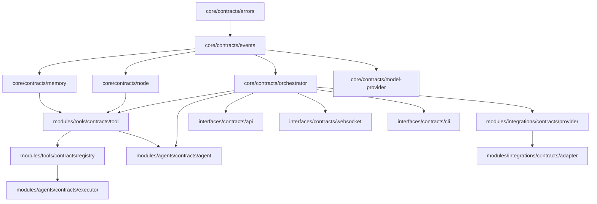

# Phase 1: Core Contracts Implementation Plan — ✅ COMPLETED

## Overview

This document outlines the comprehensive Phase 1 implementation plan for the Nexus repository, focusing on establishing the foundational contract layer across all modules as defined in AGENTS.md.

---

## Current State Analysis

### Directory Structure Status

| Directory | Status | Notes |
|-----------|--------|-------|
| `core/contracts/` | Empty | Only `.gitkeep` - needs contracts |
| `core/types/index.ts` | Fixed | Removed broken export |
| `systems/orchestration/index.ts` | Fixed | Commented out invalid exports |
| `modules/agents/` | Empty | Ready for contracts |
| `modules/integrations/` | Empty | Ready for contracts |
| `modules/tools/` | Empty | Ready for contracts |
| `interfaces/*/` | Empty | Ready for contracts |
| `systems/*/` | Empty | Ready for contracts |
| `runtime/*/` | Empty | Ready for contracts |
| `data/*/` | Empty | Ready for schemas |

### Broken Imports Fixed

1. ✅ `core/types/index.ts` - Removed invalid `./contracts` export
2. ✅ `systems/orchestration/index.ts` - Commented out non-existent module exports

---

## Phase 1 Contracts Architecture

### Contract Layer Organization

```
core/contracts/
├── orchestrator.ts     # Core orchestration contracts
├── node.ts            # DAG node contracts  
├── tool.ts            # Tool capability contracts
├── memory.ts          # Memory/context contracts
├── model-provider.ts  # Model abstraction contracts
├── events.ts          # Event system contracts
├── errors.ts          # Error type contracts
└── index.ts           # Barrel export

modules/agents/contracts/
├── agent.ts           # Agent definition contracts
├── executor.ts        # Agent execution contracts
└── index.ts

modules/integrations/contracts/
├── provider.ts        # Integration provider contracts
├── adapter.ts         # Integration adapter contracts
└── index.ts

modules/tools/contracts/
├── registry.ts        # Tool registry contracts
├── executor.ts        # Tool execution contracts
├── schema.ts          # Tool schema contracts
└── index.ts

interfaces/contracts/
├── api.ts             # API interface contracts
├── websocket.ts       # WebSocket contracts
├── cli.ts             # CLI contracts
├── events.ts          # Event interface contracts
└── index.ts
```

---

## Contract Definitions

### 1. Core Orchestrator Contracts (`core/contracts/orchestrator.ts`)

```typescript
// Purpose: Define the core orchestration interface
export interface Orchestrator {
  execute(task: Task, context: ExecutionContext): Promise<ExecutionResult>;
  registerNode(node: Node): void;
  getExecutionGraph(): DAG;
}

export interface Task {
  id: string;
  input: unknown;
  constraints?: TaskConstraints;
}

export interface ExecutionContext {
  sessionId: string;
  memory: MemorySnapshot;
  capabilities: CapabilitySet;
}

export interface TaskConstraints {
  maxTokens?: number;
  maxLatency?: number;
  timeout?: number;
}
```

### 2. Node Contracts (`core/contracts/node.ts`)

```typescript
// Purpose: Define DAG node types and execution
export type NodeType = 'reasoning' | 'tool' | 'memory' | 'control';

export interface Node {
  id: string;
  type: NodeType;
  config: NodeConfig;
  execute(input: NodeInput): Promise<NodeOutput>;
}

export interface NodeConfig {
  timeout?: number;
  retry?: RetryConfig;
  dependencies?: string[];
}

export interface RetryConfig {
  maxAttempts: number;
  backoff: 'linear' | 'exponential';
}
```

### 3. Tool Contracts (`modules/tools/contracts/tool.ts`)

```typescript
// Purpose: Define tool capability contracts
export interface Tool {
  id: string;
  name: string;
  description: string;
  inputSchema: JSONSchema;
  outputSchema: JSONSchema;
  execute(input: unknown, context: ToolContext): Promise<ToolResult>;
}

export interface ToolContext {
  sessionId: string;
  capabilities: CapabilitySet;
}

export interface ToolResult {
  success: boolean;
  output: unknown;
  error?: ToolError;
}
```

### 4. Memory Contracts (`core/contracts/memory.ts`)

```typescript
// Purpose: Define memory/context contracts
export interface Memory {
  retrieve(query: MemoryQuery): Promise<MemoryResult>;
  store(memory: MemoryEntry): Promise<void>;
  clear(sessionId: string): Promise<void>;
}

export type MemoryType = 'ephemeral' | 'session' | 'persistent' | 'derived';

export interface MemoryEntry {
  id: string;
  type: MemoryType;
  content: string;
  metadata: MemoryMetadata;
}
```

### 5. Model Provider Contracts (`core/contracts/model-provider.ts`)

```typescript
// Purpose: Define model abstraction for multi-provider support
export interface ModelProvider {
  id: string;
  name: string;
  complete(prompt: Prompt): Promise<ModelResponse>;
  completeWithStreaming(prompt: Prompt): AsyncIterable<ModelResponse>;
}

export type ModelRole = 'fast' | 'reasoning' | 'specialized';

export interface ModelConfig {
  role: ModelRole;
  maxTokens?: number;
  temperature?: number;
}
```

---

## Implementation Order

### Step 1: Core Contracts Foundation (Priority: Critical)

| File | Description | Dependencies |
|------|-------------|--------------|
| `core/contracts/errors.ts` | Error types all systems depend on | None |
| `core/contracts/events.ts` | Event types for system communication | None |
| `core/contracts/index.ts` | Barrel export | All above |

### Step 2: Primary System Contracts (Priority: High)

| File | Description | Dependencies |
|------|-------------|--------------|
| `core/contracts/orchestrator.ts` | Orchestrator interface | errors, events |
| `core/contracts/node.ts` | DAG node contracts | errors |
| `core/contracts/memory.ts` | Memory contracts | errors |
| `core/contracts/model-provider.ts` | Model provider contracts | errors |

### Step 3: Tool Contracts (Priority: High)

| File | Description | Dependencies |
|------|-------------|--------------|
| `modules/tools/contracts/schema.ts` | JSON Schema types | None |
| `modules/tools/contracts/tool.ts` | Tool interface | core/errors |
| `modules/tools/contracts/registry.ts` | Tool registry | tool.ts |
| `modules/tools/contracts/index.ts` | Barrel export | All above |

### Step 4: Agent Contracts (Priority: Medium)

| File | Description | Dependencies |
|------|-------------|--------------|
| `modules/agents/contracts/agent.ts` | Agent definition | core/contracts |
| `modules/agents/contracts/executor.ts` | Agent execution | agent.ts, tools |
| `modules/agents/contracts/index.ts` | Barrel export | All above |

### Step 5: Integration Contracts (Priority: Medium)

| File | Description | Dependencies |
|------|-------------|--------------|
| `modules/integrations/contracts/provider.ts` | Provider interface | core/errors |
| `modules/integrations/contracts/adapter.ts` | Adapter pattern | provider.ts |
| `modules/integrations/contracts/index.ts` | Barrel export | All above |

### Step 6: Interface Contracts (Priority: Medium)

| File | Description | Dependencies |
|------|-------------|--------------|
| `interfaces/contracts/api.ts` | REST API contracts | core/contracts |
| `interfaces/contracts/websocket.ts` | WebSocket contracts | core/contracts |
| `interfaces/contracts/cli.ts` | CLI contracts | core/contracts |
| `interfaces/contracts/index.ts` | Barrel export | All above |

### Step 7: Fix Core Type Exports (Priority: High)

After implementing core contracts:

1. Uncomment `export * from './contracts'` in `core/types/index.ts`
2. Run `npx tsc --noEmit` to verify compilation

---

## TypeScript Compilation Verification

### Current Status
- ✅ `npx tsc --noEmit` passes with fixed imports

### Post-Implementation Verification
After Phase 1 completion:
1. Run `npx tsc --noEmit`
2. All exports should resolve
3. No missing module errors
4. No type errors

---

## Mermaid: Contract Dependency Graph



---

## Success Criteria

### Phase 1 Complete When:

- [ ] All core contracts implemented in `core/contracts/`
- [ ] All tool contracts implemented in `modules/tools/contracts/`
- [ ] All agent contracts implemented in `modules/agents/contracts/`
- [ ] All integration contracts implemented in `modules/integrations/contracts/`
- [ ] All interface contracts implemented in `interfaces/contracts/`
- [ ] `core/types/index.ts` re-enabled with working exports
- [ ] `systems/orchestration/index.ts` has commented TODO for Phase 2
- [ ] `npx tsc --noEmit` passes without errors
- [ ] No missing module errors
- [ ] All interfaces are typed and minimal

---

## File Count Summary

| Module | Contracts | Estimated Lines |
|--------|-----------|-----------------|
| core/contracts/ | 7 files | ~400 lines |
| modules/tools/contracts/ | 4 files | ~250 lines |
| modules/agents/contracts/ | 3 files | ~150 lines |
| modules/integrations/contracts/ | 3 files | ~150 lines |
| interfaces/contracts/ | 5 files | ~200 lines |
| **Total** | **~22 files** | **~1,150 lines** |

---

## Notes

1. **Contract-First**: No implementation code in Phase 1 - only interfaces and types
2. **Minimal**: Keep interfaces as small as possible while maintaining clarity
3. **Extensible**: Design interfaces to be extendable without breaking changes
4. **No Dependencies**: Core contracts should not depend on implementations
5. **Versionable**: All contracts should be designed with versioning in mind
