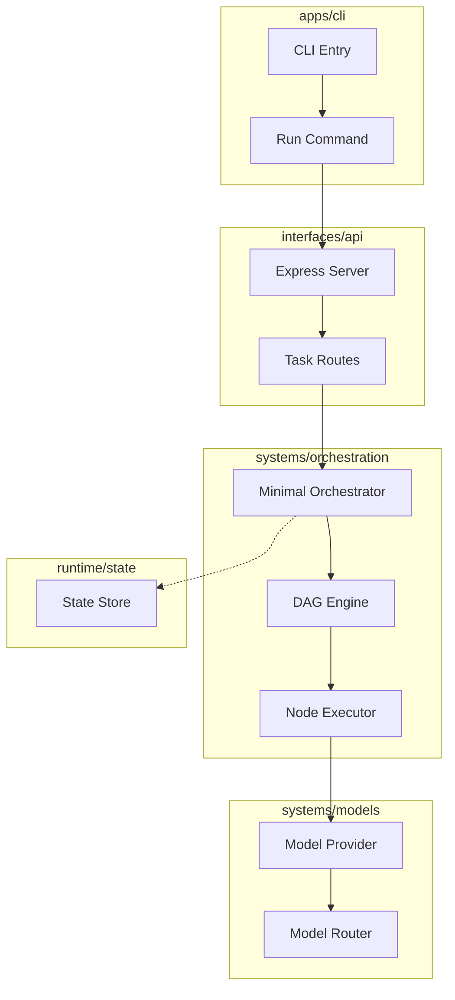

# Phase 2: Minimal Vertical Slice Implementation Plan — ✅ COMPLETED

## Overview

This document outlines the comprehensive Phase 2 implementation plan for Nexus. Phase 2 creates a **working end-to-end system with minimal capability**, establishing the data flow from apps through interfaces, orchestration, to models.

**Phase 2 Goal**: Build a minimal but functional system that demonstrates the core execution path from user input to model response.

---

## Current State Analysis

### What Was Completed in Phase 1

| Component | Status | Files |
|-----------|--------|-------|
| Core Contracts | ✅ Complete | 7 files in `core/contracts/` |
| Tool Contracts | ✅ Complete | 4 files in `modules/tools/contracts/` |
| Agent Contracts | ✅ Complete | 3 files in `modules/agents/contracts/` |
| Integration Contracts | ✅ Complete | 3 files in `modules/integrations/contracts/` |
| Interface Contracts | ✅ Complete | 5 files in `interfaces/contracts/` |

### What's Empty (Ready for Implementation)

| Directory | Status | Purpose |
|-----------|--------|---------|
| `apps/cli/` | Empty | CLI application entry point |
| `apps/desktop/` | Empty | Desktop application |
| `apps/web/` | Empty | Web application |
| `systems/orchestration/engine/` | Empty | DAG execution engine |
| `systems/orchestration/nodes/` | Empty | Node implementations |
| `systems/orchestration/scheduler/` | Empty | Task scheduling |
| `systems/orchestration/runtime/` | Empty | Runtime context |
| `systems/models/` | Empty | Model provider implementations |

---

## Phase 2 Architecture

### Execution Path

```
┌─────────────┐     ┌─────────────┐     ┌──────────────────┐     ┌─────────────┐
│    CLI      │────►│   API       │────►│   Orchestrator   │────►│   Model     │
│  (Command)  │     │  (Express)  │     │   (DAG Engine)   │     │  Provider   │
└─────────────┘     └─────────────┘     └──────────────────┘     └─────────────┘
```

### Minimal Vertical Slice Components

| Component | Description | Priority |
|-----------|-------------|----------|
| **CLI App** | Basic command-line interface | Critical |
| **API Server** | Express REST API | Critical |
| **Orchestrator** | Minimal task execution | Critical |
| **Reasoning Node** | LLM call node | Critical |
| **Model Provider** | OpenAI-compatible provider | Critical |
| **State Management** | Simple task state tracking | High |

---

## Phase 2 Deliverables

### 2.1 Minimal Orchestrator Core

**Goal**: Implement a working orchestrator that can execute simple tasks with DAG support.

**Files to Create**:

```
systems/orchestration/engine/
├── index.ts              # Engine exports
├── orchestrator.ts       # Main orchestrator implementation
├── dag.ts               # DAG creation and validation
└── executor.ts          # Node execution coordinator
```

**Implementation Details**:

| File | Purpose | Key Interfaces |
|------|---------|----------------|
| `orchestrator.ts` | Main execution engine | `MinimalOrchestrator` class |
| `dag.ts` | Graph management | `DAGBuilder`, `DAGValidator` |
| `executor.ts` | Node runner | `NodeExecutor`, `ExecutionQueue` |

**Constraints**:
- No parallel execution (sequential only for Phase 2)
- No advanced scheduling
- Simple dependency resolution

### 2.2 Basic Node Types

**Goal**: Implement the core node types needed for basic execution.

**Files to Create**:

```
systems/orchestration/nodes/
├── index.ts              # Node exports
├── base.ts              # Base node class
├── reasoning.ts         # ReasoningNode (LLM calls)
└── types.ts             # Node type utilities
```

**Node Implementation Priority**:

| Node Type | Priority | Description |
|-----------|----------|-------------|
| `ReasoningNode` | Critical | LLM call execution |
| `ControlNode` (simple) | High | Basic branching |
| `AggregatorNode` | Medium | Simple concat |

**Excluded for Phase 2** (Phase 3+):
- ToolNode (requires Tool System - Phase 5)
- MemoryNode (requires Memory System - Phase 4)
- TransformNode
- ConditionalNode

### 2.3 Single Model Provider

**Goal**: Implement a working model provider for LLM calls.

**Files to Create**:

```
systems/models/
├── index.ts              # Models exports
├── provider.ts          # Base provider class
├── openai.ts            # OpenAI-compatible provider
└── router.ts            # Simple model router
```

**Implementation Details**:

| File | Purpose | Key Classes |
|------|---------|-------------|
| `provider.ts` | Base provider abstraction | `BaseModelProvider` |
| `openai.ts` | OpenAI-compatible implementation | `OpenAIProvider` |
| `router.ts` | Simple model selection | `SimpleModelRouter` |

**Constraints**:
- Single provider (OpenAI-compatible)
- No streaming (Phase 3+)
- Basic error handling

**Environment Variables Required**:
```
OPENAI_API_KEY=<your-api-key>
OPENAI_BASE_URL=https://api.openai.com/v1
OPENAI_MODEL=gpt-4o-mini
```

### 2.4 CLI Interface

**Goal**: Create a functional CLI for executing tasks.

**Files to Create**:

```
apps/cli/
├── package.json          # CLI package config
├── src/
│   ├── index.ts         # CLI entry point
│   ├── commands/
│   │   ├── index.ts     # Command exports
│   │   ├── run.ts       # Run task command
│   │   └── status.ts    # Check status command
│   └── utils/
│       ├── index.ts
│       └── client.ts    # API client
└── tsconfig.json
```

**Commands**:

| Command | Description | Example |
|---------|-------------|---------|
| `nexus run <task>` | Execute a task | `nexus run "Analyze this code"` |
| `nexus status` | Check system status | `nexus status` |
| `nexus --help` | Show help | `nexus --help` |

### 2.5 API Server

**Goal**: Create REST API for task execution.

**Files to Create**:

```
interfaces/api/
├── package.json          # API package config
├── src/
│   ├── index.ts         # Express app
│   ├── routes/
│   │   ├── index.ts
│   │   ├── tasks.ts     # Task endpoints
│   │   └── status.ts    # Health endpoints
│   ├── middleware/
│   │   ├── index.ts
│   │   └── error.ts     # Error handling
│   └── services/
│       ├── index.ts
│       └── orchestrator.ts # Orchestrator integration
└── tsconfig.json
```

**API Endpoints**:

| Method | Endpoint | Description |
|--------|----------|-------------|
| `POST` | `/api/tasks` | Create and execute a task |
| `GET` | `/api/tasks/:id` | Get task status |
| `GET` | `/api/status` | System health |
| `GET` | `/api/models` | List available models |

### 2.6 Simple State Management

**Goal**: Basic in-memory task state tracking.

**Files to Create**:

```
runtime/state/
├── index.ts              # State exports
├── store.ts            # In-memory store
├── task-state.ts        # Task state machine
└── types.ts            # State types
```

**State Flow**:

```
PENDING → RUNNING → COMPLETED
               ↓
             FAILED
```

---

## Implementation Order

### Step 1: Foundation (Week 1)

| Task | Files | Dependencies |
|------|-------|--------------|
| Model Provider | `systems/models/provider.ts`, `openai.ts` | Phase 1 contracts |
| Orchestrator Base | `systems/orchestration/engine/orchestrator.ts` | Model provider |
| Basic Nodes | `systems/orchestration/nodes/reasoning.ts` | Orchestrator |

### Step 2: API Layer (Week 2)

| Task | Files | Dependencies |
|------|-------|--------------|
| Express Setup | `interfaces/api/src/index.ts` | None |
| Task Routes | `interfaces/api/src/routes/tasks.ts` | Orchestrator |
| Error Handling | `interfaces/api/src/middleware/error.ts` | None |

### Step 3: CLI Layer (Week 2)

| Task | Files | Dependencies |
|------|-------|--------------|
| CLI Entry | `apps/cli/src/index.ts` | API server |
| Run Command | `apps/cli/src/commands/run.ts` | CLI entry |
| Status Command | `apps/cli/src/commands/status.ts` | CLI entry |

### Step 4: Integration (Week 3)

| Task | Files | Dependencies |
|------|-------|--------------|
| Wiring | Connect CLI → API → Orchestrator → Model | All above |
| Testing | Manual integration tests | All above |
| Bug Fixes | Fix issues found in testing | Integration |

---

## Mermaid: Phase 2 Component Flow



---

## File Creation Summary

### New Files to Create

```
apps/cli/
├── package.json
├── tsconfig.json
└── src/
    ├── index.ts
    ├── commands/
    │   ├── index.ts
    │   ├── run.ts
    │   └── status.ts
    └── utils/
        ├── index.ts
        └── client.ts

interfaces/api/
├── package.json
├── tsconfig.json
└── src/
    ├── index.ts
    ├── routes/
    │   ├── index.ts
    │   ├── tasks.ts
    │   └── status.ts
    ├── middleware/
    │   ├── index.ts
    │   └── error.ts
    └── services/
        ├── index.ts
        └── orchestrator.ts

systems/orchestration/
└── engine/
    ├── index.ts
    ├── orchestrator.ts
    ├── dag.ts
    └── executor.ts

systems/orchestration/
└── nodes/
    ├── index.ts
    ├── base.ts
    ├── reasoning.ts
    └── types.ts

systems/models/
├── index.ts
├── provider.ts
├── openai.ts
└── router.ts

runtime/state/
├── index.ts
├── store.ts
├── task-state.ts
└── types.ts
```

**Total New Files**: ~25 files

---

## Documentation Updates

### Files to Update

| Document | Update Required |
|----------|-----------------|
| `README.md` | Add Phase 2 status, update roadmap |
| `meta/roadmap/ROADMAP.md` | Mark Phase 2 as in-progress |
| `docs/systems/ORCHESTRATION.md` | Add implementation status |
| `docs/systems/MODELS.md` | Add implementation status |
| `docs/guides/GETTING_STARTED.md` | Add CLI usage |
| `docs/api/REST.md` | Add task endpoints |
| `docs/api/CLI.md` | Add CLI commands |
| `plans/PHASE1_CORE_CONTRACTS.md` | Mark as completed |

### New Documentation

| Document | Description |
|----------|-------------|
| `docs/guides/PHASE2_SETUP.md` | Phase 2 setup guide |

---

## Success Criteria

### Phase 2 Complete When:

- [ ] CLI can execute a simple task end-to-end
- [ ] API server can receive and process task requests
- [ ] Orchestrator can execute a DAG with reasoning node
- [ ] Model provider can make LLM calls
- [ ] Task state is tracked and queryable
- [ ] TypeScript compiles without errors
- [ ] Basic manual testing passes
- [ ] Documentation is updated
- [ ] Changes committed and pushed to main

### Validation Commands

```bash
# TypeScript check
npm run typecheck

# Build all packages
npm run build

# Start API server
cd interfaces/api && npm run dev

# Run CLI
cd apps/cli && npm run start -- "Hello, test task"
```

---

## Constraints & Exclusions

### In Scope (Phase 2)

- Single model provider (OpenAI-compatible)
- Sequential node execution only
- Basic error handling
- In-memory state (no persistence)
- Simple CLI commands

### Out of Scope (Future Phases)

| Feature | Phase | Reason |
|---------|-------|--------|
| Memory System | Phase 4 | Requires Context Engine |
| Tool Execution | Phase 5 | Requires Capability Fabric |
| Parallel Execution | Phase 3 | Requires Graph Engine |
| Streaming | Phase 3 | Requires Graph Engine |
| Desktop/Web UI | Phase 6 | Requires UI Surface |
| Advanced Caching | Phase 7 | Requires Optimization |
| Multiple Providers | Phase 3 | Requires Router |

---

## Risk Mitigation

| Risk | Mitigation |
|------|------------|
| API key exposure | Use environment variables, not hardcoded |
| Network failures | Basic retry with exponential backoff |
| Type errors | Strict TypeScript, run typecheck before commit |
| Integration issues | Test incrementally at each layer |

---

## Notes

1. **Contract-First**: All implementations must follow Phase 1 contracts
2. **Minimal**: Keep implementations as small as possible while functional
3. **Testable**: Each component should be independently testable
4. **No Persistence**: State is in-memory only for Phase 2
5. **Sequential**: No parallel execution in Phase 2

---

**Last Updated**: 2026-03-21

**Phase Status**: 🔄 Ready for Implementation
