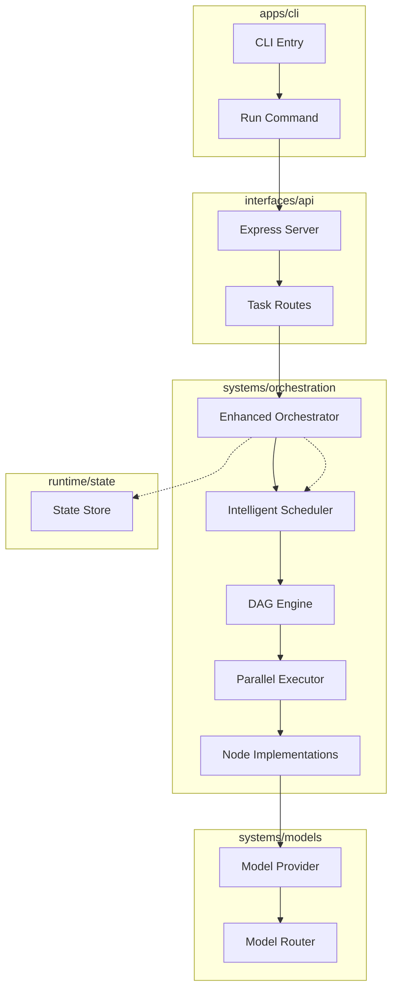

# Phase 3: Graph Execution Engine Implementation Plan

## Overview

This document outlines the comprehensive Phase 3 implementation plan for Nexus. Phase 3 creates a **full DAG-based execution engine with advanced scheduling, node execution logic, and parallel execution support**.

**Phase 3 Goal**: Build a robust execution engine that supports parallel node execution, intelligent scheduling, and enhanced DAG capabilities beyond the minimal vertical slice of Phase 2.

---

## Current State Analysis

### What Was Completed in Phase 2

| Component | Status | Files |
|-----------|--------|-------|
| Core Contracts | ✅ Complete | 7 files in `core/contracts/` |
| Tool Contracts | ✅ Complete | 4 files in `modules/tools/contracts/` |
| Agent Contracts | ✅ Complete | 3 files in `modules/agents/contracts/` |
| Integration Contracts | ✅ Complete | 3 files in `modules/integrations/contracts/` |
| Interface Contracts | ✅ Complete | 5 files in `interfaces/contracts/` |
| Minimal Orchestrator | ✅ Complete | Sequential execution only |
| Basic DAG Structure | ✅ Complete | DAGBuilder, DAGUtils, validation |
| Reasoning Node | ✅ Complete | LLM call execution |
| Model Provider | ✅ Complete | OpenAI-compatible provider |
| CLI Interface | ✅ Complete | Basic task execution |
| API Server | ✅ Complete | REST endpoints for task execution |
| Simple State Management | ✅ Complete | In-memory task tracking |

### What Needs Enhancement for Phase 3

| Component | Status | Purpose |
|-----------|--------|---------|
| DAG Structure | 🔄 Enhancement | Add parallel execution hints, metadata |
| Node Execution Logic | 🔄 Enhancement | Support concurrent node execution |
| Scheduler | ❌ Missing | Task scheduling and prioritization |
| Orchestrator | 🔄 Enhancement | Parallel execution coordination |
| Node Types | 🔄 Enhancement | Implement additional node types |
| Error Handling | 🔄 Enhancement | Advanced retry and failure handling |
| Metrics | 🔄 Enhancement | Parallel execution metrics |

---

## Phase 3 Architecture

### Enhanced Execution Path

```
┌─────────────┐     ┌─────────────┐     ┌──────────────────┐     ┌─────────────┐
│    CLI      │────►│   API       │────►│   Orchestrator   │────►│   Model     │
│  (Command)  │     │  (Express)  │     │  (DAG Engine)    │     │  Provider   │
└─────────────┘     └─────────────┘     └──────────────────┘     └─────────────┘
                              │
                              ▼
                      ┌─────────────┐
                      │  Scheduler  │
                      │ (Priority)  │
                      └─────────────┘
```

### Enhanced Components

| Component | Description | Priority |
|-----------|-------------|----------|
| **Enhanced DAG Structure** | Parallel execution hints, metadata, subgraphs | Critical |
| **Parallel Node Execution** | Concurrent execution with dependency resolution | Critical |
| **Intelligent Scheduler** | Priority-based, resource-aware scheduling | Critical |
| **Enhanced Orchestrator** | Parallel execution coordination, advanced metrics | Critical |
| **Additional Node Types** | ToolNode, MemoryNode, ControlNode implementations | High |
| **Advanced Error Handling** | Retry mechanisms, circuit breakers, fallback strategies | High |
| **Execution Metadata** | Detailed tracing, profiling, debugging support | Medium |

---

## Phase 3 Deliverables

### 3.1 Enhanced DAG Structure

**Goal**: Extend DAG structure to support parallel execution metadata and advanced graph operations.

**Files to Enhance**:
```
systems/orchestration/engine/
├── dag.ts              # Enhanced DAG builder and utilities
└── types.ts            # New DAG enhancement types
```

**Enhancements**:
- Add parallel execution groups to DAG metadata
- Support for subgraph execution
- Enhanced validation for parallel constraints
- Metadata for execution profiling

### 3.2 Parallel Node Execution Logic

**Goal**: Implement concurrent node execution with proper dependency resolution and resource management.

**Files to Create/Enhance**:
```
systems/orchestration/engine/
├── executor.ts         # Enhanced NodeExecutor with parallel support
├── parallel-executor.ts # New ParallelExecutor class
└── worker-pool.ts      # Worker pool for concurrent execution
```

**Implementation Details**:
- Worker pool with configurable concurrency limits
- Dependency-aware task queuing
- Resource allocation and monitoring
- Thread-safe execution context sharing

### 3.3 Intelligent Scheduler

**Goal**: Implement a scheduler that optimizes execution order based on priorities, resource requirements, and dependencies.

**Files to Create**:
```
systems/orchestration/scheduler/
├── index.ts              # Scheduler exports
├── priority-scheduler.ts # Priority-based scheduling
├── resource-scheduler.ts # Resource-aware scheduling
└── scheduler-strategies.ts # Scheduling algorithms
```

**Features**:
- Priority-based task queuing
- Resource-aware scheduling (CPU, memory, tokens)
- Dynamic priority adjustment
- Deadline-aware scheduling
- Work-stealing algorithms for load balancing

### 3.4 Enhanced Orchestrator

**Goal**: Upgrade the orchestrator to coordinate parallel execution and integrate with the scheduler.

**Files to Enhance**:
```
systems/orchestration/engine/
├── orchestrator.ts     # Enhanced orchestrator with parallel support
└── execution-planner.ts # New execution planning component
```

**Enhancements**:
- Integration with scheduler for execution planning
- Parallel execution coordination
- Advanced metrics collection (parallelism, throughput, latency)
- Dynamic execution plan adjustment
- Enhanced error handling and recovery

### 3.5 Additional Node Types

**Goal**: Implement core node types beyond the reasoning node from Phase 2.

**Files to Create**:
```
systems/orchestration/nodes/
├── tool.ts             # ToolNode implementation
├── memory.ts           # MemoryNode implementation
├── control.ts          # ControlNode implementation
├── aggregator.ts       # AggregatorNode implementation
├── transform.ts        # TransformNode implementation
└── conditional.ts      # ConditionalNode implementation
```

### 3.6 Advanced Error Handling

**Goal**: Implement robust error handling with retry mechanisms, circuit breakers, and fallback strategies.

**Files to Create**:
```
systems/orchestration/engine/
├── error-handler.ts    # Centralized error handling
├── retry-strategy.ts   # Configurable retry mechanisms
└── circuit-breaker.ts  # Circuit breaker pattern implementation
```

---

## Implementation Order

### Step 1: DAG Enhancements (Week 1)

| Task | Files | Dependencies |
|------|-------|--------------|
| Enhanced DAG Metadata | `systems/orchestration/engine/dag.ts` | Phase 1 contracts |
| Parallel Execution Groups | `systems/orchestration/engine/types.ts` | Enhanced DAG |
| Subgraph Support | `systems/orchestration/engine/dag.ts` | Parallel groups |
| DAG Validation Enhancements | `systems/orchestration/engine/dag.ts` | All above |

### Step 2: Scheduler Implementation (Week 2)

| Task | Files | Dependencies |
|------|-------|--------------|
| Scheduler Interface | `systems/orchestration/scheduler/index.ts` | Core contracts |
| Priority Scheduler | `systems/orchestration/scheduler/priority-scheduler.ts` | Scheduler interface |
| Resource Scheduler | `systems/orchestration/scheduler/resource-scheduler.ts` | Priority scheduler |
| Worker Pool | `systems/orchestration/engine/worker-pool.ts` | Resource scheduler |
| Scheduler Integration | `systems/orchestration/engine/orchestrator.ts` | Worker pool |

### Step 3: Parallel Execution Engine (Week 3)

| Task | Files | Dependencies |
|------|-------|--------------|
| Parallel Executor | `systems/orchestration/engine/parallel-executor.ts` | Worker pool |
| Enhanced NodeExecutor | `systems/orchestration/engine/executor.ts` | Parallel executor |
| Execution Planner | `systems/orchestration/engine/execution-planner.ts` | Scheduler |
| Orchestrator Integration | `systems/orchestration/engine/orchestrator.ts` | All above |

### Step 4: Node Type Implementations (Week 4)

| Task | Files | Dependencies |
|------|-------|--------------|
| ToolNode | `systems/orchestration/nodes/tool.ts` | Core/node contracts |
| MemoryNode | `systems/orchestration/nodes/memory.ts` | Core/node contracts |
| ControlNode | `systems/orchestration/nodes/control.ts` | Core/node contracts |
| AggregatorNode | `systems/orchestration/nodes/aggregator.ts` | Core/node contracts |
| TransformNode | `systems/orchestration/nodes/transform.ts` | Core/node contracts |
| ConditionalNode | `systems/orchestration/nodes/conditional.ts` | Core/node contracts |

### Step 5: Advanced Error Handling (Week 5)

| Task | Files | Dependencies |
|------|-------|--------------|
| Error Handler | `systems/orchestration/engine/error-handler.ts` | Core/errors |
| Retry Strategy | `systems/orchestration/engine/retry-strategy.ts` | Error handler |
| Circuit Breaker | `systems/orchestration/engine/circuit-breaker.ts` | Retry strategy |
| Orchestrator Integration | `systems/orchestration/engine/orchestrator.ts` | All above |

### Step 6: Integration and Testing (Week 6)

| Task | Files | Dependencies |
|------|-------|--------------|
| End-to-End Testing | All Phase 3 components | All previous steps |
| Performance Benchmarking | `dev/benchmarks/` | Integrated system |
| Documentation Updates | Various docs files | Completed implementation |
| Bug Fixes | All components | Testing feedback |

---

## Mermaid: Phase 3 Component Flow



---

## File Creation Summary

### New Files to Create

```
systems/orchestration/engine/
├── types.ts              # DAG enhancement types
├── parallel-executor.ts  # Parallel execution coordinator
├── worker-pool.ts        # Worker pool for concurrent execution
├── execution-planner.ts  # Execution planning component
├── error-handler.ts      # Centralized error handling
├── retry-strategy.ts     # Configurable retry mechanisms
└── circuit-breaker.ts    # Circuit breaker pattern

systems/orchestration/scheduler/
├── index.ts              # Scheduler exports
├── priority-scheduler.ts # Priority-based scheduling
├── resource-scheduler.ts # Resource-aware scheduling
└── scheduler-strategies.ts # Scheduling algorithms

systems/orchestration/nodes/
├── tool.ts             # ToolNode implementation
├── memory.ts           # MemoryNode implementation
├── control.ts          # ControlNode implementation
├── aggregator.ts       # AggregatorNode implementation
├── transform.ts        # TransformNode implementation
└── conditional.ts      # ConditionalNode implementation
```

### Files to Enhance

```
systems/orchestration/engine/
├── dag.ts              # Enhanced DAG builder and utilities
├── executor.ts         # Enhanced NodeExecutor with parallel support
└── orchestrator.ts     # Enhanced orchestrator with parallel support

systems/orchestration/
├── index.ts            # Updated exports
```

### Total New Files: ~15 files
### Total Enhanced Files: ~4 files

---

## Documentation Updates

### Files to Update

| Document | Update Required |
|----------|-----------------|
| `README.md` | Add Phase 3 status, update roadmap |
| `meta/roadmap/ROADMAP.md` | Mark Phase 3 as in-progress |
| `docs/systems/ORCHESTRATION.md` | Add parallel execution details |
| `docs/systems/EXECUTION.md` | Add scheduler documentation |
| `docs/architecture/OVERVIEW.md` | Update Phase 3 status |
| `docs/architecture/LAYERS.md` | Update orchestration layer details |
| `docs/decisions/ADR-005-DAG-Based-Orchestration.md` | Add Phase 3 enhancements |
| `docs/guides/DEVELOPMENT.md` | Add parallel execution patterns |
| `docs/api/REST.md` | Add parallel execution endpoints |
| `docs/api/CLI.md` | Add parallel execution CLI options |
| `plans/PHASE2_VERTICAL_SLICE.md` | Mark as completed |

### New Documentation

| Document | Description |
|----------|-------------|
| `docs/guides/PARALLEL-EXECUTION.md` | Guide to parallel execution patterns |
| `docs/systems/SCHEDULER.md` | Scheduler implementation details |
| `docs/guides/ERROR-HANDLING.md` | Advanced error handling patterns |

---

## Success Criteria

### Phase 3 Complete When:

- [ ] DAG structure supports parallel execution groups and metadata
- [ ] Scheduler can prioritize and schedule tasks based on resources and dependencies
- [ ] Node execution logic supports concurrent execution with proper synchronization
- [ ] Orchestrator coordinates parallel execution and integrates with scheduler
- [ ] All core node types (Tool, Memory, Control, Aggregator, Transform, Conditional) are implemented
- [ ] Advanced error handling with retry mechanisms and circuit breakers is implemented
- [ ] TypeScript compiles without errors
- [ ] Comprehensive testing passes (unit, integration, performance)
- [ ] Documentation is updated
- [ ] Changes committed and pushed to main

### Validation Commands

```bash
# TypeScript check
npm run typecheck

# Build all packages
npm run build

# Run stress tests for parallel execution
npm run test:parallel

# Start API server
cd interfaces/api && npm run dev

# Run CLI with parallel tasks
cd apps/cli && npm run start -- "complex parallel task"

# Monitor metrics
curl http://localhost:3000/api/metrics
```

---

## Constraints & Exclusions

### In Scope (Phase 3)

- Parallel node execution with dependency resolution
- Intelligent scheduling based on priorities and resources
- Enhanced DAG structure with execution metadata
- All six core node types implementation
- Advanced error handling and recovery mechanisms
- Comprehensive metrics collection for parallel execution

### Out of Scope (Future Phases)

| Feature | Phase | Reason |
|---------|-------|--------|
| Context Engine | Phase 4 | Requires memory and compression systems |
| Tool Registry | Phase 5 | Requires capability fabric implementation |
| Advanced Caching | Phase 7 | Requires optimization layer |
| Machine Learning Planning | Phase 5 | Requires cognitive system |
| Distributed Execution | Phase 7 | Requires runtime optimization |
| Real-time Collaboration | Phase 6 | Requires UI control surface |

---

## Risk Mitigation

| Risk | Mitigation |
|------|------------|
| Race conditions | Use thread-safe data structures and proper locking |
| Deadlocks | Implement timeout mechanisms and deadlock detection |
| Resource exhaustion | Add resource limits and monitoring |
| Increased complexity | Modular design with clear interfaces |
| Performance overhead | Benchmark and optimize critical paths |
| Testing complexity | Comprehensive test suite with parallel scenarios |

---

## Notes

1. **Contract-First**: All enhancements must follow existing contracts in `core/contracts/`
2. **Backward Compatibility**: Phase 3 enhancements must not break Phase 2 functionality
3. **Determinism**: Parallel execution must maintain deterministic behavior given same inputs
4. **Observability**: Enhanced metrics and tracing for debugging parallel execution
5. **Scalability**: Design should support horizontal scaling in future phases
6. **Resource Awareness**: Scheduler should consider CPU, memory, and token constraints

---
**Last Updated**: 2026-03-21
**Phase Status**: 📋 Ready for Implementation