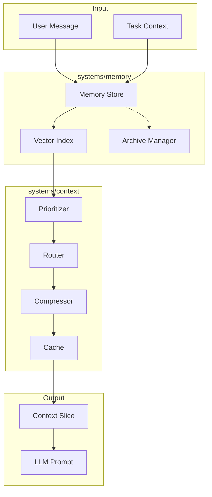
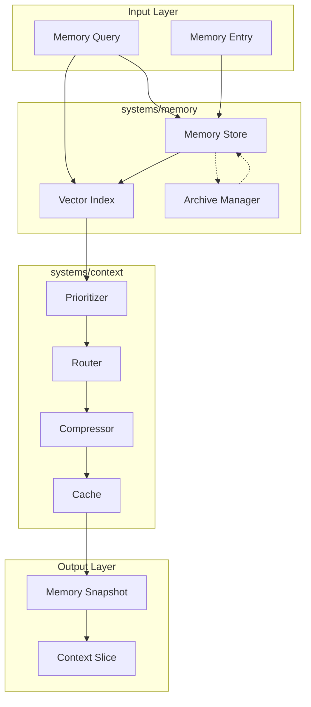

# Phase 4: Context Engine Implementation Plan

## Overview

This document outlines the comprehensive Phase 4 implementation plan for Nexus. Phase 4 implements the **Context Engine** - a memory abstraction, retrieval system, and basic context compression for token optimization.

**Phase 4 Goal**: Build a robust memory and context management system that enables persistent context across sessions, efficient retrieval via embeddings, and token optimization through compression.

---

## Current State Analysis

### What Was Completed in Phase 3

| Component | Status | Files |
|-----------|--------|-------|
| DAG Engine | ✅ Complete | `systems/orchestration/engine/dag.ts` |
| Parallel Executor | ✅ Complete | `systems/orchestration/engine/src/parallel-executor.ts` |
| Worker Pool | ✅ Complete | `systems/orchestration/engine/src/worker-pool.ts` |
| Scheduler | ✅ Complete | `systems/orchestration/scheduler/` |
| Node Types | ✅ Complete | `systems/orchestration/nodes/` (6 node types) |
| Error Handling | ✅ Complete | Circuit breaker, retry strategy, error handler |
| Orchestrator | ✅ Complete | `systems/orchestration/engine/orchestrator.ts` |

### What Needs Implementation for Phase 4

| Component | Status | Purpose |
|-----------|--------|---------|
| Memory System | ❌ Missing | Full Memory implementation |
| Vector Index | ❌ Missing | Embedding-based retrieval |
| Context Compressor | ❌ Missing | Token reduction for prompts |
| Memory Snapshot | ❌ Missing | Context slice for execution |
| Archive System | ❌ Missing | Memory expiration and cleanup |
| Context Cache | ❌ Missing | Response caching |
| Context Prioritizer | ❌ Missing | Memory prioritization |
| Context Router | ❌ Missing | Context pipeline routing |

---

## Phase 4 Architecture

### Context Engine Data Flow



### Phase 4 Component Architecture

```
┌─────────────────────────────────────────────────────────────────┐
│                     Context Engine                              │
├─────────────────────────────────────────────────────────────────┤
│  systems/memory/          │  systems/context/                  │
│  ├── index.ts             │  ├── cache/                        │
│  ├── store.ts             │  │   └── response-cache.ts         │
│  ├── vector-index.ts      │  ├── compressor/                   │
│  ├── archive.ts           │  │   ├── index.ts                  │
│  └── types.ts             │  │   ├── truncate.ts               │
│                           │  │   ├── summarize.ts              │
│                           │  │   └── hybrid.ts                 │
│                           │  ├── prioritizer/                  │
│                           │  │   ├── index.ts                  │
│                           │  │   └── scorer.ts                 │
│                           │  └── router/                       │
│                           │      └── index.ts                  │
└─────────────────────────────────────────────────────────────────┘
```

---

## Phase 4 Deliverables

### 4.1 Memory System Implementation

**Goal**: Implement the full Memory interface from `core/contracts/memory.ts`.

**Files to Create**:
```
systems/memory/
├── index.ts              # Main exports
├── store.ts              # In-memory memory store implementation
├── types.ts              # Internal types for memory system
├── vector-index.ts       # Vector-based similarity search
└── archive.ts            # Memory expiration and cleanup
```

**Implementation Details**:

#### 4.1.1 Memory Store (`store.ts`)

**Purpose**: Primary in-memory implementation of the Memory interface.

**Key Functions**:
- `retrieve(query: MemoryQuery)`: Search memories by text, embedding, type, session, tags
- `store(entry: MemoryEntry)`: Add new memory entry
- `update(id, updates)`: Modify existing entry
- `delete(id)`: Remove entry
- `clear(sessionId)`: Remove all session memories
- `getSnapshot(sessionId, maxTokens)`: Get token-optimized context slice
- `archive(olderThan)`: Archive expired memories
- `getStats()`: Return memory statistics

**Data Structures**:
```typescript
// Internal storage
private entries: Map<string, MemoryEntry> = new Map();
private sessionIndex: Map<string, Set<string>> = new Map();
private typeIndex: Map<MemoryType, Set<string>> = new Map();
private tagIndex: Map<string, Set<string>> = new Map();
```

**Validation Criteria**:
- [ ] All Memory interface methods implemented
- [ ] TypeScript compiles without errors
- [ ] Unit tests pass for CRUD operations
- [ ] Session isolation works correctly

#### 4.1.2 Vector Index (`vector-index.ts`)

**Purpose**: Fast similarity search using embeddings.

**Key Functions**:
- `index(entry)`: Add embedding to index
- `remove(id)`: Remove from index
- `search(embedding, limit)`: Find similar entries by cosine similarity
- `searchByText(text, limit)`: Text-based keyword search

**Implementation Approach**:
- Use simple cosine similarity for in-memory vectors
- Support configurable similarity threshold
- Maintain inverted index for text search

**Validation Criteria**:
- [ ] Embedding search returns relevant results
- [ ] Similarity threshold filtering works
- [ ] Text search returns matching entries

#### 4.1.3 Archive Manager (`archive.ts`)

**Purpose**: Handle memory expiration and cleanup.

**Key Functions**:
- `archive(olderThan)`: Archive memories past expiration date
- `getExpired()`: List all expired memories
- `prune()`: Permanently delete archived memories
- `restore(id)`: Restore archived memory to active

**Validation Criteria**:
- [ ] Expired memories are correctly identified
- [ ] Archive operation marks memories correctly
- [ ] Cleanup removes archived memories

### 4.2 Context Compressor Implementation

**Goal**: Implement token reduction strategies for LLM prompts.

**Files to Create**:
```
systems/context/compressor/
├── index.ts              # Main exports and factory
├── truncate.ts           # Truncation-based compression
├── summarize.ts          # Summarization-based compression
└── hybrid.ts             # Combined compression strategy
```

**Implementation Details**:

#### 4.2.1 Compressor Interface

```typescript
interface ContextCompressor {
  compress(memory: MemorySnapshot, maxTokens: number): Promise<ContextSlice>;
  expand(slice: ContextSlice): Promise<MemorySnapshot>;
}
```

#### 4.2.2 Truncate Strategy (`truncate.ts`)

**Approach**: Keep most recent entries, discard oldest.

**Algorithm**:
1. Sort entries by timestamp (newest first)
2. Add entries until token budget exhausted
3. Mark truncated entries in metadata

**Validation Criteria**:
- [ ] Output fits within maxTokens
- [ ] Most recent entries preserved
- [ ] Metadata indicates truncation

#### 4.2.3 Summarize Strategy (`summarize.ts`)

**Approach**: Use LLM to summarize older entries.

**Algorithm**:
1. Identify entries to summarize (older than threshold)
2. Group related entries
3. Generate summary preserving key information
4. Replace original entries with summary

**Dependencies**:
- Model provider from Phase 2/3

**Validation Criteria**:
- [ ] Summaries preserve key information
- [ ] Token reduction achieved
- [ ] Quality maintained

#### 4.2.4 Hybrid Strategy (`hybrid.ts`)

**Approach**: Combine truncation and summarization.

**Algorithm**:
1. Keep recent N entries directly (truncation)
2. Summarize middle entries
3. Archive oldest entries

**Validation Criteria**:
- [ ] Optimal token reduction
- [ ] Recent context preserved
- [ ] Historical context summarized

### 4.3 Context Cache Implementation

**Goal**: Cache context snapshots to reduce redundant processing.

**Files to Create**:
```
systems/context/cache/
└── response-cache.ts     # LRU cache for context snapshots
```

**Implementation Details**:

#### 4.3.1 Response Cache (`response-cache.ts`)

**Purpose**: Cache MemorySnapshot results to avoid recomputation.

**Key Features**:
- LRU (Least Recently Used) eviction
- TTL (Time To Live) support
- Cache invalidation on memory updates
- Token budget tracking

**Configuration**:
```typescript
interface CacheConfig {
  maxSize: number;           // Max number of cached items
  maxTokens: number;         // Max total tokens cached
  ttl: number;               // Time to live in ms
  invalidateOnUpdate: boolean;
}
```

**Validation Criteria**:
- [ ] Cache hit/miss tracking works
- [ ] LRU eviction functions correctly
- [ ] TTL expiration works
- [ ] Invalidation triggers on memory update

### 4.4 Context Prioritizer Implementation

**Goal**: Implement intelligent memory prioritization.

**Files to Create**:
```
systems/context/prioritizer/
├── index.ts              # Main exports
└── scorer.ts             # Relevance scoring algorithms
```

**Implementation Details**:

#### 4.4.1 Relevance Scorer (`scorer.ts`)

**Purpose**: Score memories by relevance for retrieval.

**Scoring Factors**:
- **Recency**: Newer memories score higher
- **Importance**: Explicit importance metadata
- **Relevance**: Query similarity (embedding cosine)
- **Frequency**: How often referenced
- **Diversity**: Avoid redundant entries

**Algorithm**:
```typescript
function score(entry: MemoryEntry, query: MemoryQuery): number {
  const recencyScore = calculateRecency(entry);
  const importanceScore = entry.metadata.importance || 0.5;
  const relevanceScore = calculateRelevance(entry, query);
  const frequencyScore = calculateFrequency(entry);
  
  return (recencyWeight * recencyScore) +
         (importanceWeight * importanceScore) +
         (relevanceWeight * relevanceScore) +
         (frequencyWeight * frequencyScore);
}
```

**Validation Criteria**:
- [ ] Recency weighting works
- [ ] Importance metadata affects scores
- [ ] Query relevance calculated correctly
- [ ] Diversity maintained in results

### 4.5 Context Router Implementation

**Goal**: Route context through appropriate processing pipelines.

**Files to Create**:
```
systems/context/router/
└── index.ts              # Context pipeline router
```

**Implementation Details**:

#### 4.5.1 Context Router (`index.ts`)

**Purpose**: Direct context to appropriate processing based on query characteristics.

**Routing Logic**:
- **Simple query**: Direct retrieval → compression → output
- **Complex query**: Retrieval → prioritization → compression → output
- **Tool-heavy query**: Include tool definitions prominently
- **Multi-session**: Aggregate across sessions

**Key Functions**:
- `route(query)`: Determine processing pipeline
- `aggregate(sessions)`: Combine multiple session contexts
- `enrich(query)`: Add relevant system context

**Validation Criteria**:
- [ ] Simple queries route correctly
- [ ] Complex queries get prioritization
- [ ] Multi-session aggregation works

### 4.6 Integration with Orchestrator

**Goal**: Connect memory system to the orchestration engine from Phase 3.

**Files to Enhance**:
```
systems/orchestration/
└── engine/orchestrator.ts  # Add memory integration
```

**Enhancements**:
- Add MemoryNode that can access context engine
- Integrate memory snapshot into task context
- Support memory-aware task scheduling

---

## Implementation Order

### Step 1: Memory Core (Week 1)

| Task | Files | Dependencies |
|------|-------|--------------|
| Memory Store Interface | `systems/memory/store.ts` | Core contracts |
| Basic CRUD Operations | `systems/memory/store.ts` | Memory interface |
| Session Management | `systems/memory/store.ts` | CRUD operations |
| Memory Statistics | `systems/memory/store.ts` | All above |

### Step 2: Vector Index (Week 2)

| Task | Files | Dependencies |
|------|-------|--------------|
| Vector Index Interface | `systems/memory/vector-index.ts` | Memory store |
| Cosine Similarity Search | `systems/memory/vector-index.ts` | Index interface |
| Text Search | `systems/memory/vector-index.ts` | Index interface |
| Index Integration | `systems/memory/store.ts` | Vector index |

### Step 3: Archive System (Week 2)

| Task | Files | Dependencies |
|------|-------|--------------|
| Archive Manager | `systems/memory/archive.ts` | Memory store |
| Expiration Detection | `systems/memory/archive.ts` | Archive manager |
| Cleanup Operations | `systems/memory/archive.ts` | Archive manager |

### Step 4: Context Compressor (Week 3)

| Task | Files | Dependencies |
|------|-------|--------------|
| Compressor Interface | `systems/context/compressor/index.ts` | Core contracts |
| Truncate Strategy | `systems/context/compressor/truncate.ts` | Compressor interface |
| Summarize Strategy | `systems/context/compressor/summarize.ts` | Compressor interface |
| Hybrid Strategy | `systems/context/compressor/hybrid.ts` | All strategies |

### Step 5: Context Cache (Week 3)

| Task | Files | Dependencies |
|------|-------|--------------|
| Cache Implementation | `systems/context/cache/response-cache.ts` | Memory snapshot |
| LRU Eviction | `systems/context/cache/response-cache.ts` | Cache implementation |
| TTL Support | `systems/context/cache/response-cache.ts` | Cache implementation |

### Step 6: Context Prioritizer (Week 4)

| Task | Files | Dependencies |
|------|-------|--------------|
| Prioritizer Interface | `systems/context/prioritizer/index.ts` | Core contracts |
| Relevance Scorer | `systems/context/prioritizer/scorer.ts` | Prioritizer interface |
| Multi-factor Scoring | `systems/context/prioritizer/scorer.ts` | Scorer interface |

### Step 7: Context Router (Week 4)

| Task | Files | Dependencies |
|------|-------|--------------|
| Router Interface | `systems/context/router/index.ts` | Core contracts |
| Pipeline Routing | `systems/context/router/index.ts` | Router interface |
| Multi-session Support | `systems/context/router/index.ts` | Router interface |

### Step 8: Integration & Testing (Week 5)

| Task | Files | Dependencies |
|------|-------|--------------|
| Orchestrator Integration | `systems/orchestration/engine/orchestrator.ts` | All components |
| End-to-End Testing | All Phase 4 components | Integration |
| Performance Benchmarking | `dev/benchmarks/` | Integrated system |
| Documentation Updates | Various docs files | Completed implementation |

---

## Mermaid: Phase 4 Component Flow



---

## File Creation Summary

### New Files to Create

```
systems/memory/
├── index.ts              # Main exports
├── store.ts              # In-memory memory store
├── types.ts              # Internal types
├── vector-index.ts       # Vector similarity search
└── archive.ts            # Archive management

systems/context/
├── index.ts              # Context exports
├── cache/
│   └── response-cache.ts # LRU cache
├── compressor/
│   ├── index.ts          # Compressor exports
│   ├── truncate.ts       # Truncation strategy
│   ├── summarize.ts      # Summarization strategy
│   └── hybrid.ts         # Hybrid strategy
├── prioritizer/
│   ├── index.ts          # Prioritizer exports
│   └── scorer.ts         # Relevance scoring
└── router/
    └── index.ts          # Context routing
```

### Files to Enhance

```
systems/orchestration/
└── engine/orchestrator.ts  # Add memory integration
```

### Total New Files: ~14 files
### Total Enhanced Files: ~1 file

---

## Documentation Updates

### Files to Update

| Document | Update Required |
|----------|-----------------|
| `README.md` | Add Phase 4 status, update roadmap |
| `meta/roadmap/ROADMAP.md` | Mark Phase 4 as in-progress |
| `docs/systems/MEMORY.md` | Add implementation details |
| `docs/systems/CONTEXT.md` | Add compressor, cache, prioritizer docs |
| `docs/architecture/OVERVIEW.md` | Update Phase 4 status |
| `docs/architecture/LAYERS.md` | Update context layer details |
| `docs/guides/DEVELOPMENT.md` | Add memory patterns |
| `plans/PHASE3_GRAPH_EXECUTION_ENGINE.md` | Mark as completed |

### New Documentation

| Document | Description |
|----------|-------------|
| `docs/guides/MEMORY.md` | Memory system usage guide |
| `docs/guides/CONTEXT_COMPRESSION.md` | Compression strategies guide |
| `docs/systems/CACHE.md` | Cache implementation details |

---

## Success Criteria

### Phase 4 Complete When:

- [ ] Memory store implements full Memory interface from contracts
- [ ] Vector index supports similarity search with embeddings
- [ ] Archive system handles memory expiration and cleanup
- [ ] Context compressor reduces tokens while preserving context
- [ ] Context cache reduces redundant processing
- [ ] Prioritizer scores memories by relevance
- [ ] Router directs context through appropriate pipelines
- [ ] Integration with orchestrator complete
- [ ] TypeScript compiles without errors
- [ ] Comprehensive testing passes (unit, integration, performance)
- [ ] Documentation is updated
- [ ] Changes committed and pushed to main

### Validation Commands

```bash
# TypeScript check
npm run typecheck

# Build all packages
npm run build

# Run memory system tests
npm run test:memory

# Run context tests
npm run test:context

# Start API server
cd interfaces/api && npm run dev

# Test memory operations via CLI
cd apps/cli && npm run start -- "test memory operation"

# Monitor memory stats
curl http://localhost:3000/api/memory/stats
```

---

## Constraints & Exclusions

### In Scope (Phase 4)

- In-memory storage implementation (SQLite in Phase 7)
- Basic compression strategies (advanced in Phase 7)
- Single-session context (multi-session in Phase 5+)
- Local vector search (distributed in Phase 7)
- Basic caching (semantic caching in Phase 7)

### Out of Scope (Future Phases)

| Feature | Phase | Reason |
|---------|-------|--------|
| SQLite Persistence | Phase 7 | Requires optimization layer |
| Distributed Memory | Phase 7 | Requires runtime optimization |
| Semantic Caching | Phase 7 | Requires optimization layer |
| Multi-node Memory | Phase 7 | Requires distributed system |
| Real-time Sync | Phase 6 | Requires UI control surface |

---

## Risk Mitigation

| Risk | Mitigation |
|------|------------|
| Memory exhaustion | Implement size limits and LRU eviction |
| Slow similarity search | Use approximate nearest neighbor |
| Token limit exceeded | Aggressive compression fallback |
| Cache invalidation complexity | Version-based invalidation |
| Integration complexity | Incremental integration with tests |

---

## Testing Strategy

### Unit Tests

- Memory store CRUD operations
- Vector index search accuracy
- Compressor token reduction
- Cache hit/miss behavior
- Prioritizer scoring

### Integration Tests

- Memory → Context → Orchestrator flow
- Multi-session context aggregation
- Cache invalidation on updates

### Performance Tests

- Memory retrieval latency
- Compression speed
- Cache effectiveness
- Vector search performance

---

## Notes

1. **Contract-First**: All implementations must follow contracts in `core/contracts/memory.ts`
2. **Backward Compatibility**: Phase 4 enhancements must not break Phase 3 functionality
3. **Token Optimization**: Always prioritize token efficiency per AGENTS.md rules
4. **Memory Limits**: Enforce configurable memory limits to prevent exhaustion
5. **Extensibility**: Design for future backend implementations (SQLite, PostgreSQL)
6. **Observability**: Add logging for memory operations and cache hits

---

**Last Updated**: 2026-03-24
**Phase Status**: 📋 Ready for Implementation
