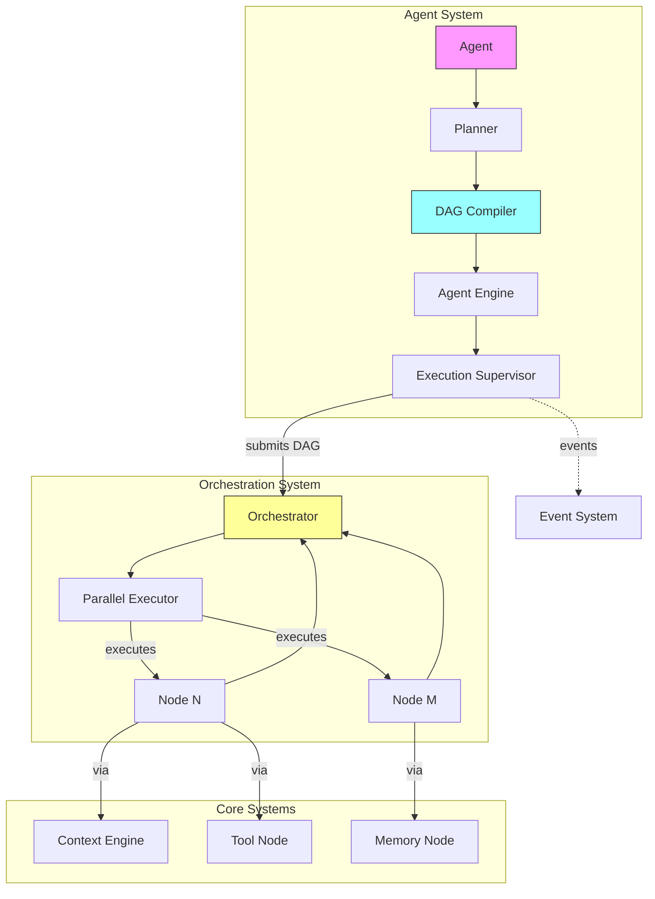

# Phase 8: Agent Execution System Implementation Plan

## Overview

This document outlines the comprehensive Phase 8 implementation plan for the Nexus project. Phase 8 introduces **autonomous agent execution with goal-directed behavior**, where agents compile their execution plans into DAGs instead of bypassing the orchestration layer.

**Phase 8 Goal**: Transform Nexus from tool-driven orchestration to goal-directed autonomous execution, where agents act as planning entities that compile their intended actions into executable DAGs through the established orchestrator.

**Core Principle**: Agents must compile into DAGs, not bypass orchestration. This maintains determinism, observability, and the core architectural contract established in AGENTS.md.

---

## Phase Overview

### Objective

Move from tool-driven orchestration → goal-directed autonomous execution. Agents should be capable of:

1. **Planning**: Breaking down high-level goals into executable steps
2. **Compiling**: Converting plans into DAGs compatible with the orchestrator
3. **Executing**: Running through the orchestrator with full observability
4. **Iterating**: Refining plans based on execution feedback when needed

### Architectural Position

Phase 8 sits at the intersection of multiple existing systems:

```
┌─────────────────────────────────────────────────────────────┐
│                     Application Layer                        │
│  (CLI, Web, Desktop Apps)                                   │
└─────────────────────────────────────────────────────────────┘
                              │
                              ▼
┌─────────────────────────────────────────────────────────────┐
│                     Interface Layer                          │
│  (API, WebSocket, CLI Contracts)                           │
└─────────────────────────────────────────────────────────────┘
                              │
                              ▼
┌─────────────────────────────────────────────────────────────┐
│                     Agent System (NEW)                       │
│  ┌─────────────┐  ┌─────────────┐  ┌──────────────────────┐ │
│  │Agent Engine │  │Agent        │  │ Planners/Executors   │ │
│  │             │  │ Registry    │  │ (compilers to DAG)   │ │
│  └─────────────┘  └─────────────┘  └──────────────────────┘ │
└─────────────────────────────────────────────────────────────┘
                              │
                              ▼
┌─────────────────────────────────────────────────────────────┐
│                     Orchestration Layer                      │
│  (DAG Engine, Scheduler, Parallel Executor)                │
└─────────────────────────────────────────────────────────────┘
                              │
                              ▼
┌─────────────────────────────────────────────────────────────┐
│                     Core Systems                             │
│  (Context Engine, Memory, Models, Tools, Capabilities)      │
└─────────────────────────────────────────────────────────────┘
```

### Layer Separation

Following AGENTS.md's strict layer separation:

- **apps**: No business logic (unchanged)
- **interfaces**: Contracts only (unchanged)
- **systems**: Agent implementation lives in `systems/agents/`
- **core**: Primitives only - agents are NOT in core

---

## Current State Analysis

### What's Already in Place

| Component | Status | Location |
|-----------|--------|----------|
| Agent Contracts | ✅ Complete | `modules/agents/contracts/` |
| Agent Interface | ✅ Complete | `modules/agents/contracts/agent.ts` |
| Executor Contracts | ✅ Complete | `modules/agents/contracts/executor.ts` |
| ExecutionPlan Type | ✅ Complete | `modules/agents/contracts/executor.ts` |
| DAG Infrastructure | ✅ Complete | `systems/orchestration/engine/dag.ts` |
| Parallel Executor | ✅ Complete | `systems/orchestration/engine/src/parallel-executor.ts` |
| Orchestrator | ✅ Complete | `systems/orchestration/engine/orchestrator.ts` |

### What's Missing (Implementation Gap)

| Component | Priority | Description |
|-----------|----------|-------------|
| Agent Engine | 🔴 Critical | Main execution engine for agents |
| Agent Registry | 🔴 Critical | Agent registration and discovery |
| Planner Implementation | 🔴 Critical | Converts goals to execution plans |
| DAG Compiler | 🔴 Critical | Compiles plans to DAGs |
| Execution Supervisor | 🟡 High | Monitors and iterates on execution |
| Agent State Management | 🟡 High | Tracks agent execution state |

### Dependencies on Previous Phases

Phase 8 depends on:

1. **Phase 1** (Core Contracts): Agent contracts, error types, event types
2. **Phase 3** (Graph Execution): DAG infrastructure, parallel execution
3. **Phase 4** (Context Engine): Context routing for agent planning
4. **Phase 5** (Capability Fabric): Tool and capability discovery

---

## Required Components

### Directory Structure

```
systems/agents/
├── index.ts                 # Barrel export
├── agent-engine.ts          # Main agent execution engine
├── agent-registry.ts        # Agent registration and discovery
├── types.ts                 # Agent system types
└── __tests__/
    ├── agent-engine.test.ts
    └── registry.test.ts

systems/agents/planners/
├── index.ts
├── base-planner.ts          # Abstract base for planners
├── goal-decomposer.ts       # Breaks goals into sub-goals
└── step-planner.ts          # Plans individual execution steps

systems/agents/compilers/
├── index.ts
├── dag-compiler.ts          # Compiles ExecutionPlan to DAG
└── plan-validator.ts        # Validates execution plans

systems/agents/supervision/
├── index.ts
├── execution-supervisor.ts  # Monitors and controls execution
└── iteration-controller.ts # Handles plan refinement
```

### Core Files

| File | Purpose | Lines (est.) |
|------|---------|--------------|
| `agent-engine.ts` | Main engine | ~300 |
| `agent-registry.ts` | Registry | ~200 |
| `planners/goal-decomposer.ts` | Goal planning | ~250 |
| `planners/step-planner.ts` | Step planning | ~200 |
| `compilers/dag-compiler.ts` | DAG compilation | ~300 |
| `supervision/execution-supervisor.ts` | Supervision | ~250 |

---

## Core Design Specifications

### 1. Agent Interface Requirements

The existing `Agent` interface in `modules/agents/contracts/agent.ts` defines:

```typescript
export interface Agent {
  id: string;
  config: AgentConfig;
  state: AgentState;
  start(): Promise<void>;
  stop(): Promise<void>;
  pause(): Promise<void>;
  resume(): Promise<void>;
  process(request: AgentRequest): Promise<AgentResponse>;
  reset(): void;
  getStatus(): AgentStatus;
}
```

**Phase 8 Enhancement**: Add method for compiling to DAG:

```typescript
export interface Agent {
  // ... existing methods
  
  /**
   * Compile execution plan to DAG for orchestrator execution
   * @throws AgentCompilationError if plan cannot be compiled
   */
  compileToDAG(plan: ExecutionPlan, context: AgentContext): Promise<DAG>;
}
```

### 2. AgentExecutor Requirements

The existing `AgentExecutor` interface in `modules/agents/contracts/executor.ts` defines:

```typescript
export interface AgentExecutor {
  execute(agent: Agent, request: AgentRequest): Promise<AgentResponse>;
  plan(agent: Agent, request: AgentRequest): Promise<ExecutionPlan>;
  cancel(agentId: string): Promise<void>;
  pause(agentId: string): Promise<void>;
  resume(agentId: string): Promise<void>;
  getStatus(agentId: string): ExecutionStatus | null;
}
```

**Phase 8 Enhancement**: Add DAG compilation:

```typescript
export interface AgentExecutor {
  // ... existing methods
  
  /**
   * Compile execution plan to executable DAG
   */
  compileToDAG(plan: ExecutionPlan, context: AgentContext): Promise<EnhancedDAG>;
  
  /**
   * Execute via orchestrator (not direct)
   */
  executeViaOrchestrator(agent: Agent, dag: EnhancedDAG): Promise<AgentResponse>;
}
```

### 3. How Agents Compile to DAGs (Critical Constraint)

This is the **central architectural requirement** of Phase 8:

```
┌─────────────┐     ┌──────────────┐     ┌─────────────────┐
│   Agent     │────►│  Planner     │────►│  DAG Compiler  │
│  (Planning) │     │ (Goal→Steps) │     │ (Plan→DAG)      │
└─────────────┘     └──────────────┘     └─────────────────┘
                                                    │
                                                    ▼
                                         ┌─────────────────┐
                                         │  Orchestrator   │
                                         │ (DAG Execution)  │
                                         └─────────────────┘
```

**Compilation Flow**:

1. **Goal Decomposition**: Agent receives high-level goal
2. **Step Planning**: Planner creates `ExecutionPlan` with `ExecutionStep[]`
3. **DAG Construction**: Compiler converts steps to DAG nodes + edges
4. **Orchestration**: DAG is submitted to orchestrator for execution
5. **Result Mapping**: Orchestrator results are mapped back to agent response

**Node Mapping**:

| ExecutionStep Type | DAG Node Type |
|-------------------|---------------|
| reasoning | ReasoningNode |
| tool_call | ToolNode |
| memory | MemoryNode |
| conditional | ConditionalNode |
| transform | TransformNode |

**Edge Creation**:
- Sequential steps: `step[N]` → `step[N+1]`
- Parallel steps: Group in `ParallelExecutionGroup`
- Conditional branching: Edge with `condition` property

### 4. Execution Supervision Model

Agents must be observable throughout execution:

```typescript
export interface ExecutionSupervisor {
  /**
   * Start supervising an agent execution
   */
  supervise(
    executionId: string,
    agent: Agent,
    dag: EnhancedDAG,
    observer: ExecutionObserver
  ): Promise<void>;
  
  /**
   * Check if execution should continue (iteration limit, etc.)
   */
  shouldContinue(executionId: string): boolean;
  
  /**
   * Get current execution state
   */
  getState(executionId: string): SupervisedExecutionState;
  
  /**
   * Request plan refinement if execution is stuck
   */
  requestRefinement(executionId: string, reason: string): Promise<ExecutionPlan>;
}
```

---

## Non-Negotiable Constraints

### 1. No Direct Tool Calls from Agents

**Rule**: Agents CANNOT directly invoke tools.

**Correct Pattern**:
```
Agent → Plan → DAG Compiler → DAG → Orchestrator → ToolNode → Tool
```

**Incorrect Pattern**:
```
Agent → Tool (DIRECT CALL) ❌
```

**Implementation**: DAG Compiler creates ToolNodes, orchestrator executes them.

### 2. No Model Calls Outside Orchestration

**Rule**: All LLM/reasoning calls must go through orchestrator's ReasoningNode.

**Correct Pattern**:
```
Agent → Plan → DAG Compiler → DAG → Orchestrator → ReasoningNode → Model
```

**Implementation**: Planner creates reasoning steps, compiler converts to ReasoningNodes.

### 3. All Execution Observable via DAG Events

**Rule**: Agent execution must emit events at every step.

**Events Required**:
- `agent:start` - Agent begins execution
- `agent:plan:created` - ExecutionPlan generated
- `agent:dag:compiled` - DAG compiled successfully
- `agent:dag:submitted` - DAG submitted to orchestrator
- `node:start` - Each node starts (from orchestrator)
- `node:complete` - Each node completes (from orchestrator)
- `agent:complete` - Agent execution complete
- `agent:error` - Agent execution error

### 4. Plans Must Be Serializable

**Rule**: `ExecutionPlan` must be serializable for:
- Persistence (save/resume execution)
- Audit (replay execution history)
- Distribution (execute on different nodes)

```typescript
export interface ExecutionPlan {
  agentId: string;
  steps: ExecutionStep[];
  estimatedDuration?: number;
  requiredTools?: string[];
  // All fields must be JSON-serializable
}
```

---

## Edge Cases to Handle

### 1. Recursive Planning (Max Depth Constraint)

**Problem**: Agent creates sub-plans that create sub-plans infinitely.

**Solution**:
```typescript
interface PlannerConfig {
  maxPlanningDepth: number;        // Default: 3
  maxStepsPerPlan: number;         // Default: 50
  planningTimeout: number;         // Default: 30000ms
}

class GoalDecomposer {
  private depth: number = 0;
  
  async decompose(goal: Goal, config: PlannerConfig): Promise<ExecutionPlan> {
    if (this.depth >= config.maxPlanningDepth) {
      throw new PlanningDepthExceededError(goal.id, this.depth);
    }
    this.depth++;
    try {
      return await this.decomposeImpl(goal);
    } finally {
      this.depth--;
    }
  }
}
```

### 2. Infinite Refinement (Iteration Cap)

**Problem**: Agent keeps refining plan without making progress.

**Solution**:
```typescript
interface IterationConfig {
  maxIterations: number;           // Default: 5
  convergenceThreshold: number;    // Default: 0.1 (10% improvement)
  earlyExitConditions: string[];   // e.g., ["timeout", "resource_exhausted"]
}

class IterationController {
  private iterationCount: number = 0;
  private previousScore: number = Infinity;
  
  async shouldContinue(config: IterationConfig): Promise<boolean> {
    if (this.iterationCount >= config.maxIterations) {
      return false;
    }
    // Check convergence
    // ...
    return true;
  }
}
```

### 3. Tool Explosion (Capability-Scoped Planning)

**Problem**: Agent discovers too many tools and creates plans with hundreds of tool calls.

**Solution**:
```typescript
interface CapabilityScope {
  allowedCapabilities: string[];   // From agent config
  maxToolCallsPerPlan: number;     // Default: 20
  
  filterTools(tools: Tool[]): Tool[] {
    return tools.filter(t => 
      this.allowedCapabilities.includes(t.category)
    ).slice(0, this.maxToolCallsPerPlan);
  }
}
```

### 4. Context Overflow (Context Engine Routing)

**Problem**: Planning consumes too much context.

**Solution**: All context for planning must route through Context Engine:

```typescript
class Planner {
  constructor(
    private contextEngine: ContextEngine,  // Phase 4
    private modelProvider: ModelProvider   // Phase 1-3
  ) {}
  
  async createPlan(goal: Goal): Promise<ExecutionPlan> {
    // Compress goal and context via Context Engine
    const compressedContext = await this.contextEngine.compress({
      prompt: this.buildPlanningPrompt(goal),
      constraints: { maxTokens: 4000 }
    });
    
    // Use compressed context for planning
    const response = await this.modelProvider.complete(compressedContext);
    return this.parsePlan(response);
  }
}
```

---

## Implementation Phases

### Phase 8.1: Minimal Agent Engine

**Goal**: Basic agent that can receive goals and execute via orchestrator.

**Files to Create**:
```
systems/agents/
├── types.ts                     # Agent system types
├── agent-engine.ts              # Basic engine
└── __tests__/agent-engine.test.ts
```

**Milestone**: Agent can execute a single-step "hello world" goal via orchestrator.

### Phase 8.2: Basic Planning

**Goal**: Agent can decompose simple goals into multi-step plans.

**Files to Create**:
```
systems/agents/planners/
├── index.ts
├── base-planner.ts
└── goal-decomposer.ts
```

**Milestone**: Agent can create plan with 3+ steps for a simple task.

### Phase 8.3: Agent Registry

**Goal**: Agents can be registered, discovered, and instantiated.

**Files to Create**:
```
systems/agents/
├── agent-registry.ts
└── __tests__/registry.test.ts
```

**Milestone**: Multiple agent types can be registered and retrieved.

### Phase 8.4: DAG Compilation

**Goal**: ExecutionPlans can be compiled to executable DAGs.

**Files to Create**:
```
systems/agents/compilers/
├── index.ts
├── dag-compiler.ts
└── plan-validator.ts
```

**Milestone**: Plan compiles to valid DAG, orchestrator executes DAG.

### Phase 8.5: Execution Supervision

**Goal**: Agent execution is observable and can be controlled.

**Files to Create**:
```
systems/agents/supervision/
├── index.ts
├── execution-supervisor.ts
└── iteration-controller.ts
```

**Milestone**: Agent emits events, can pause/resume/cancel, handles iteration.

### Phase 8.6: Integration & Edge Cases

**Goal**: Full system with edge case handling.

**Enhancements**:
- Max depth constraint in planners
- Iteration cap in supervision
- Capability scoping in compiler
- Context Engine integration

**Milestone**: All edge cases handled, full test coverage.

---

## Mermaid: Agent Execution Flow



---

## Success Criteria

### Phase 8 Complete When:

- [ ] Agent Engine can execute agents via orchestrator
- [ ] Planner can decompose goals into execution plans
- [ ] DAG Compiler converts plans to valid DAGs
- [ ] Agent Registry supports registration and discovery
- [ ] Execution Supervisor provides observability
- [ ] All constraints enforced (no direct tool calls, no direct model calls)
- [ ] Edge cases handled (max depth, iteration cap, capability scope)
- [ ] Context Engine integration for planning
- [ ] Runnable tests for agent compilation
- [ ] Observable DAG execution with events

### Validation Commands

```bash
# TypeScript check
npm run typecheck

# Build all packages
npm run build

# Run agent tests
npm test -- systems/agents

# Run integration tests
npm test -- --grep "agent.*orchestrator"

# Run specific agent execution
cd apps/cli && npm run start -- "search for recent news about AI"
```

---

## Constraints & Exclusions

### In Scope (Phase 8)

- Agent Engine implementation
- Agent Registry implementation
- Goal decomposition planning
- DAG compilation from ExecutionPlan
- Execution supervision and iteration control
- Event emission for observability
- Edge case handling (depth, iteration, scope, context)

### Out of Scope (Future Phases)

| Feature | Phase | Reason |
|---------|-------|--------|
| Multi-Agent Collaboration | Phase 9 | Requires agent-to-agent protocols |
| Learning Agents | Phase 9+ | Requires feedback loops |
| Agent Persistence | Phase 10 | Requires data layer |
| Distributed Agent Execution | Phase 10 | Requires runtime scaling |
| Agent Marketplaces | Phase 10+ | Requires ecosystem |

---

## Risk Mitigation

| Risk | Mitigation |
|------|------------|
| Plan explosion | Max steps per plan, capability scoping |
| Infinite recursion | Max planning depth counter |
| Context overflow | Route all context through Context Engine |
| Orchestrator bottlenecks | Use parallel execution groups |
| Tool discovery failure | Graceful degradation with available tools |
| Plan compilation failure | Validation before submission |

---

## Notes

1. **Contract-First**: All agent implementations must follow contracts in `modules/agents/contracts/`
2. **DAG-First**: Never bypass orchestrator - all execution compiles to DAG
3. **Observable**: Every agent action emits events for debugging/monitoring
4. **Serializable**: Plans and execution state must be JSON-serializable
5. **Deterministic**: Same goal + context = same plan (for replayability)
6. **Graceful Degradation**: If planning fails, fall back to direct orchestrator call

---

**Last Updated**: 2026-03-25
**Phase Status**: 📋 Ready for Implementation