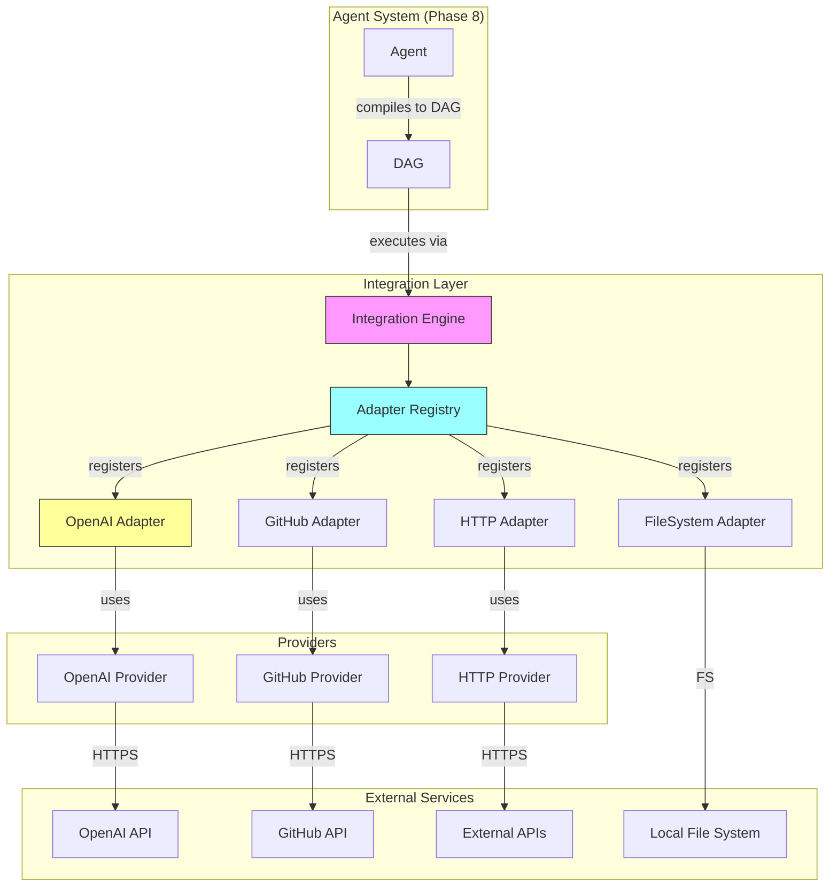

# Phase 9: Integration Layer Implementation Plan

## Overview

This document outlines the comprehensive Phase 9 implementation plan for the Nexus project. Phase 9 transforms Nexus from a pure execution system into a **system integrator** — capable of connecting to external services, APIs, and platforms through a unified adapter pattern.

**Phase 9 Goal**: Convert Nexus into a system integrator by implementing the Integration Layer, enabling external service connections through stateless, externally-authenticated adapters.

**Core Principle**: Adapters must be stateless and externally configured. No embedded credentials, no stateful sessions inside adapters. All authentication flows through environment variables or external configuration.

---

## Phase Overview

### Objective

Transform Nexus into a system integrator that can:

1. **Connect**: Establish connections to external services (OpenAI, GitHub, HTTP APIs, file systems)
2. **Abstract**: Provide unified interfaces through adapter pattern
3. **Scale**: Support hot-swappable adapters for different providers
4. **Secure**: Externalize all authentication, no credentials in code

### Architectural Position

Phase 9 introduces the Integration Layer between the Agent System and external services:

```
┌─────────────────────────────────────────────────────────────┐
│                     Application Layer                        │
│  (CLI, Web, Desktop Apps)                                   │
└─────────────────────────────────────────────────────────────┘
                               │
                               ▼
┌─────────────────────────────────────────────────────────────┐
│                     Interface Layer                          │
│  (API, WebSocket, CLI Contracts)                           │
└─────────────────────────────────────────────────────────────┘
                               │
                               ▼
┌─────────────────────────────────────────────────────────────┐
│                     Agent System (Phase 8)                   │
│  (Agent Engine, Planner, DAG Compiler)                      │
└─────────────────────────────────────────────────────────────┘
                               │
                               ▼
┌─────────────────────────────────────────────────────────────┐
│               Integration Layer (NEW - Phase 9)              │
│  ┌─────────────────┐  ┌─────────────────┐  ┌─────────────┐  │
│  │ Integration     │  │ Adapter         │  │ Adapters    │  │
│  │ Engine          │  │ Registry        │  │ (OpenAI,    │  │
│  │                 │  │                 │  │  GitHub,    │  │
│  │                 │  │                 │  │  HTTP, FS)  │  │
│  └─────────────────┘  └─────────────────┘  └─────────────┘  │
└─────────────────────────────────────────────────────────────┘
                               │
                               ▼
┌─────────────────────────────────────────────────────────────┐
│                     Orchestration Layer                      │
│  (DAG Engine, Scheduler, Parallel Executor)                │
└─────────────────────────────────────────────────────────────┘
                               │
                               ▼
┌─────────────────────────────────────────────────────────────┐
│                     Core Systems                             │
│  (Context Engine, Memory, Models, Tools, Capabilities)      │
└─────────────────────────────────────────────────────────────┘
```

### Why Integration Matters

1. **Extensibility**: New external services can be added without modifying core systems
2. **Unified Interface**: Agents interact with a consistent API regardless of the underlying service
3. **Hot-Swappability**: Switch between providers (e.g., OpenAI ↔ Anthropic) without code changes
4. **Security**: Credentials never touch the core system; all auth is externalized
5. **Testability**: Adapters can be mocked for testing without external dependencies

---

## Current State Analysis

### What's Already in Place

| Component | Status | Location |
|-----------|--------|----------|
| Integration Contracts | ✅ Complete | `modules/integrations/contracts/` |
| IntegrationAdapter Interface | ✅ Complete | `modules/integrations/contracts/adapter.ts` |
| IntegrationProvider Interface | ✅ Complete | `modules/integrations/contracts/provider.ts` |
| Adapter Factory Pattern | ✅ Complete | `modules/integrations/contracts/adapter.ts` |
| Provider Factory Pattern | ✅ Complete | `modules/integrations/contracts/provider.ts` |
| OpenAI Model Provider | ✅ Complete | `systems/models/src/openai.ts` |
| HTTP Tool (GET) | ✅ Complete | `modules/tools/builtins/http/get.ts` |
| File System Tools | ✅ Complete | `modules/tools/builtins/filesystem/` |

### What's Missing (Implementation Gap)

| Component | Priority | Description |
|-----------|----------|-------------|
| Integration Engine | 🔴 Critical | Core execution engine for integrations |
| Adapter Registry | 🔴 Critical | Registration and discovery of adapters |
| OpenAI Adapter | 🔴 Critical | Formalize existing OpenAI as adapter |
| GitHub Adapter | 🟡 High | GitHub API integration |
| HTTP Generic Adapter | 🟡 High | Generic HTTP client adapter |
| File System Adapter | 🟡 High | Local file operations adapter |

### Dependencies on Previous Phases

Phase 9 depends on:

1. **Phase 1** (Core Contracts): Integration contracts already in place
2. **Phase 3** (Graph Execution): DAG infrastructure for integration workflows
3. **Phase 4** (Context Engine): Context routing for integration requests
4. **Phase 5** (Capability Fabric): Tool system foundation
5. **Phase 8** (Agent Execution): Agents can trigger integration calls via DAG

---

## Integration Architecture

### Directory Structure

```
systems/integrations/
├── index.ts                      # Barrel export
├── integration-engine.ts         # Main integration execution engine
├── adapter-registry.ts           # Adapter registration and discovery
├── types.ts                      # Integration system types
└── __tests__/
    ├── integration-engine.test.ts
    └── adapter-registry.test.ts

systems/integrations/adapters/
├── index.ts
├── base-adapter.ts               # Abstract base for all adapters
├── openai-adapter.ts             # OpenAI integration
├── github-adapter.ts             # GitHub integration
├── http-adapter.ts               # Generic HTTP adapter
└── filesystem-adapter.ts         # File system adapter

systems/integrations/providers/
├── index.ts
├── base-provider.ts              # Abstract base for providers
├── openai-provider.ts            # OpenAI provider
├── github-provider.ts            # GitHub provider
└── http-provider.ts              # Generic HTTP provider
```

### Core Files

| File | Purpose | Lines (est.) |
|------|---------|--------------|
| `integration-engine.ts` | Main engine | ~300 |
| `adapter-registry.ts` | Registry | ~200 |
| `adapters/base-adapter.ts` | Base adapter | ~150 |
| `adapters/openai-adapter.ts` | OpenAI adapter | ~250 |
| `adapters/github-adapter.ts` | GitHub adapter | ~300 |
| `adapters/http-adapter.ts` | HTTP adapter | ~200 |
| `adapters/filesystem-adapter.ts` | FS adapter | ~200 |

---

## Adapter Contract Design

### IntegrationAdapter Interface Requirements

The existing `IntegrationAdapter` interface in `modules/integrations/contracts/adapter.ts` defines:

```typescript
export interface IntegrationAdapter<T = unknown> {
  id: string;
  provider: IntegrationProvider;
  config: AdapterConfig;
  status: AdapterStatus;
  
  initialize(): Promise<void>;
  execute(operation: string, params?: unknown): Promise<AdapterResult<T>>;
  transform<TInput = unknown, TOutput = unknown>(data: TInput): TOutput;
  reverseTransform<TInput = unknown, TOutput = unknown>(data: TInput): TOutput;
  getCapabilities(): string[];
  validate(): { valid: boolean; errors?: string[] };
}
```

### IntegrationProvider Interface Requirements

The existing `IntegrationProvider` interface in `modules/integrations/contracts/provider.ts` defines:

```typescript
export interface IntegrationProvider {
  id: string;
  config: ProviderConfig;
  status: IntegrationProviderStatus;
  
  connect(): Promise<void>;
  disconnect(): Promise<void>;
  isConnected(): boolean;
  request<T = unknown>(method: string, path: string, data?: unknown): Promise<T>;
  getMetadata(): ProviderMetadata;
  healthCheck(): Promise<boolean>;
}
```

### Key Design Decision: Stateless + Externally Configured

**CRITICAL**: All adapters MUST follow these rules:

1. **No Embedded Credentials**: API keys, tokens, secrets must come from environment variables or external config
2. **No Stateful Sessions**: Adapters cannot maintain internal session state between calls
3. **Configuration Injection**: All config must be passed in at creation time
4. **Connection Management**: Providers handle connections, not adapters

**Correct Pattern**:
```typescript
class OpenAIAdapter implements IntegrationAdapter {
  constructor(
    private provider: IntegrationProvider,  // Provider handles auth
    private config: AdapterConfig            // Config from external source
  ) {}
  
  async execute(operation: string, params?: unknown): Promise<AdapterResult> {
    // Use provider for requests - auth is handled by provider
    const result = await this.provider.request('POST', '/chat/completions', params);
    return { success: true, data: this.transform(result) };
  }
}
```

**Incorrect Pattern**:
```typescript
class OpenAIAdapter implements IntegrationAdapter {
  private apiKey = 'sk-xxx';  // ❌ NEVER embed credentials
  
  async execute(operation: string, params?: unknown): Promise<AdapterResult> {
    // ❌ NEVER store session state
    this.session = await this.createSession();
  }
}
```

### What to Avoid

| Anti-Pattern | Why | Solution |
|--------------|-----|----------|
| Embedded API keys | Security risk | Use env vars: `process.env.OPENAI_API_KEY` |
| Hardcoded endpoints | Inflexibility | Use config: `config.baseUrl` |
| Session caching | State pollution | Stateless, recreate per request |
| Credential storage | Compliance violation | External auth services only |
| Retry logic in adapters | Duplication | Use orchestrator retry strategies |

---

## Initial Integration Targets

### 1. OpenAI Adapter (Priority: 🔴 Critical)

**Rationale**: Already abstracted in `systems/models/src/openai.ts`. Formalize as adapter for consistency.

**Capabilities**:
- Chat completions
- Embeddings
- Model listing
- Streaming support

**Configuration**:
```typescript
interface OpenAIAdapterConfig extends AdapterConfig {
  options: {
    model?: string;
    temperature?: number;
    maxTokens?: number;
  };
}
```

**Environment Variables**:
- `OPENAI_API_KEY` - Required for authentication
- `OPENAI_BASE_URL` - Optional, defaults to OpenAI API

### 2. GitHub Adapter (Priority: 🟡 High)

**Rationale**: High leverage for developer workflows - agents can interact with repositories, issues, PRs.

**Capabilities**:
- Repository operations (list, read, search)
- Issue management (create, read, update, close)
- Pull request operations
- File content retrieval
- Workflow triggers

**Configuration**:
```typescript
interface GitHubAdapterConfig extends AdapterConfig {
  options: {
    owner?: string;
    repo?: string;
    defaultBranch?: string;
  };
}
```

**Environment Variables**:
- `GITHUB_TOKEN` - Required for authentication
- `GITHUB_API_URL` - Optional, for GitHub Enterprise

### 3. HTTP Generic Adapter (Priority: 🟡 High)

**Rationale**: Fallback for external APIs not covered by specific adapters. Enables integration with any REST API.

**Capabilities**:
- GET, POST, PUT, DELETE operations
- Custom headers
- Query parameter support
- Response transformation

**Configuration**:
```typescript
interface HTTPAdapterConfig extends AdapterConfig {
  options: {
    baseUrl: string;
    defaultHeaders?: Record<string, string>;
    timeout?: number;
  };
}
```

**Environment Variables**:
- `HTTP_AUTH_TOKEN` - Optional, for authenticated endpoints

### 4. File System Adapter (Priority: 🟡 High)

**Rationale**: For local file operations - read, write, list, search files in designated directories.

**Capabilities**:
- Read file contents
- Write file contents
- List directories
- File metadata
- Search files by pattern

**Configuration**:
```typescript
interface FileSystemAdapterConfig extends AdapterConfig {
  options: {
    rootPath: string;           // Required - allowed directory
    allowedExtensions?: string[];
    maxFileSize?: number;
  };
}
```

**Security**: Root path must be validated to prevent directory traversal attacks.

---

## Implementation Phases

### Phase 9.1: Integration Engine + Registry

**Goal**: Core infrastructure for integration management.

**Files to Create**:
```
systems/integrations/
├── types.ts                     # Integration types
├── integration-engine.ts        # Main engine
├── adapter-registry.ts          # Registry
└── __tests__/
    ├── integration-engine.test.ts
    └── adapter-registry.test.ts
```

**Key Components**:

```typescript
// integration-engine.ts
export class IntegrationEngine {
  private registry: AdapterRegistry;
  private providers: Map<string, IntegrationProvider>;
  
  async execute(
    adapterId: string,
    operation: string,
    params?: unknown
  ): Promise<AdapterResult>;
  
  async registerAdapter(adapter: IntegrationAdapter): Promise<void>;
  
  async registerProvider(provider: IntegrationProvider): Promise<void>;
  
  getAdapter(id: string): IntegrationAdapter | null;
  
  healthCheck(): Promise<Record<string, boolean>>;
}

// adapter-registry.ts
export class AdapterRegistry {
  private adapters: Map<string, IntegrationAdapter>;
  private descriptors: Map<string, AdapterDescriptor>;
  
  register(descriptor: AdapterDescriptor): void;
  
  create<T extends IntegrationAdapter>(
    type: string,
    provider: IntegrationProvider,
    config: AdapterConfig
  ): T;
  
  get(id: string): IntegrationAdapter | null;
  
  list(): IntegrationAdapter[];
  
  has(type: string): boolean;
}
```

**Milestone**: Registry can register and retrieve adapters, engine can execute operations.

### Phase 9.2: OpenAI Adapter

**Goal**: Formalize existing OpenAI integration as adapter.

**Files to Create**:
```
systems/integrations/adapters/
├── index.ts
├── base-adapter.ts
└── openai-adapter.ts
```

**Implementation**:
- Wrap existing `OpenAIProvider` from `systems/models/`
- Implement `IntegrationAdapter` interface
- Support chat completions and embeddings operations

**Milestone**: OpenAI operations flow through adapter pattern.

### Phase 9.3: GitHub Adapter

**Goal**: GitHub API integration for developer workflows.

**Files to Create**:
```
systems/integrations/adapters/
└── github-adapter.ts

systems/integrations/providers/
├── index.ts
├── base-provider.ts
└── github-provider.ts
```

**Implementation**:
- Create GitHub provider with token-based auth
- Implement GitHub-specific adapter operations
- Support repo, issue, PR, and file operations

**Milestone**: Agents can interact with GitHub via adapter.

### Phase 9.4: HTTP Generic Adapter

**Goal**: Generic HTTP client for external APIs.

**Files to Create**:
```
systems/integrations/adapters/
└── http-adapter.ts

systems/integrations/providers/
└── http-provider.ts
```

**Implementation**:
- Generic HTTP provider with configurable base URL
- Support all HTTP methods
- Request/response transformation

**Milestone**: Any REST API can be integrated via HTTP adapter.

### Phase 9.5: File System Adapter

**Goal**: Local file operations through adapter pattern.

**Files to Create**:
```
systems/integrations/adapters/
└── filesystem-adapter.ts
```

**Implementation**:
- Read/write/list operations on designated directories
- Path validation to prevent directory traversal
- Configurable root path and allowed extensions

**Milestone**: File operations flow through adapter with security controls.

---

## Mermaid: Integration Architecture



---

## Security Considerations

### Authentication Externalization

All authentication MUST be externalized:

```typescript
// ✅ CORRECT: Read from environment
class GitHubProvider implements IntegrationProvider {
  private token: string;
  
  constructor(config: ProviderConfig) {
    this.token = process.env.GITHUB_TOKEN || '';
    if (!this.token) {
      throw new Error('GITHUB_TOKEN environment variable required');
    }
  }
}

// ❌ WRONG: Accept token in constructor
class GitHubProvider implements IntegrationProvider {
  constructor(config: ProviderConfig) {
    this.token = config.apiKey;  // Never accept secrets in config
  }
}
```

### Credential Management Rules

| Rule | Implementation |
|------|----------------|
| No hardcoded secrets | Use `process.env` exclusively |
| No config file secrets | External auth service or env vars |
| No logging secrets | Mask tokens in logs |
| No URL-embedded secrets | Use headers, not query params |

### Rate Limiting and Quota Management

```typescript
interface RateLimitConfig {
  requestsPerMinute: number;
  requestsPerHour: number;
  retryAfterMs: number;
}

class RateLimitedProvider implements IntegrationProvider {
  private rateLimit: RateLimitConfig;
  private requestTimestamps: number[] = [];
  
  async request<T>(method: string, path: string, data?: unknown): Promise<T> {
    this.checkRateLimit();
    // ... make request
  }
  
  private checkRateLimit(): void {
    const now = Date.now();
    const recentRequests = this.requestTimestamps.filter(
      t => now - t < 60000  // Last minute
    );
    
    if (recentRequests.length >= this.rateLimit.requestsPerMinute) {
      throw new RateLimitError('Rate limit exceeded');
    }
    
    this.requestTimestamps = recentRequests;
  }
}
```

### Path Validation (File System Adapter)

```typescript
class FileSystemAdapter implements IntegrationAdapter {
  private rootPath: string;
  
  validatePath(filePath: string): boolean {
    const resolved = path.resolve(this.rootPath, filePath);
    return resolved.startsWith(this.rootPath);
  }
  
  async execute(operation: string, params?: unknown): Promise<AdapterResult> {
    const { filePath } = params as { filePath: string };
    
    if (!this.validatePath(filePath)) {
      return { success: false, error: 'Path traversal detected' };
    }
    
    // ... proceed with operation
  }
}
```

---

## Success Criteria

### Phase 9 Complete When:

- [ ] Integration Engine can execute operations through any registered adapter
- [ ] Adapter Registry supports registration, discovery, and creation
- [ ] OpenAI Adapter is functional and hot-swappable
- [ ] GitHub Adapter supports repo, issue, PR, and file operations
- [ ] HTTP Adapter provides generic REST API integration
- [ ] File System Adapter provides secure local file operations
- [ ] All adapters are stateless (no internal state between calls)
- [ ] All authentication is externalized (no embedded credentials)
- [ ] Rate limiting is implemented for external API calls
- [ ] Path validation prevents directory traversal in FileSystem adapter
- [ ] Runnable tests for all adapters
- [ ] TypeScript compiles without errors
- [ ] ESLint passes

### Validation Commands

```bash
# TypeScript check
npm run typecheck

# Build all packages
npm run build

# Run integration tests
npm test -- systems/integrations

# Run adapter-specific tests
npm test -- --grep "adapter.*openai"
npm test -- --grep "adapter.*github"

# Test adapter registration
cd apps/cli && npm run start -- "list repositories from GitHub"
```

---

## Constraints & Exclusions

### In Scope (Phase 9)

- Integration Engine implementation
- Adapter Registry implementation
- OpenAI, GitHub, HTTP, FileSystem adapters
- External authentication via environment variables
- Rate limiting for external APIs
- Path validation for file system operations

### Out of Scope (Future Phases)

| Feature | Phase | Reason |
|---------|-------|--------|
| OAuth Flow | Phase 10 | Requires auth service |
| Webhook Integration | Phase 10 | Requires event system |
| GraphQL Support | Phase 10+ | Requires schema parsing |
| Database Adapters | Phase 10+ | Requires persistence layer |
| Streaming Adapters | Phase 10+ | Requires streaming infrastructure |
| Adapter Hot-Reload | Phase 10+ | Requires runtime scaling |

---

## Risk Mitigation

| Risk | Mitigation |
|------|------------|
| Credential leakage | Strict code review, env-only secrets |
| Rate limit violations | Implement client-side rate limiting |
| API breaking changes | Version adapters, graceful degradation |
| Path traversal attacks | Strict path validation, root path enforcement |
| Adapter explosion | Registry pattern, type-safe creation |
| Provider downtime | Health checks, fallback adapters |

---

## Notes

1. **Contract-First**: All adapter implementations must follow contracts in `modules/integrations/contracts/`
2. **Stateless**: Adapters must not maintain state between calls
3. **External Auth**: All credentials come from environment variables
4. **Hot-Swappable**: Adapters can be replaced at runtime via registry
5. **Observable**: All adapter operations emit events for monitoring
6. **Validated**: All inputs must be validated before execution

---

**Last Updated**: 2026-03-25
**Phase Status**: 📋 Ready for Implementation